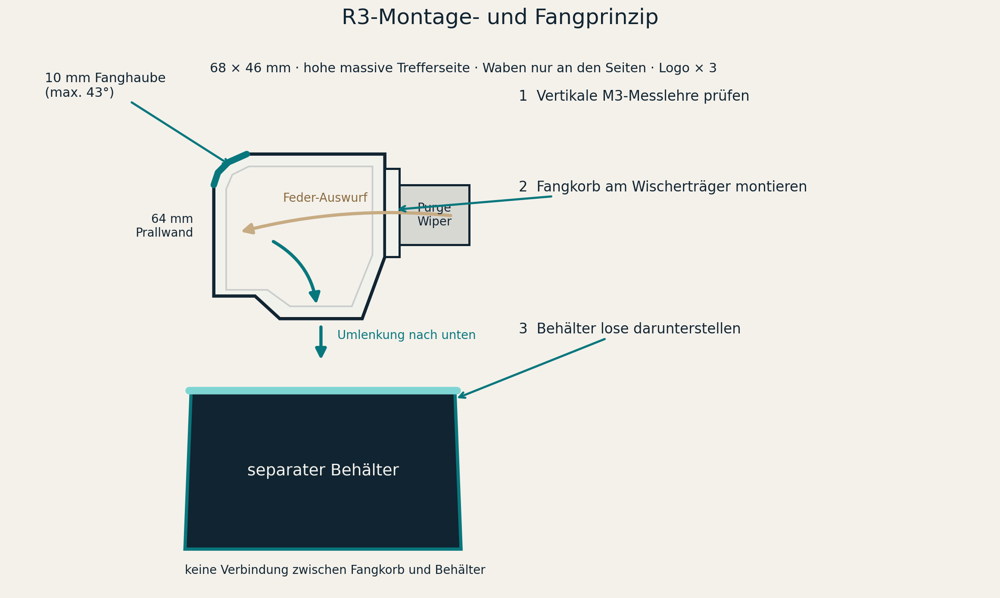
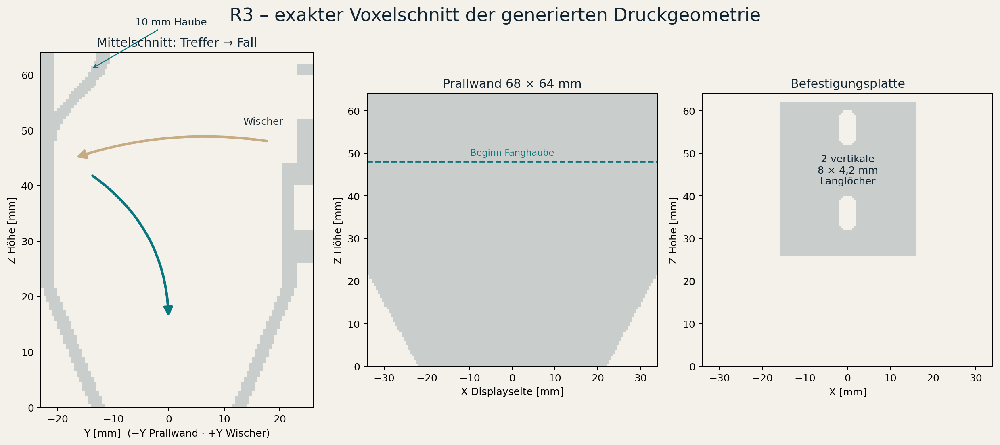
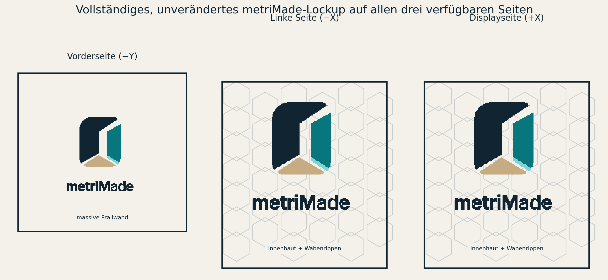

# Anycubic Kobra 3 Max – kompakter metriMade Fangkorb R3

Der kleine Fangkorb sitzt an der Purge-/Wischereinheit. Seine massive, 64 mm hohe Wand liegt der federbelasteten Auswurfmechanik gegenüber, bremst herausgeschossene Filamentreste und leitet sie durch den offenen Auslass nach unten. Die oberen 16 mm dieser Prallwand laufen weich um 10 mm nach innen und bilden eine Fanghaube. Der große Behälter steht **lose und mechanisch unabhängig** darunter. Nur der Fangkorb wird am Drucker verschraubt.





## Wabenaufbau

Die beiden Seitenwände sind nicht offen perforiert. Sie bestehen aus einer durchgehenden 1,0-mm-Innenhaut und 1,5 mm tiefen äußeren Wabenrippen. Dadurch bleiben auch dünne Purge-Fäden im Fangkorb. Die gegenüberliegende Trefferseite, Fanghaube, Trichter, Kanten, Befestigungsplatte und Logo-Auflagen sind massiv.

- Wabenzellradius: 4,8 mm
- sichtbare Rippenbreite: 1,5 mm
- vollständige Wanddicke an Rippen und Rahmen: 2,5 mm
- rechnerische Körpervolumen-Reduktion gegenüber dieser R3-Geometrie mit vollflächigen Seitenwänden: ca. 2,66 %

Die Einsparung ist bewusst kleiner als bei einer vollständig gewabten Konstruktion: Die vom federbelasteten Auswerfer direkt getroffene Wand darf keine offene oder nur dünn gerippte Schlagzone sein.

## Exaktes Logo

Verwendet wird ausschließlich `evidence/metrimade-lockup-stacked-color.svg`. Die vollständige SVG-`viewBox`, Pfadpositionen, Gruppentransformationen, Zeichenreihenfolge, Symbol, Schriftzug und vier Originalfarben bleiben erhalten. Es gibt keinen Zusatztext und keinen Zuschnitt.

Das vollständige Lockup wird auf drei verfügbaren Außenseiten direkt mitgedruckt:

- Vorderseite `−Y`
- linke Seite `−X`
- rechte Displayseite `+X`



Ein neutralweißer Fangkorb plus die vier unveränderten Logofarben benötigt **fünf Materialzuweisungen**. Ein Vierfach-Farbsystem kann diese Kombination nicht in einem einzigen unveränderten Mehrfarbdruck ausgeben. Möglich sind dann ein bewusst monochromer Druck, eine zusammengelegte Farbe oder eine separate Nachbearbeitung.

## Dateien und Zusammenbau

Empfohlene Druckjobs:

1. `models/3mf/mount-fit-gauge-core.3mf` – zuerst die vertikale Schraubenpaarung und die unbekannte Befestigungszone prüfen.
2. `models/3mf/metriMade-purge-catcher-3sides-5material-core.3mf` – kleiner Waben-Fangkorb.
3. `models/3mf/lower-bin-core.3mf` – großer freistehender Behälter.

Es gibt **keine mechanische Verbindung** zwischen Fangkorb und Unterbehälter. Der Fangkorb wird an der Wischereinheit verschraubt; der Behälter wird mit 10–40 mm Start-Luftspalt direkt unter den Auslass gestellt.

## STL-Fallback für Anycubic Slicer Next

Wenn der Slicer den Core-3MF weiterhin nicht öffnet, diese fünf Fangkorb-STLs **gemeinsam** importieren und als ein Objekt mit mehreren Teilen behandeln:

- `models/stl/catcher-body-white-honeycomb.stl`
- `models/stl/catcher-logo-navy-3sides.stl`
- `models/stl/catcher-logo-teal-3sides.stl`
- `models/stl/catcher-logo-aqua-3sides.stl`
- `models/stl/catcher-logo-sand-3sides.stl`

Die Teile teilen dasselbe Koordinatensystem. Nicht einzeln automatisch anordnen oder zentrieren. Das Körper-STL enthält den vollständigen funktionsfähigen Fangkorb; für einen monochromen Test können alle fünf Teile demselben Filament zugeordnet werden. Wenn der 3MF-Import weiterhin fehlschlägt, ist der gemeinsame STL-Import der vorgesehene Kompatibilitätsweg.

Die [offizielle Kurzanleitung](https://wiki.anycubic.com/en/software-and-app/new-page-anycubic-slicer-beta(orca-version)/anycubic-slicer-next-slicing-software-quick-start-guide) nennt `.3mf` und `.stl` als Importformate. Die Anycubic-Funktion [Split to Objects/Parts](https://wiki.anycubic.com/en/software-and-app/new-page-anycubic-slicer-beta(orca-version)/split-to-objects/parts) beschreibt die Objekt-/Teilbehandlung.

## Druckeinstellungen als Startpunkt

| Einstellung | Fangkorb | Unterbehälter | Messlehre |
|---|---:|---:|---:|
| Material | PETG | PETG | PETG/Restmaterial |
| Düse | 0,4 mm | 0,4 mm | 0,4 mm |
| Schichthöhe | 0,20 mm | 0,20–0,28 mm | 0,20 mm |
| Wände | 4 | 4 | 3 |
| Infill | 0–10 % | 0 % | 100 % durch geringe Dicke |
| Support | aus | aus | aus |
| Brim | 5 mm empfohlen | optional | nicht nötig |
| Orientierung | Auslassring auf Druckbett | Boden auf Druckbett | flach |

Die drei vertikalen Logos erzeugen viele Farbwechsel. Vor dem Export Farbwechselzahl, Purge-Tower, Abfallmenge und Druckdauer kontrollieren. Ein 30–40 mm breiter Wand-/Logo-Ausschnitt ist als Materialtest sinnvoll, bevor der vollständige Mehrfarbdruck gestartet wird.

## Konstruktionsdaten und offene Passung

- obere Fangöffnung: 68 × 46 mm; gesamter Fangkorb ca. 68 × 49 × 64 mm.
- gegenüberliegende Prallwand: 64 mm hoch; ab 48 mm Höhe um 10 mm nach innen gerundet.
- Fanghaube: maximal ca. 43,2° von der Vertikalen; Trichter maximal ca. 28,6°.
- freier Auslass: ca. 39 × 23 mm.
- Montierter PETG-Anteil inklusive drei Logos: geometrisch ca. 40,9 g.
- Gegenüber R2 sinkt die Fläche der oberen Öffnung um ca. 40,8 % und die geschätzte montierte Masse um ca. 34,6 %.
- Unterbehälter: ca. 173 × 127 × 125 mm, rechnerisch ca. 1,75 l nutzbares Volumen.

Die [offizielle Purge-Wiper-Reparaturanleitung](https://wiki.anycubic.com/en/fdm-3d-printer/kobra-3-max/purge-wiper-components-replace-guide) zeigt zwei Befestigungsschrauben **vertikal übereinander**, enthält aber keine Maßzeichnung. Die [offizielle Fehlerhilfe zum abnormalen Auswurf](https://wiki.anycubic.com/en/fdm-3d-printer/kobra-3-max/troubleshooting-abnormal-discharge-of-purge-wiper-material) dokumentiert die Rückfederung des Auswerfers und eine interne Zugfeder. Das offizielle ACE-2-Pro-Nachrüstpaket nennt zwei M3×7-Schrauben für den Ersatzwischer; diese Serienlänge ist wegen der zusätzlichen 3-mm-Druckplatte nicht automatisch ausreichend. Lochabstand, Schraubenlänge und dynamischer Freiraum müssen mit Messlehre, Gewindeeingriffsprüfung und ausgeschaltetem Drucker geprüft werden.

Die 20,0-mm-Nennteilung im Modell ist lediglich aus den offiziellen Bildern abgeleitet. Zwei vertikale 8 × 4,2-mm-Langlöcher decken zusammen etwa 16,2–23,8 mm Schraubenabstand ab. Das ist ein kalibrierbarer Startwert, keine behauptete Anycubic-Spezifikation.

## Status

Eigene Geometrie-/Manifoldprüfung, Logo-Quelltreue und Standard-Core-3MF-Struktur: **PASS**. Anycubic-Slicer-Vorschau, Maschinenpassung und Purge-Funktion: **offen**. Die Reihenfolge und Stop-Kriterien stehen in `PRINT-CHECKLIST-DE.md`.

Reproduzierbarer Neuaufbau:

```bash
python src/generate_purge_catcher.py
```
