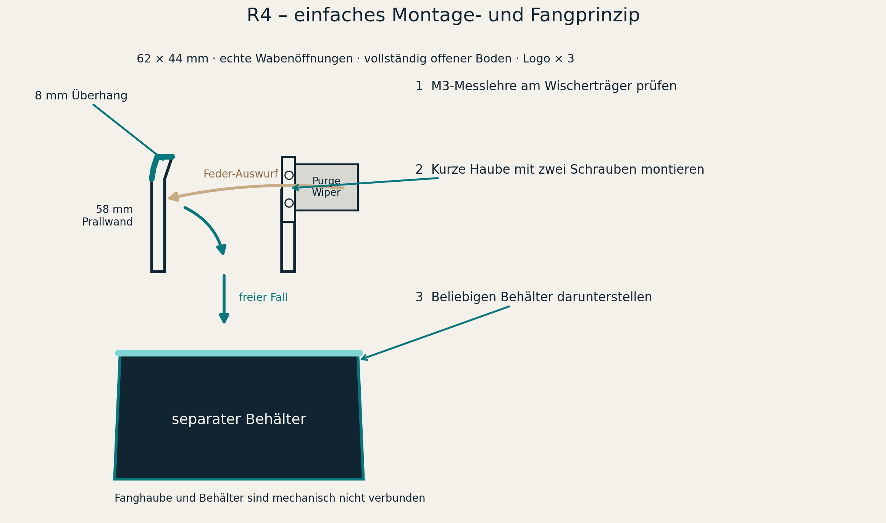
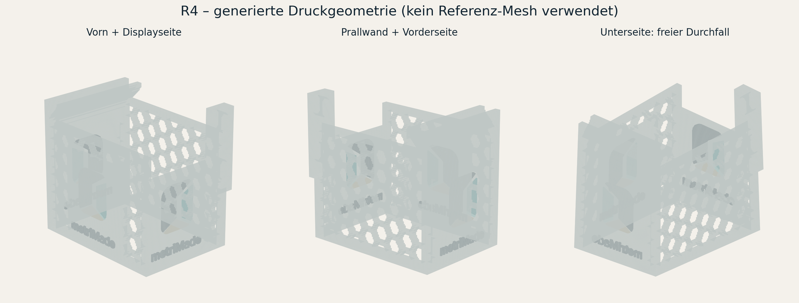
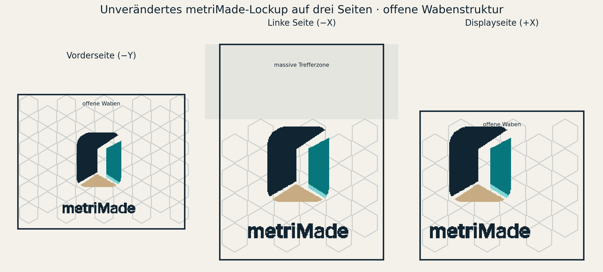

# Anycubic Kobra 3 Max – offene metriMade-Fanghaube R4

R4 ist bewusst kein Sammelbehälter mehr. Es ist eine kurze Fanghaube direkt am Purge-Wiper: Der federbelastet ausgeworfene Filamentrest trifft die hohe gegenüberliegende Wand, wird vom 8-mm-Überhang zurückgehalten und fällt durch den vollständig offenen Boden in einen frei darunterstehenden Korb oder Behälter.





## Aufbau

- Außenmaß des Fangbereichs: 62 × 44 mm.
- Prallwand gegenüber dem Wischer: 58 mm hoch.
- Massive Trefferzone ab Z = 38 mm; ab Z = 46 mm läuft die Wand um 8 mm nach innen.
- Vorder- und Rückwand: 50 mm hoch.
- Displayseite: 40 mm hohe Unterwand mit darüber offenem Einflugbereich.
- Freier Durchfall: nominell 57 × 39 mm; kein Boden, Trichter, Schieber oder Anschluss zum Unterbehälter.
- Echte Wabendurchbrüche mit 4,6 mm Zellradius und 1,5 mm Rippenbreite.
- Nur Randrahmen, Logo-Unterlagen, Schraubflansch und obere Trefferzone sind massiv.

Der Körper spart geometrisch rund 23,3 % Volumen gegenüber derselben R4-Hülle mit geschlossenen Wandfeldern. Der montierte Anteil einschließlich aller Logos wird für PETG auf rund 27,6 g geschätzt, etwa 32,7 % weniger als R3.

## Befestigung und Zusammenbau

Die Montageidee des beigefügten Beispiels wurde nur funktional ausgewertet: ein flaches seitliches Ohr nutzt dasselbe vertikale Schraubenpaar wie der Purge-Wiper. Keine Mesh-Geometrie, Kontur oder Abmessung des Beispiels wurde übernommen.

1. Zuerst `models/3mf/mount-fit-gauge-core.3mf` oder `models/stl/mount-fit-gauge.stl` drucken.
2. Am ausgeschalteten und abgekühlten Drucker prüfen, ob die beiden vertikalen Schrauben in die 8 × 4,2-mm-Langlöcher fallen.
3. Die Fanghaube so ansetzen, dass das Schlitz-Ohr an der Displayseite liegt, der offene obere Bereich direkt unter dem Wischer steht und die hohe Wand gegenüberliegt.
4. Beide Schrauben gleichmäßig befestigen. Eine längere M3-Schraube darf nur verwendet werden, wenn Gewindeeingriff und Einschraubtiefe geprüft sind.
5. Wischerpaddel, Druckkopf, Bett und Kabel bei ausgeschaltetem Drucker vollständig bewegen. Nichts darf die Fanghaube berühren.
6. Einen beliebigen Behälter mit 10–40 mm Start-Luftspalt unter die 57 × 39-mm-Fallöffnung stellen.

Der offizielle Wischer verwendet ein vertikales Schraubenpaar, veröffentlicht aber keinen Lochabstand. Die 20,0-mm-Nennteilung im Modell ist daher nur ein bildabgeleiteter Startwert; die Langlöcher decken etwa 16,2–23,8 mm ab. Das Benutzerbeispiel empfiehlt M3×10, während offizielle Ersatzteilinformationen M3×7 als Serienhardware nennen. Keine Länge wird ohne Prüfung als passend freigegeben.

## Unverändertes Logo auf drei Seiten

Verwendet wird ausschließlich `evidence/metrimade-lockup-stacked-color.svg`. Symbol, Schriftzug, relative Positionen, vollständige SVG-`viewBox`, Pfadreihenfolge, Gruppentransformationen und vier Originalfarben bleiben erhalten. Es gibt keinen Zuschnitt, keine Neuanordnung und keine Spiegelung.

Das vollständige Lockup wird direkt auf drei Außenseiten gedruckt:

- Vorderseite `−Y`
- Prallwand `−X`
- Displayseite `+X`



Weißer Körper plus Navy, Teal, Aqua und Sand ergeben fünf Materialzuweisungen. Bei nur vier Farbslots muss eine Farbe bewusst zusammengelegt oder der Druck in einem zweiten Arbeitsschritt ergänzt werden.

## Dateien für Anycubic Slicer Next

Empfohlene Reihenfolge:

1. Messlehre: `models/3mf/mount-fit-gauge-core.3mf`
2. Fanghaube: `models/3mf/metriMade-purge-catcher-3sides-5material-core.3mf`
3. Optionaler freistehender Behälter: `models/3mf/lower-bin-core.3mf`

Die R4-3MFs sind absichtlich minimale Core-3MF-Dateien mit einem direkten Meshobjekt und ohne fremde Slicer-Projektmetadaten. Falls Anycubic Slicer Next sie trotzdem nicht lädt, diese fünf STL-Dateien gemeinsam als ein Mehrteilobjekt importieren und nicht automatisch anordnen:

- `models/stl/catcher-body-white-open-honeycomb.stl`
- `models/stl/catcher-logo-navy-3sides.stl`
- `models/stl/catcher-logo-teal-3sides.stl`
- `models/stl/catcher-logo-aqua-3sides.stl`
- `models/stl/catcher-logo-sand-3sides.stl`

Alle fünf STLs besitzen dasselbe Koordinatensystem. Für einen ersten einfarbigen Funktionstest können sie demselben Filament zugeordnet werden.

## Druckstartwerte

| Einstellung | Fanghaube | Unterbehälter | Messlehre |
|---|---:|---:|---:|
| Material | PETG | PETG | PETG/Restmaterial |
| Düse | 0,4 mm | 0,4 mm | 0,4 mm |
| Schichthöhe | 0,20 mm | 0,20–0,28 mm | 0,20 mm |
| Wände | 4 | 4 | 3 |
| Infill | 0–10 % | 0 % | 100 % durch geringe Dicke |
| Support | aus | aus | aus |
| Brim | 5–8 mm | optional | nicht nötig |
| Orientierung | Unterkanten auf Druckbett | Boden auf Druckbett | flach |

Die obere Einrollung erreicht im Geometriemodell maximal 45° von der Vertikalen. Im Layer-Preview müssen Waben, beide Langlöcher, die offene Unterseite und die Logo-Unterlagen dennoch vollständig geprüft werden.

## Status

Eigene Manifold-/Volumenprüfung, offene Fallstrecke, Wabenöffnungen, Logo-Quelltreue und Core-3MF-Struktur: **PASS**. Anycubic-Slicer-Import, Maschinenpassung und reale Purge-Flugbahn: **noch offen**. Erst Messlehre und drei beaufsichtigte Purge-Zyklen erlauben die Funktionsfreigabe; Details stehen in `PRINT-CHECKLIST-DE.md`.

Reproduzierbarer Neuaufbau:

```bash
python src/generate_purge_catcher.py
```
