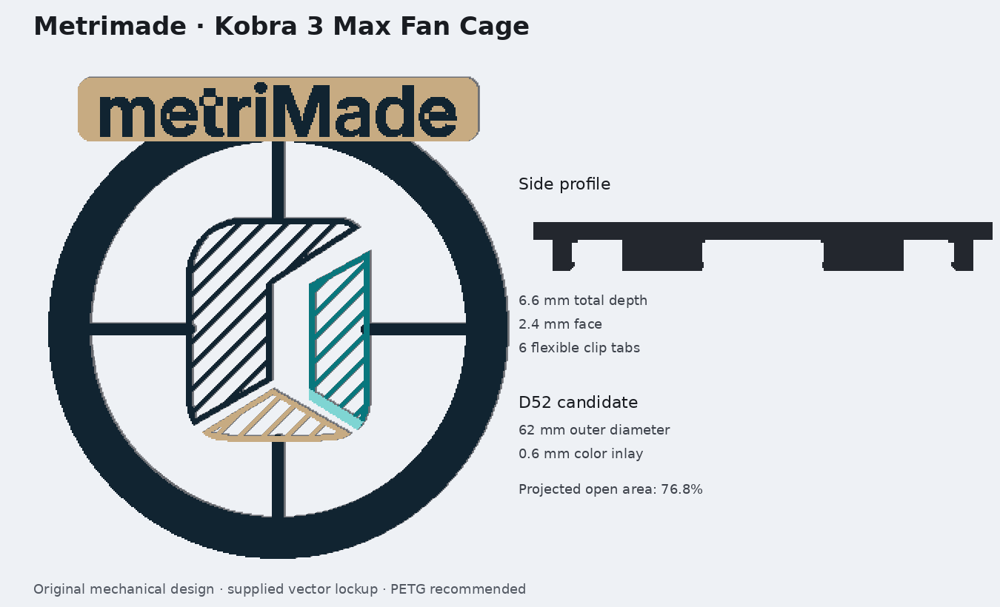

# Anycubic Kobra 3 Max – Metrimade Fan Cage

Originärer, leichter Aufsteck-Fankäfig für die runde Lüfteröffnung an der Frontschale des Kobra-3-Max-Druckkopfs. Die räumliche M-Bildmarke ist als luftdurchlässige Kontur mit Lamellen in den Lüfterkreis integriert; der originale `metriMade`-Schriftzug liegt auf einer geschlossenen sandfarbenen Fläche oberhalb des Luftstroms. Das Modell verwendet keine heruntergeladene Fremdgeometrie.

## Wichtig vor dem Vollteil

Anycubic veröffentlicht für den erhabenen runden Frontring kein bemaßtes Schnittstellenblatt. Drucke deshalb **zuerst nur eine Fit-Probe**:

1. Miss den größten Außendurchmesser des erhabenen runden Lüfterrings mit einem Messschieber an mehreren Stellen.
2. Wähle `clip_fit_test_D50.stl`, `D52` oder `D54` passend zum Messwert. Bei einem Zwischenmaß im OpenSCAD-Quellmodell `target_bezel_diameter` ändern.
3. Der Ring soll sich mit gleichmäßigem, mäßigem Druck aufschieben und ohne weiße Spannungsstellen wieder abnehmen lassen. Nichts erzwingen.
4. Erst danach die gleich bezeichnete komplette Variante drucken. `D52` ist nur der foto-basierte Startkandidat, kein behauptetes Herstellermaß.

## Dateien

| Datei | Zweck |
|---|---|
| `exports/fan_cage_metrimade_D50/D52/D54_multicolor.3mf` | Vierfarben-Baugruppen für alle drei Passgrößen; Körper bleiben ausgerichtet |
| `exports/fan_cage_D50/D52/D54_body_navy.stl` | Navy-Grundkörper samt originalem Navy-Schriftzug |
| `exports/fan_cage_D50/D52/D54_brand_teal.stl` | Teal-Ebene der Bildmarke |
| `exports/fan_cage_D50/D52/D54_brand_aqua.stl` | Aqua-Innenkante der Bildmarke |
| `exports/fan_cage_D50/D52/D54_brand_sand.stl` | Sandfarbene Bodenebene der Bildmarke |
| `exports/fan_cage_singlecolor_D50/D52/D54.stl` | Einfarbige Vollvarianten |
| `exports/clip_fit_test_D50/D52/D54.stl` | Kleine Schnittstellenproben |
| `source/fan_cage_metrimade.scad` | Editierbares parametrisches OpenSCAD-Master |
| `source/generate_fan_cage.py` | Reproduzierbarer Exportgenerator ohne externe CAD-Abhängigkeit |

## Konstruktionsmaße

| Merkmal | Wert |
|---|---:|
| Kreis-Außendurchmesser | 62.0 mm |
| Gesamt-Hüllmaß mit oberem Schild | ca. 62.0 × 65.2 mm |
| Gesamttiefe | 6.6 mm |
| Frontstärke | 2.4 mm |
| Farbinlay | 0.6 mm / 3 Schichten bei 0.2 mm |
| Federsegmente | 6 × 24°; kein Clip direkt bei 6 Uhr |
| Clip-Kandidaten | 50 / 52 / 54 mm Ziel-Außendurchmesser |
| Logo-Quellformat | geliefertes SVG, Markenzeichen und Schriftzug getrennt |
| Luftdurchlässige Bildmarke | 30.0 mm hoch; 0.8-mm-Kontur plus 0.8-mm-Lamellen bei 3.2-mm-Teilung |
| Schriftzug/Schild | 48.0 mm Wortbreite auf 54.0 × 8.8 mm Fläche |
| Projizierter offener Anteil innerhalb Ø40 mm | ca. 76.8 % |

Der offene Anteil ist eine reine 2D-Geometriekennzahl. Er ist **keine** Messung des Luftvolumenstroms oder der Hotend-Temperatur.

## Druckprofil

- Material: PETG in allen Farben; PLA nur außerhalb einer warmen Einhausung und nach Temperaturkontrolle.
- Düse: 0.4 mm; Schichthöhe 0.20 mm; Linienbreite etwa 0.42–0.46 mm.
- Orientierung: sichtbare Logo-Seite (`z=0`) flach auf das Druckbett. Keine Supports.
- Für eine saubere Videoansicht möglichst eine glatte PEI-Fläche verwenden. Eine strukturierte Platte überträgt ihre Textur sichtbar auf Logo und Schrift.
- 4 Wände, mindestens 5 Boden-/Deckschichten; Infill ist bei der dünnen Geometrie praktisch ohne Bedeutung.
- Dünnwand-/Arachne-Erkennung aktivieren. Erste Schicht langsam drucken; kein Ironing.
- Mehrfarbe: alle vier Körper als **ein zusammengesetztes Objekt** importieren. Im 3MF sind sie bereits gemeinsam platziert. ACE-Slots im Anycubic Slicer Next manuell zuweisen.

Die vier Körper verwenden direkt die SVG-Farben Navy `#112431`, Teal `#08777D`, Aqua `#7FD5D3` und Sand `#C7AB82`. Der Käfigkörper und der Schriftzug sind navy; die geschlossene Fläche hinter dem Schriftzug ist sandfarben. Dadurch bleiben Bildmarke, Schriftzug und Mechanik innerhalb der vier ACE-Slots. Die tatsächlichen Filamentfarben müssen mit gedruckten Mustern gegen das Logo abgeglichen werden.

## Montage und Funktionsprüfung

1. Drucker ausschalten und Druckkopf vollständig abkühlen lassen.
2. Käfig nur am äußeren Ring halten und gleichmäßig auf den erhabenen Frontring drücken. Keine Lasche einzeln überdehnen.
3. Prüfen, dass nichts in die vorhandenen Lüfterschlitze hineinragt, der Käfig die Frontschale nicht aufdrückt und das obere Schriftzugschild nirgends anstößt.
4. Lüfter nacheinander bei 25 %, 50 % und 100 % testen. Bei Schleifen, Pfeifen, zusätzlichen Vibrationen oder gelockerter Frontabdeckung sofort abnehmen.
5. Einen normalen Druck beobachten: Hotend-Solltemperatur, Lüftergeräusch und Extrusionsverhalten müssen gegenüber dem Zustand ohne Käfig unauffällig bleiben.

## Recherche und Unsicherheit

Die offizielle Anycubic-Anleitung zeigt die Frontschale, den mittigen Radiallüfter und die Demontagefolge. Die Frontschale wird nach Entfernen der Luftdüse über zwei rückseitige Schrauben gelöst und seitlich gedrückt; diese Originalbefestigung bleibt unangetastet. Der neue Käfig greift nur reversibel am äußeren erhabenen Frontring. Quellen und Ableitungen stehen in `reports/research.md`.

## Recht/Provenienz

- Keine fremde STL-, STEP-, 3MF- oder CAD-Geometrie wurde importiert oder nachgebaut.
- Herstellerbilder dienen nur als technische Beobachtung; sie sind nicht im Paket enthalten.
- `Anycubic` wird ausschließlich zur Kompatibilitätsbeschreibung verwendet.
- Das gelieferte `metriMade`-Logo und der zugehörige Schriftzug werden als unveränderte Vektorpfade eingebettet; die Quelldatei ist im Paket enthalten.
- Vor öffentlichem oder kommerziellem Einsatz bleibt die Marken- und Filamentfarbfreigabe beim Projektinhaber.

Der digitale Kandidat ist geometrisch geprüft. Reale Passung, Luftstrom, Kameralesbarkeit und Betriebsverhalten bleiben absichtlich als physische Freigaben offen.
