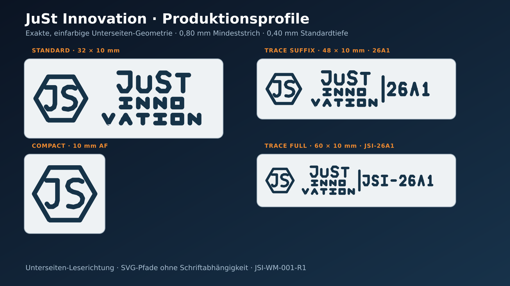

# JuSt Innovation – Produkt-Wasserzeichen

Freigegebene Produktionskandidaten für ein vertieftes Wasserzeichen auf der Druckbettseite von FDM-Bauteilen. Release `JSI-WM-001-R1`, Einheiten Millimeter.

Die CAD- und Netzgeometrie ist geprüft. Die abschließende Slicerprüfung und der reale Testdruck bleiben bewusst als Freigabeschritt offen, weil sie vom konkreten Filament, der ersten Schicht und der Druckbettoberfläche abhängen.



## Profile

| Profil | Nennhülle | Zweck | Produktionsdatei |
|---|---:|---|---|
| Compact | 10 mm über Flächen, 11,42 mm über Ecken | Kleine Produkte, reines JS-Monogramm | `just-innovation-compact-cutter-10af-d040` |
| Standard | 32 × 10 mm | Reguläre Produktkennzeichnung | `just-innovation-standard-cutter-32x10-d040` |
| Trace Suffix | 48 × 10 mm | Standardmarke plus Beispielcharge `26A1` | `just-innovation-trace-suffix-48x10-26A1-d040` |
| Trace Full | 60 × 10 mm | Standardmarke plus Beispielcode `JSI-26A1` | `just-innovation-trace-full-60x10-JSI-26A1-d040` |

Im 32-mm-Profil steht `INNOVATION` in zwei Zeilen (`INNO` / `VATION`). Diese produktionsbedingte Verfeinerung hält 0,80 mm Mindeststrich und 0,60 mm Mindestfreiraum ein; alle Markenbestandteile bleiben erhalten.

## Schnellstart

1. Zuerst den Testcoupon aus `exports/3mf/` oder `exports/stl/` flach und ohne Stützmaterial drucken.
2. Für 0,4-mm-Düse und 0,2-mm-Schichthöhe mit 0,40 mm Vertiefung beginnen.
3. Den gewählten Cutter per Boolescher Differenz von der Unterseite des Wirtskörpers abziehen. Eine Überlappung von 0,01 mm vermeidet koplanare Flächen.
4. In der Unterseitenansicht prüfen, dass `JuSt Innovation` normal lesbar ist. Je nach CAD-Flächennormale kann eine Spiegelung erforderlich sein; das OpenSCAD-Modul bietet dafür `mirror_x`.
5. Erst nach bestandenem Coupon die Marke in Serienmodelle übernehmen.

## Dateiwahl

- `exports/3mf/`: bevorzugte, maßhaltige und manifold Netzdateien mit Release- und KI-Provenienzmetadaten.
- `exports/step/`: geprüfte OpenCascade-B-Rep-Cutter für CAD-Boolean-Workflows.
- `exports/stl/`: kompatible, geschlossene Dreiecksnetze ohne Metadatencontainer.
- `exports/svg/`: geschlossene Fertigungskonturen in Millimetern, ohne Live-Schrift.
- `exports/dxf/`: R12-Polylinien auf Layer `WATERMARK`, `$INSUNITS=4` (mm).
- `source/just-innovation-watermark.scad`: parametrischer Varianten-, Tiefen- und Spiegelungswrapper.
- `exports/*/just-innovation-depth-size-test-coupon.*`: sechs getrennte Couponfelder.

Der Coupon vergleicht oben die Standardmarke bei 0,20 / 0,40 / 0,60 mm Tiefe und unten das Compact-Monogramm bei 8 / 10 / 12 mm über Flächen, jeweils mit 0,40 mm Tiefe.

## Fertigungsgrenzen

- Referenz: 0,40-mm-Düse, 0,20-mm-Schicht, PLA/PETG oder vergleichbares nicht flexibles Filament.
- Mindeststrich 0,80 mm; Mindestfreiraum 0,60 mm. Die Profile nicht unter die qualifizierten Mindestgrößen skalieren.
- Standardtiefe 0,40 mm. 0,20 und 0,60 mm nur über den Coupon vergleichen; mehr als 0,80 mm separat prüfen.
- Wirtswand mindestens 1,20 mm und nach der Vertiefung mindestens 0,80 mm Restwand. Nicht auf Dicht-, Pass-, Lager- oder hoch belastete Flächen setzen.
- Keine Stützstruktur in der Gravur. Elefantenfußkompensation und erste Schicht anhand des Coupons einstellen.
- Das Compact-Profil ist bei 10 mm qualifiziert; 8 mm ist ausschließlich ein Grenztest.

## OpenSCAD

```scad
use <source/just-innovation-watermark.scad>

jsi_subtract_watermark(
    variant = "standard",
    depth = 0.40,
    mirror_x = false
) {
    // Wirtskörper mit Unterseite bei Z=0
    cube([80, 40, 3]);
}
```

Die Ordnerstruktur muss erhalten bleiben, weil das Modul die DXF-Profile relativ importiert.

## Reproduzierbarer Build

```bash
cd build-tools
npm ci
npm run release
```

Die Erzeugung nutzt Node.js, Replicad/OpenCascade und Manifold. `npm run validate` prüft B-Rep-Status, STEP-Struktur, 3MF-Paketintegrität, STL/3MF-Topologie, Nullflächen, positive Volumina, SVG/DXF/PNG und den B-Rep/Netz-Volumenabgleich. Die physische Druckprüfung ist in `test-plan.yaml` beschrieben.

## Freigabestatus

- Anforderungen: freigegeben.
- Gestaltungskonzept: freigegeben.
- Digitale Produktionsgeometrie: bestanden.
- Slicer- und physischer Coupon-Test: ausstehend.

Das sichtbare Zeichen unterstützt Identifikation und Rückverfolgbarkeit, ersetzt aber weder Markenrecherche noch Schutzrechts-, Produkt- oder Sicherheitsprüfung.
