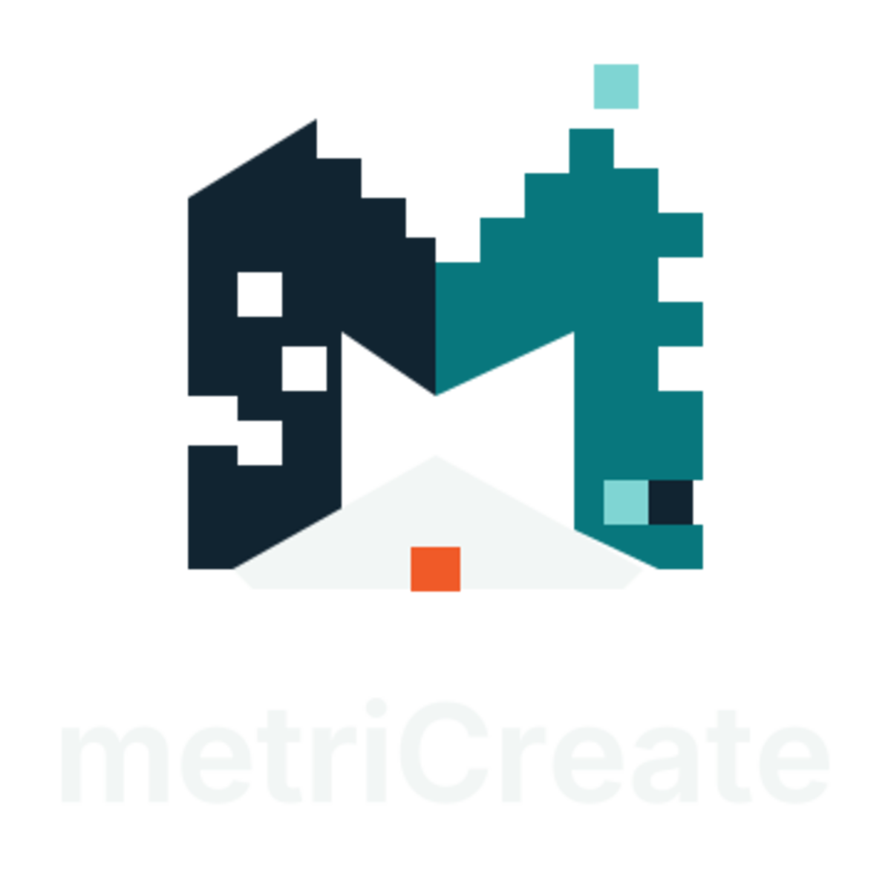

# metriCreate logo

Status: `SELECTED_VECTOR_REDRAW_CLEARANCE_PENDING`

Asset revision: `MC-BRAND-001-R1`

Selected by: Stefan Junk on 2026-08-29

The production direction is concept `04` from the [v3 sister-brand concept sheet](../../logo-concepts/metricreate-metrimade-sibling-concepts-v3.png): a clearly readable spatial `M` built from midnight-navy and teal voxel-cut planes, a detached aqua module, a fitted off-white floor and one signal-orange active block. The SVG redraw uses flat colors and explicit geometry so it remains crisp, editable and reproducible without the concept image's raster gradients or artifacts.



## Binding assets

| Use | Preferred file |
|---|---|
| Primary stacked logo on dark background | `exports/metricreate-lockup-stacked-color-dark.svg` |
| Website/header lockup on dark background | `exports/metricreate-lockup-horizontal-color-dark.svg` |
| Compact app icon/favicon | `exports/metricreate-mark-color.svg` |
| One-color or light-background production | corresponding `*-mono.svg` file |
| Raster preview only | corresponding PNG file |

Use SVG for web, print and packaging masters. PNG files are previews, not source artwork. Do not reconstruct the logo from the AI-generated concept sheet.

## Binding palette

| Role | Value |
|---|---|
| Anthracite canvas | `#0B0F12` |
| Shared midnight navy | `#112431` |
| Shared brand teal | `#08777D` |
| Shared light aqua | `#7FD5D3` |
| High-contrast off-white | `#F2F6F5` |
| Signal orange | `#F05A28` |

The wordmark is outlined from Inter Variable at weight 650. No live font remains in the SVG files. The font used for the deterministic build is licensed under the SIL Open Font License 1.1; see [the rights record](THIRD-PARTY-NOTICES.md) and `provenance.json`.

The intended rights owner is `Stefan Junk Holding UG (haftungsbeschränkt)`. That ownership and the public-use risk decision remain subject to the signed `BRD-001` record; the asset package does not itself establish trademark availability.

## Background and light-ground study

The non-binding [`MC-BRAND-001-R2` candidate study](candidates/r2-background-light-ground/README.md)
tests two responses to the color mark's background dependency: permanent
Midnight Forge carriers and controlled floor-color treatments for white or light
grounds. The R1 binding exports remain unchanged until a human selection is
recorded.

## Minimum-use rules

- Preserve the spelling and capitalization `metriCreate`.
- Keep clear space of at least one quarter of the mark width around the complete logo.
- Use the full-color logo on anthracite or near-black. Use the monochrome navy version on light backgrounds or when color reproduction is unreliable.
- Do not recolor individual planes, add gradients/shadows, rotate the mark, scatter extra voxels or place text inside the central opening.
- Keep the complete `M` silhouette intact. Detached modules are accents and must never replace a core stroke.
- Use the compact mark at no less than 24 CSS pixels for ordinary UI. At 16 pixels, use it only as the tested favicon treatment on its dark square field.
- This selection does not close `BRD-001`: trademark/name searches, visual similarity review and the signed risk decision remain open.

## Rebuild

```bash
python3 source/build_brand_assets.py
sha256sum -c manifest.sha256
```

The build requires FontTools, ImageMagick and a local Inter Variable font. The build source, concept-sheet hash, font hash and generated asset hashes are retained in this directory.

## Website integration

The shared storefront workspace uses the same mark geometry in `src/components/logo.tsx`, full color in the metriCreate header and monochrome where required. `public/metricreate-icon.svg` and `public/metricreate-apple-icon.svg` use the full-color mark on the Midnight Forge canvas. No deployment was performed as part of the logo adoption.
