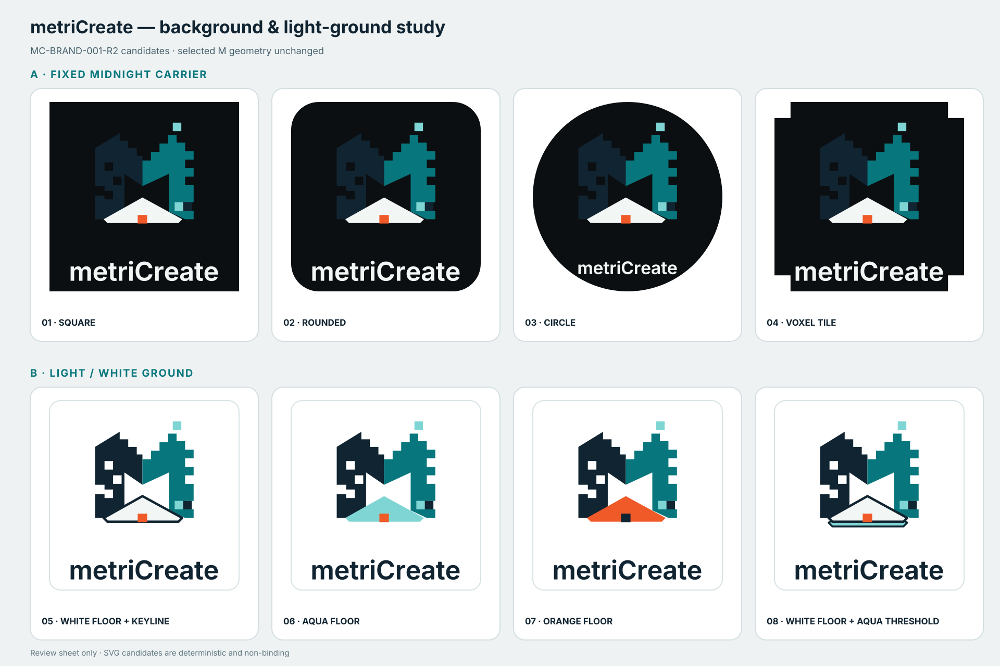

# metriCreate background and light-ground candidates

Status: `NON_BINDING_REVIEW_CANDIDATES`

Candidate revision: `MC-BRAND-001-R2`

Generated: 2026-09-04

This study responds to the observed dependency of the selected color mark on a
dark canvas. It preserves the complete `MC-BRAND-001-R1` M geometry and tests
two controlled strategies. No file in this directory replaces a binding R1
asset until a human selection is recorded.



## Series A — fixed Midnight Forge carrier

Candidates `01`–`04` keep the current mark and wordmark colors on a permanent
anthracite `#0B0F12` field. Only the carrier silhouette changes.

| Candidate | Carrier | Intended use |
|---|---|---|
| `01` | square | neutral master tile and avatar |
| `02` | rounded square | app icon, profile image and storefront card |
| `03` | circle | social avatar and seal-like placements |
| `04` | voxel-cut tile | more distinctive maker/technical badge |

## Series B — light or white ground

Candidates `05`–`08` keep the navy and teal M planes but solve the disappearing
off-white floor on a white ground in different ways.

| Candidate | Floor treatment | Assessment |
|---|---|---|
| `05` | off-white floor with navy keyline | closest to R1; most conservative adaptation |
| `06` | aqua floor | cleanest flat-color solution with no outline dependency |
| `07` | orange floor with navy active block | strongest signal color; visually louder |
| `08` | off-white floor with navy keyline and aqua threshold | preserves the white floor while giving it a fitted technical base |

Initial shortlist: `02` for a permanent background carrier, `05` for the
smallest change on white, and `08` for the strongest white-floor interpretation.
Selection should be checked at favicon, header, print and monochrome sizes before
promotion into the binding export set.

## Rebuild and verification

```bash
python3 ../../source/build_background_color_candidates.py
sha256sum -c manifest.sha256
```

The generator imports the binding R1 geometry and outlined Inter wordmark from
`source/build_brand_assets.py`; it does not trace or regenerate the logo.
