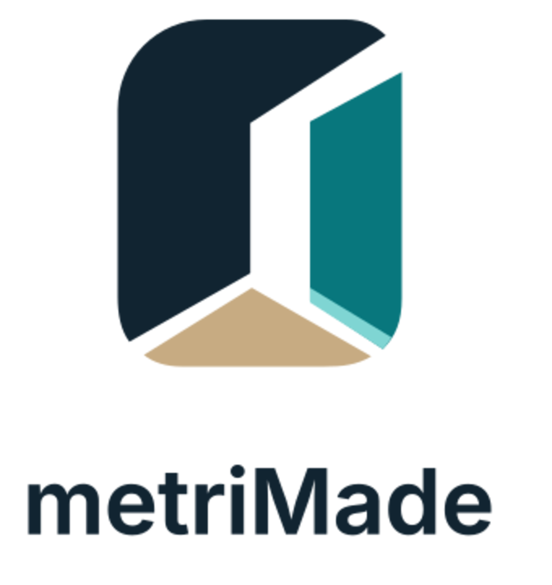

# metriMade logo

Status: `SELECTED_VECTOR_REDRAW_CLEARANCE_PENDING`  
Asset revision: `MM-BRAND-001-R1`  
Selected by: Stefan Junk on 2026-08-25

The production direction is concept `08` from the [V10 concept sheet](../../logo-concepts/metrimade-v7-04-four-color-variations-v10.png): a compact spatial `M` made from navy and teal planes, a warm fitted sand floor, and a restrained aqua inner-edge strip. The SVG redraw uses flat colors and explicit geometry so it remains crisp, editable and reproducible without the concept image's raster gradients or artifacts.



## Binding assets

| Use | Preferred file |
|---|---|
| Primary stacked logo | `exports/metrimade-lockup-stacked-color.svg` |
| Website/header lockup | `exports/metrimade-lockup-horizontal-color.svg` |
| Compact app icon/favicon | `exports/metrimade-mark-color.svg` |
| One-color production | corresponding `*-mono.svg` file |
| Raster preview only | corresponding PNG file |

Use SVG for web, print and packaging masters. PNG files are previews, not source artwork. Do not reconstruct the logo from the AI-generated concept sheet.

## Binding palette

| Role | Value |
|---|---|
| Deep navy | `#112431` |
| Brand teal | `#08777D` |
| Light aqua | `#7FD5D3` |
| Warm sand/beige | `#C7AB82` |
| Warm canvas | `#FBFAF7` |

The wordmark is outlined from Inter Variable at weight 650. No live font remains in the SVG files. The font used for the deterministic build is licensed under the SIL Open Font License 1.1; see [the rights record](THIRD-PARTY-NOTICES.md) and `provenance.json`.

The intended rights owner is `Stefan Junk Holding UG (haftungsbeschränkt)`. That ownership and the public-use risk decision remain subject to the signed `BRD-001` record; the asset package does not itself establish trademark availability.

## Minimum-use rules

- Preserve the spelling and capitalization `metriMade`.
- Keep clear space of at least one quarter of the mark width around the complete logo.
- Use the full-color logo on warm canvas, ivory or white. Use the monochrome navy version when color reproduction is unreliable.
- Do not recolor individual planes, add gradients/shadows, rotate the mark, or place text inside the spatial opening.
- Use the compact mark at no less than 24 CSS pixels for ordinary UI. Confirm favicon legibility separately at 16 pixels.
- This selection does not close `BRD-001`: trademark/name searches, visual similarity review and the signed risk decision remain open.

## Rebuild

```bash
python3 source/build_brand_assets.py
sha256sum -c manifest.sha256
```

The build requires FontTools, ImageMagick and a local Inter Variable font. The build source, concept-sheet hash, font hash and generated asset hashes are retained in this directory.

## Website integration

The current store workspace uses the same mark geometry in `src/components/logo.tsx`, full color in the header and monochrome in the dark footer. `public/icon.svg` and `public/apple-icon.svg` use the four-color mark on warm canvas. Header/footer lockups use the spelling `metriMade`. TypeScript with incremental output disabled and ESLint both pass for the changed components on 2026-08-25; no deployment was performed as part of the asset adoption.
