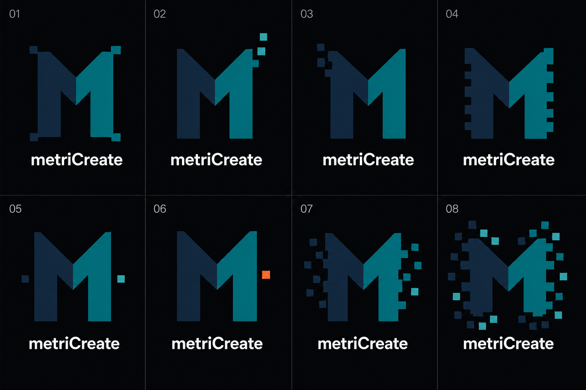

# metriCreate M-Locked Voxel Forge — v6

Status: `SUPERSEDED_BY_V3_01_SELECTION_RETAINED_AS_CORRECTION_PROVENANCE`

Generated: 2026-08-29

Generator: OpenAI built-in image generation

Selection outcome: Stefan Junk selected v3 concept `01` on 2026-09-04,
superseding the earlier v3 concept `04` / R1 selection. The binding production
candidate is [metriCreate `MC-BRAND-001-R3`](../brand-assets/metricreate/README.md).
V6 remains a useful record of the prior `M`-legibility correction, but none of
its cells is the selected logo.

Human correction: v5 was rejected because the `M` disappeared into two
separate wall-like planes. In v6, the complete uppercase `M` is a protected
invariant and voxel geometry may appear only outside its core strokes.

## Concept sheet



SHA-256: `eb9fd9863adccaaf24173f725a8e3f82a392a95ba57cfb9a495a17274855723d`

## Protected M rule

Every valid future concept must retain two complete outer stems, two continuous
inward diagonals meeting at a centered vertex, two straight inner edges and two
complete lower legs. Removing all detached voxels must leave an ordinary,
immediately readable uppercase `M`. No voxel may replace or interrupt a core
letter stroke.

## Assessment

| Concept | Direction | Assessment |
|---|---|---|
| `01` | restrained symmetric corner modules | strong M and direct voxel-family continuity; corner feet are slightly decorative |
| `02` | teal pixels rising outward | best dynamic transformation while preserving the complete M |
| `03` | navy pixels moving outward | clean mirrored alternative to `02` |
| `04` | coarse stepped outer edges | strongest static technical mark and best favicon candidate |
| `05` | one detached module per side | clearest M, but the voxel idea is comparatively quiet |
| `06` | external orange active voxel | best controlled use of the Midnight Forge orange accent |
| `07` | bilateral outward dispersion | energetic and still legible; requires a simplified micro version |
| `08` | external voxel halo | strongest overdrive expression without sacrificing the M core |

Recommended shortlist: `02`, `04`, `06`, and `08`. Use `04` as the strongest
static primary-mark candidate, `06` when the orange active-state cue should be
part of the identity, and `08` only if the deliberately exaggerated treatment
is desired at ordinary and large sizes.

## Production gate

The selected concept remains a raster exploration. Reconstruct one selected
geometry as original deterministic SVG, then derive its compact, monochrome and
motion variants from that same source. Validate at 16, 24, 32 and 64 pixels, on
light and dark backgrounds, and as an engraving. Complete the outstanding word-
and device-mark similarity review and brand-risk approval before public use.

## Prompt provenance

```text
Use case: logo-brand
Asset type: corrected metriCreate "M-Locked Voxel Forge" logo selection sheet
Input images: Image 1 is the authoritative M-shape reference. Preserve its unmistakable uppercase M construction: two tall outer vertical stems, two solid inward diagonal shoulders meeting at one centered V vertex, two straight inner vertical edges below that vertex, and two complete lower legs. Image 2 contributes only the square-voxel style from cell 04. Image 3 contributes only the square-voxel style from cell D. Image 4 is a NEGATIVE reference: its v5 marks were rejected because the M disappeared into two separate walls; do not repeat that geometry.
Primary request: Create exactly eight corrected metriCreate logo variants. Every icon must read immediately and unambiguously as a bold uppercase letter M before any voxel detail is noticed. Lock one identical solid M skeleton across all eight variants. The protected M core includes both outer stems, both diagonal strokes, the centered inner V, both straight inner edges and both lower legs. Never cut, separate, shorten, erode or replace those protected strokes. Add the digital maker-tech character only as square notches on the far OUTER silhouette or as a few detached square modules moving OUTWARD away from the letter.
Critical invariant: if all detached pixels were removed, a complete ordinary uppercase M must remain. Do not create two pillars, a doorway, an arch, an H, an N, or a pair of disconnected planes.
Variant plan: 01 two restrained symmetrical outer-corner notches; 02 three teal pixels rising outward from the right shoulder; 03 three navy pixels moving outward from the left shoulder; 04 coarse stepped outer edges optimized for favicon scale; 05 one small detached module on each side; 06 one signal-orange active voxel outside the right edge; 07 controlled bilateral outward dispersion while the M stays fully solid; 08 maximum overdrive with a protected central M and an external voxel halo.
Style/medium: flat vector-like logo marks, mechanically redrawable as SVG, crisp square modules, premium technical fabrication identity, strong small-size silhouette, not retro pixel art.
Composition/framing: exact 4 columns by 2 rows grid on a uniform near-black anthracite canvas; one large centered mark above one wordmark in every cell; generous padding; subtle dividers; label cells exactly 01 through 08.
Color palette: left half of the solid M in midnight navy #112431, right half in teal #08777D, optional restrained aqua #7FD5D3 only on detached modules, off-white #F2F6F5 for the wordmark, and signal orange #F05A28 in at most one external active voxel. Preserve high contrast. No purple.
Text (verbatim): "metriCreate" beneath every mark, exact camel case, m-e-t-r-i-C-r-e-a-t-e, exactly once per cell; no slogan or extra text; one consistent geometric sans-serif wordmark.
Constraints: M legibility has absolute priority over voxel styling; continuous solid diagonals; centered V vertex; continuous inner vertical edges; no floor shape may cover or replace the lower M; flat colors only; no gradients, glow, shadows, bevel, 3D mockup or watermark. Avoid portals, buildings, separate wall panels, generic gears, circuits, printers, nozzles, rockets, flames, shields, weapons, crypto symbols, game sprites, Space-Invader resemblance, QR-code appearance and random confetti.
```
