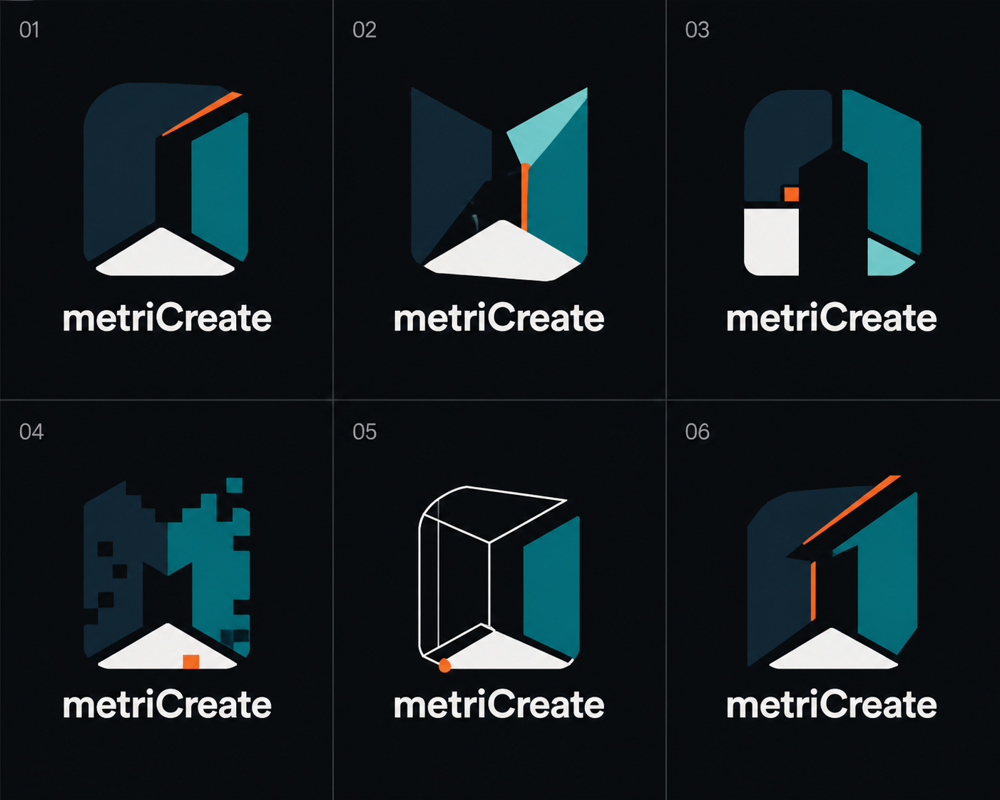
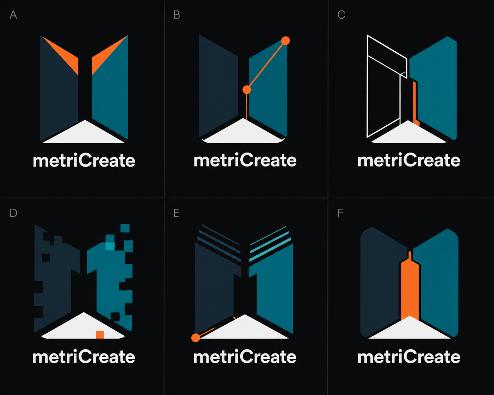

# metriCreate family evolution — v3 and v4

Status: `V3_04_SELECTED_VECTOR_R1_CLEARANCE_PENDING`

Generated: 2026-08-29

Generator: OpenAI built-in image generation

Authoritative family reference: metriMade `MM-BRAND-001-R1`

Human selection: Stefan Junk selected v3 concept `04` on 2026-08-29. The binding deterministic redraw is [metriCreate `MC-BRAND-001-R1`](../brand-assets/metricreate/README.md). This explicit selection supersedes the recommendation and all later v4-v6 shortlist exploration; the sheets remain provenance artifacts.

## Objective

Develop a `metriCreate` identity that is recognizably related to the selected
metriMade spatial `M`, but more technical, configurable and energetic. The
concepts use the Midnight Forge palette and test two intensity levels:

- v3 keeps the sister-brand relationship tight;
- v4 deliberately pushes the mark into a more aggressive maker-tech direction.

These PNG sheets are selection and provenance artifacts only. They are not
production masters and must not be traced or published as final marks.

## Concept sheets

### v3 — controlled sister-brand evolution



SHA-256: `821fc7fccab16f71db2b71d17f3d404848fc9c13f8648608d54f271da7e00f5b`

| Concept | Reading | Strength | Main risk |
|---|---|---|---|
| `01` | precision-cut Forge `M` | strongest direct family resemblance; compact and memorable | still conservative compared with the Midnight Forge site |
| `02` | parametric facet `M` | technical, dimensional and energetic | facets and the narrow orange edge need simplification at small sizes |
| `03` | modular split-plane enclosure | configurable assembly language | weaker immediate `M` reading |
| `04` | voxel-cut `M` | explicit digital fabrication cue | too busy for a primary favicon or engraving mark |
| `05` | wireframe-to-solid transition | best expression of digital model becoming a finished object | thin construction lines are unsuitable for the smallest static mark |
| `06` | angular overdrive `M` | confident, aggressive and still close to metriMade | diagonal cut needs careful optical balancing |

### v4 — Midnight Forge overdrive



SHA-256: `6f1891fd926f3410ec6d42bf27865730156228d4cf3fdcbacb17e8125c56721d`

| Concept | Reading | Strength | Main risk |
|---|---|---|---|
| `A` | split-blade Forge `M` | strongest bold primary-mark candidate; simple, distinctive and high energy | orange upper cuts must not become horn-like |
| `B` | parametric-node `M` | configuration is immediately understandable | control nodes disappear or clutter at favicon size |
| `C` | wireframe-to-solid `M` | most credible technical/CAD direction and ideal for motion | needs a simplified compact companion mark |
| `D` | modular voxel-cut `M` | experimental and maker-oriented | silhouette is noisy and generic at small sizes |
| `E` | offset scan-layer `M` | fast, digital and visually active | scan lines are fragile in print and engraving |
| `F` | fitted orange insert | boldest color blocking and simplest compact outline | central insert weakens the negative-space `M` and can suggest a rocket or nib |

## Historical recommendation before selection

Use three finalists for the next human decision:

1. `v3-01` for the clearest brand-family architecture;
2. `v4-A` for the strongest Midnight Forge primary logo;
3. `v4-C` for the most technical direction and the best animated website identity.

The recommended production route is `v4-A` if metriCreate should feel visibly
more forceful than metriMade. If long-term family recognition is more important,
select `v3-01`. The wireframe-to-solid behavior of `v4-C` is best retained as a
motion/interaction system even when it is not selected as the static mark.

The human selection resolves this step in favor of `v3-04`. Do not combine it
with the other marks. Static, monochrome and small-size variants now derive from
the single `MC-BRAND-001-R1` source geometry.

## Binding exploration palette

| Role | Value |
|---|---|
| Shared midnight | `#112431` |
| Shared teal | `#08777D` |
| Shared aqua | `#7FD5D3` |
| Midnight Forge canvas | `#0B0F12` |
| High-contrast off-white | `#F2F6F5` |
| Functional signal orange | `#F05A28` |

Orange is a structural cut, active node, fitted insert or status edge. It is not
a decorative gradient or a general replacement for teal/aqua.

## Remaining production and release gate

The selected concept has been reconstructed as original deterministic SVG
geometry rather than auto-traced from the PNG. `MC-BRAND-001-R1` includes
horizontal and stacked lockups, compact and monochrome marks, an outlined
licensed wordmark, source/provenance hashes and raster previews. Small-size,
light/dark and reproduction checks belong to the adoption validation. The
outstanding word/device-mark similarity review and brand-risk approval remain
mandatory before unrestricted public use.

## Prompt provenance

### v3 prompt

```text
Use case: logo-brand
Asset type: metriCreate sister-brand logo concept selection sheet
Input images: Image 1 is the authoritative compact metriMade mark and Image 2 is its authoritative horizontal lockup; use them only as family-DNA references, not as edit targets.
Primary request: Create exactly six original logo proposals for the sister brand "metriCreate". Each must unmistakably belong to the same brand family as the referenced metriMade spatial M, while becoming more technical, configurable, energetic and slightly more aggressive. Preserve the family idea of a compact spatial enclosure, strong M-like negative space, fitted geometric planes and a clear small-size silhouette. Explore six controlled evolutions: 1) precision-cut Forge M, 2) parametric facet M, 3) modular split-plane M, 4) voxel-cut M, 5) wireframe/solid transition M, 6) angular overdrive M. Do not simply repeat the reference mark.
Style/medium: flat vector-like logo construction, mechanically redrawable as SVG, crisp hard geometry, premium maker-tech, no photorealism.
Composition/framing: clean 3 columns by 2 rows grid on a uniform near-black anthracite canvas; exactly one centered compact mark above one wordmark in every cell; large generous margins; thin subtle grid dividers; number cells 01 through 06 only.
Color palette: shared midnight navy #112431, teal #08777D and aqua #7FD5D3; use off-white #F2F6F5 for negative space and wordmark legibility; use signal orange #F05A28 only as a small structural cut, active edge, node or fitted accent. No purple. Sand may appear only as a tiny optional family echo, never dominant.
Text (verbatim): "metriCreate" beneath every mark, exact camel case, m-e-t-r-i-C-r-e-a-t-e. Render exactly once per cell with no slogan and no extra words. Use a clean geometric sans-serif related to the referenced wordmark; emphasize the capital C subtly, not through gimmicks.
Constraints: exactly six distinct but related concepts; retain an M-family silhouette; scalable and favicon-capable; flat colors only; balanced negative space; no generic gear, printer, nozzle, rocket, circuit-board cliché, unsafe or weapon-like imagery; no gradients, glow, shadow, bevel, mockup, 3D rendering, watermark or decorative background.
```

### v4 prompt

```text
Use case: logo-brand
Asset type: metriCreate "Overdrive" logo concept selection sheet
Input images: Image 1 is the authoritative metriMade spatial mark and defines the family DNA. Image 2 is the preceding controlled metriCreate concept sheet and defines the starting level of technical evolution. Generate a new sister-brand exploration, not an edit or duplicate.
Primary request: Create exactly six new, bolder, more exaggerated logo proposals for "metriCreate". Push the shared spatial M into a distinctive Midnight Forge maker-tech identity while keeping obvious family resemblance and professional credibility. Each symbol must still read first as a compact M-family spatial enclosure, but may add aggressive precision cuts, split armor-like planes, one parametric control node, CAD construction outlines, voxel notches, scan offsets, fitted tabs or a wireframe-to-solid transition. The exaggeration should feel like advanced configurable fabrication, not esports.
Style/medium: original flat vector-like marks, crisp mechanically redrawable geometry, high-energy industrial design, strong silhouette, no photorealism.
Composition/framing: exact 3 columns by 2 rows selection grid on uniform near-black anthracite; one large centered icon above one wordmark per cell; generous padding; subtle divider lines; label cells exactly A through F only.
Color palette: midnight navy #112431, teal #08777D, aqua #7FD5D3, off-white #F2F6F5, and signal orange #F05A28. Orange can be more visible than in the controlled sheet but remains one functional plane/cut/node, never a flame or decorative glow. No purple, red or neon gradients.
Text (verbatim): "metriCreate" beneath every symbol, exact camel case, m-e-t-r-i-C-r-e-a-t-e, rendered exactly once per cell; no slogan, no other words. Geometric sans-serif related to the metriMade wordmark, with the capital C subtly emphasized.
Concept families: A split-blade forge M; B parametric-node M; C wireframe-to-solid M; D modular voxel-cut M; E offset scan-layer M; F monolithic overdrive M with a fitted orange structural insert.
Constraints: six truly distinct marks; remain scalable and legible at favicon size; preserve meaningful negative space; flat colors only; no gear, printer, nozzle, rocket, flame, shield, weapon, animal, circuit-board pattern, hexagon cliché, crypto token, gradients, glow, shadows, bevel, 3D mockup, watermark or background decoration.
```
