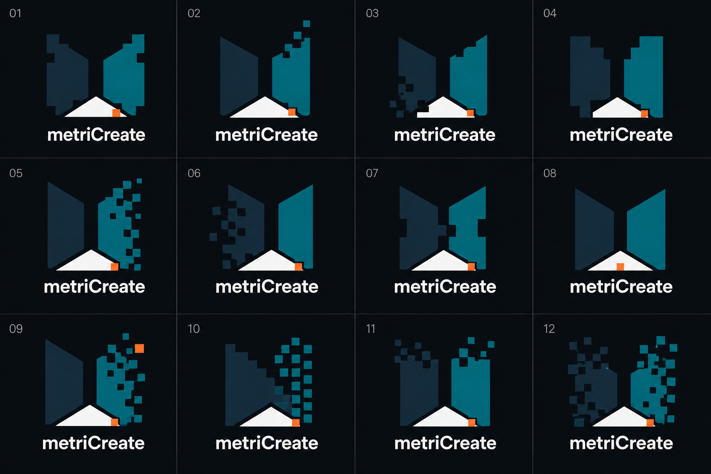

# metriCreate Voxel Forge — v5

Status: `REJECTED_M_LEGIBILITY_2026-08-29`

Generated: 2026-08-29

Generator: OpenAI built-in image generation

Human direction: Stefan Junk selected `v3-04` and `v4-D` for further exploration.

Human review: this entire v5 sheet was rejected because the uppercase `M` was
lost in the wall-like split-plane construction. The corrected exploration is
[M-Locked Voxel Forge v6](metricreate-m-locked-voxel-forge-v6.md). The
assessment below is retained only as immutable concept provenance.

## Objective

Develop the selected voxel-cut spatial `M` into a coherent metriCreate logo
family. The twelve variants preserve the navy/teal spatial planes, central `M`
opening and fitted off-white floor while varying square-module size, density,
direction and signal-orange placement.

## Concept sheet



SHA-256: `24c9dc24c6179abc83ff641bfda95ccd9b02fb47f534d18ee4c71ff905211c5f`

## Assessment

| Concept | Direction | Assessment |
|---|---|---|
| `01` | coarse balanced corner notches | strongest direct continuation of `04` and `D`; clear and compact |
| `02` | teal plane resolving upward | dynamic and optimistic; strongest directional motion |
| `03` | navy plane dissolving downward | technical, but can look damaged rather than configurable |
| `04` | restrained large stepped voxels | best favicon and small-size candidate |
| `05` | dense right-side digital erosion | energetic and distinctive; requires a simplified micro mark |
| `06` | left-side internal erosion | interesting depth, but the left plane becomes visually noisy |
| `07` | central modular interlock | communicates fit/configuration; slightly weakens the open `M` |
| `08` | clean planes with active floor voxel | highly scalable, but less characteristic of the selected voxel family |
| `09` | teal dispersion with floating orange voxel | most expressive active/configurable-state candidate |
| `10` | diagonal solid-to-module transition | strongest transformation story; reduced symmetry |
| `11` | restrained pixel crown | balanced compromise between clean body and digital activity |
| `12` | maximum bilateral fragmentation | strongest overdrive statement; unsuitable as the only small-size mark |

No v5 concept may advance. The former shortlist (`01`, `02`, `04`, `09`, and
`12`) is superseded by the protected-M rule documented in v6.

## Production gate

The selected concept remains a raster exploration. Reconstruct it as original,
deterministic SVG geometry rather than tracing this PNG. Validate the resulting
mark at 16, 24, 32 and 64 pixels, in monochrome, on light and dark backgrounds,
and as an engraving before website adoption. Complete the outstanding word- and
device-mark similarity review and brand-risk approval before public release.

## Prompt provenance

```text
Use case: logo-brand
Asset type: focused metriCreate "Voxel Forge" logo selection sheet
Input images: Image 1 is a prior controlled metriCreate concept sheet; use only cell 04 as an authoritative form reference. Image 2 is a prior overdrive concept sheet; use only cell D as an authoritative form reference. Ignore the geometry of every other cell. These are references, not edit targets.
Primary request: Create exactly twelve new close variants descended from reference 04 and reference D. Preserve their defining visual DNA: a strong spatial uppercase M made from one midnight-navy left plane and one teal right plane, a completely readable central M opening, a fitted off-white triangular floor, and selective square voxel cutouts or detached square modules along the outer silhouette. Explore controlled variations in voxel scale, density, asymmetry, erosion direction, stepped edges, attached versus detached blocks, one active orange voxel, and solid-to-digital transitions. Keep every proposal recognizably in the same family; do not introduce unrelated logo ideas.
Variant plan: 01 coarse symmetrical corner notches; 02 pixels rising from the teal upper edge; 03 pixels dissolving from navy lower edge; 04 restrained large-voxel silhouette for favicon use; 05 asymmetric right-side digital erosion; 06 asymmetric left-side digital erosion; 07 paired modular tabs and sockets; 08 central orange active voxel at the floor; 09 one orange voxel floating in the teal dispersion; 10 stepped scan transition from solid navy to teal modules; 11 compact pixel crown with clean lower body; 12 maximum controlled fragmentation while retaining a clear M.
Style/medium: flat vector-like logo concepts, mechanically redrawable as SVG, crisp square modules, strong silhouette, premium maker-tech rather than retro pixel-art.
Composition/framing: exact 4 columns by 3 rows grid on a uniform near-black anthracite canvas; exactly one centered compact mark above one wordmark per cell; generous consistent padding; thin subtle dividers; number cells exactly 01 through 12.
Color palette: midnight navy #112431, teal #08777D, restrained aqua #7FD5D3, off-white #F2F6F5, signal orange #F05A28 used in at most one functional square or fitted tab per concept. No purple.
Text (verbatim): "metriCreate" beneath every mark, exact camel case, m-e-t-r-i-C-r-e-a-t-e, exactly once per cell; no slogan and no other words. Use the same clean geometric sans-serif treatment throughout.
Constraints: the central M must remain immediately readable in every cell; voxel cutouts must be intentional square geometry, not noise; include both attached cutouts and a few detached modules; flat colors only; scalable; no gradients, glow, shadow, bevel, 3D mockup or watermark. Avoid generic gears, circuits, printers, nozzles, rockets, flames, shields, weapons, crypto symbols, game sprites, Space-Invader resemblance, QR-code appearance and random confetti.
```
