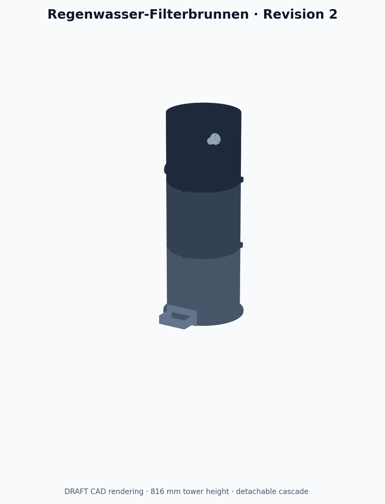

# Regenwasser-Filterbrunnen für Pool · Revision 2



Revision 2 ist als parametrischer DRAFT-Freigabekandidat umgesetzt. Das freigegebene Konzept wurde in drei offene, drucklose Filterstufen überführt; STEP- und STL-Dateien sind erzeugt und geometrisch geprüft. Eine finale Druck-/Produktfreigabe ist noch nicht erteilt, weil Slicer-Toolpaths und physische Funktionsprüfungen ausstehen.

## Aufbau

| Stufe | Funktion | Wartungsteil |
|---|---|---|
| 1 · Wirbelabscheider | tangentialer 18-mm-Zulauf, ruhiger zentraler 40-mm-Klarwasserabzug, Schlammablass | herausnehmbarer Sedimenttrichter |
| 2 · Lamellenabscheider | geschützte 32-mm-Fallleitung, Diffusor, 12 Lamellen bei 60°, 40-mm-Überlauf | Lamellenkassette, Fallrohr, Diffusor |
| 3 · Medienfilter | Verteiler, drei sequenzielle Medienkörbe, 80-mm-Notüberlauf | drei Körbe und Verteilerplatte |

Der sichtbare Kaskadenauslauf kann gegen einen 25-mm-Schlauchadapter getauscht werden. Zwei Modulübergänge werden jeweils mit drei M6-Verbindungen gesichert. Vier 9-mm-Bohrungen im Standflansch sind ausschließlich für eine passende Kippsicherung auf dem konkreten Untergrund vorgesehen.

## Eckdaten des CAD-Stands

- Auslegungspunkt: 800 L/h; Einstellbereich 400–1.200 L/h
- Gehäuse: 300 mm Außendurchmesser, je 280 mm hoch
- montiert: 816 mm hoch; Standdurchmesser 330 mm; mit Kaskade etwa 330 × 406 mm Stellfläche
- Werkstoffvorgabe: UV-stabilisiertes, blickdichtes PETG
- Zielprozess: 0,6-mm-Düse, 0,28-mm-Schicht, 4,8-mm-Wasserwand, 6,0-mm-Basis
- Drucker-Hüllraum: Anycubic Kobra 3 Max, 420 × 420 × 500 mm
- vollständiger Dateisatz einschließlich Alternativauslauf und Coupon: etwa 10,15 kg modelliertes PETG; Basiskonfiguration etwa 9,96 kg

Die Materialmenge ist eine direkte Folge der freigegebenen 4,8-mm-Wasserwand und der drei großformatigen Gehäuse. Sie entspricht ungefähr zehn 1-kg-Spulen zuzüglich Ausschuss und Kalibrierung. Die reine theoretische Extrusionszeit liegt bei 8–10 mm³/s bereits bei etwa 222–277 Stunden; eine belastbare Druckzeit darf erst der konkrete Slicer liefern.

## Dateien

- `src/parameters.mjs`: alle Konstruktionsparameter und Plausibilitätsregeln
- `src/geometry.mjs`: parametrische OpenCascade-Geometrie
- `src/watermark.mjs`: exakter DXF-Import der freigegebenen JuSt-Kontur
- `build/draft-r2/step/`: Einzelteile und Baugruppe als STEP
- `build/draft-r2/stl/`: druckorientierte Einzelteile als binäre STL
- `build/draft-r2/renders/`: Montage-, Schnitt-, Explosions- und Kennzeichnungsansichten
- `build/draft-r2/metadata/`: CAD- und unabhängige STL-Prüfdaten
- `BOM.md`, `ASSEMBLY.md`, `PRINTING.md`, `HYDRAULICS.md`, `TEST-PLAN.md`, `VALIDATION.md`: Fertigungs- und Prüfdokumentation

## Reproduzierbarer Build

Voraussetzungen sind Node.js 20+ und Python 3 mit NumPy und Matplotlib.

```bash
npm install
npm run check
npm run build
python3 scripts/validate_stl.py build/draft-r2/stl \
  --metadata build/draft-r2/metadata/geometry-metadata.json \
  --json build/draft-r2/metadata/stl-validation.json \
  --markdown build/draft-r2/metadata/stl-validation.md
```

## Freigabestatus

- Anforderungen R2: freigegeben
- Konzept R2: freigegeben
- B-Rep/STL-Geometrie: bestanden, 14/14 Typen
- JuSt-Kontur: in allen drei Primärgehäusen integriert und geometrisch regressionsgeprüft
- Slicer-Dry-Run: offen
- Pass-, Dichtheits-, Durchfluss-, Überlauf- und Kippprüfung: offen
- finale Modellfreigabe: offen

Das System ist ein mechanischer, offener Vorfilter. Es ist kein Druckbehälter, keine Trinkwasseraufbereitung und kein Ersatz für Poolfiltration, Desinfektion und pH-Regelung. Vor dem Filter bleiben Laubfang und First-Flush-Abscheider erforderlich.

