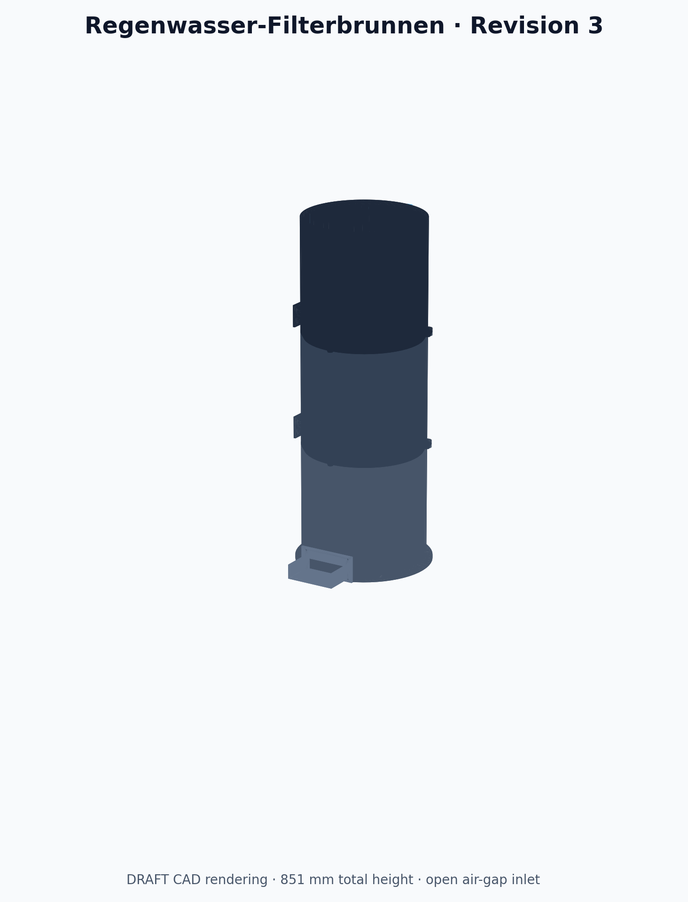

# Regenwasser-Filterbrunnen für Pool · Revision 3



Revision 3 setzt das freigegebene Konzept als parametrischen DRAFT-Freigabekandidaten um. Der Zulauf ist jetzt ein offener, belüfteter Einlaufbecher ohne hydraulischen Mindestdurchfluss; Stufe 1 und Stufe 2 besitzen getrennte, bodennahe DN25-Schlammablässe. STEP- und STL-Dateien sind erzeugt und digital geprüft. Eine finale Druck-/Produktfreigabe ist noch nicht erteilt, weil Slicer-Toolpaths und physische Funktionstests ausstehen.

## Aufbau

| Stufe | Funktion | Wartung |
|---|---|---|
| 1 · Wirbelabscheider | 25-mm-Pumpenschlauch mit 15-mm-Luftspalt über offenem Becher; 32-mm-Fallrohr; getauchter tangentialer 28-mm-Auslass; zentraler 40-mm-Klarwasserabzug | herausnehmbarer Trichter, mindestens 10-mm-Schlammspalt, eigener DN25-Ablass |
| 2 · Lamellenabscheider | geschütztes 32-mm-Fallrohr, Diffusor, aufwärts gerichtete Strömung durch 12 Lamellen bei 60° | 5,02° Sedimentboden, 18,8-mm-Mindestabstand, eigener DN25-Ablass, herausnehmbare Kassette |
| 3 · Medienfilter | Verteiler und drei sequenzielle Medienkörbe; sichtbarer Normal- und Notüberlauf | drei Körbe und Verteilerplatte von oben entnehmbar |

Der offene Zulaufbecher trennt Pumpenschlauch und Behälter hydraulisch. Bei 0 L/h steht das bereits gefüllte System still; oberhalb 0 L/h gibt es keine definierte Mindestmenge. Bei kleinen Mengen überwiegt das ruhige Absetzen, bei größeren Mengen bildet sich in Stufe 1 der gewünschte Volumenwirbel.

## Eckdaten

- Betriebsbereich: 0–1.200 L/h; Auslegungspunkt 800 L/h
- Gehäuse: 300 mm Außendurchmesser, je 280 mm hoch
- montiert: 851 mm hoch einschließlich Schlauchhalter; Standdurchmesser 330 mm; mit Kaskade etwa 330 × 406 mm Stellfläche
- Werkstoffvorgabe: UV-stabilisiertes, blickdichtes PETG
- Zielprozess: 0,6-mm-Düse, 0,28-mm-Schicht, 4,8-mm-Wasserwand, 6,0-mm-Basis
- Drucker-Hüllraum: Anycubic Kobra 3 Max, 420 × 420 × 500 mm
- 17 druckbare Teiltypen; Basiskonfiguration etwa 10,27 kg, vollständiger Alternativ-/Coupon-Satz etwa 10,55 kg modelliertes PETG

Die analytische Zulaufrechnung ergibt bei 1.200 L/h rund 38,9 mm erforderliche Differenzhöhe am 28-mm-Auslass und etwa 9,6 mm Reserve bis zum Becher-Notüberlauf. Das ist eine Plausibilisierung, keine Leistungszusage; der Nasslauf ist verbindlich.

## Dateien

- `src/parameters.mjs`: Konstruktionsparameter und Plausibilitätsregeln
- `src/geometry.mjs`: parametrische OpenCascade-Geometrie
- `build/draft-r3/step/`: Einzelteile und Baugruppe als STEP
- `build/draft-r3/stl/`: druckorientierte Einzelteile als binäre STL
- `build/draft-r3/renders/`: Montage-, Schnitt-, Explosions- und Kennzeichnungsansichten
- `build/draft-r3/metadata/`: CAD-, STL-, Schnittstellen- und Hashnachweise
- `BOM.md`, `ASSEMBLY.md`, `PRINTING.md`, `HYDRAULICS.md`, `TEST-PLAN.md`, `VALIDATION.md`: Fertigungs- und Prüfdokumentation

## Reproduzierbarer Build

Voraussetzungen sind Node.js 20+ und Python 3 mit NumPy und Matplotlib.

```bash
npm install
npm run check
npm run verify
python3 scripts/hash_candidate.py --project-root . \
  --output build/draft-r3/metadata/candidate-hash.json
```

## Freigabestatus

- Anforderungen R3: freigegeben
- Konzept R3: freigegeben
- B-Rep/STL-Geometrie: bestanden, 17/17 Teiltypen
- R3-Schnittstellen- und Hydraulikprüfung: bestanden, 11/11 Kriterien
- JuSt-Kontur: in allen drei Primärgehäusen integriert und regressionsgeprüft
- Slicer-Dry-Run sowie Pass-, Dichtheits-, Schlamm-, Durchfluss-, Überlauf- und Kippprüfung: offen
- finale Modellfreigabe: offen

Das System ist ein offener mechanischer Vorfilter. Es ist kein Druckbehälter, keine Trinkwasseraufbereitung und kein Ersatz für Poolfiltration, Desinfektion und pH-Regelung. Vor dem Filter bleiben Laubfang und First-Flush-Abscheider erforderlich.
