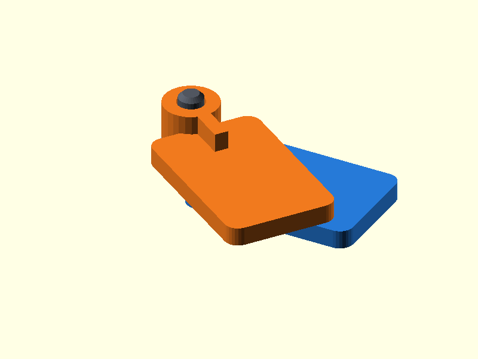

# 002 — Versetztes Stiftgelenk

**Variante:** standard  
**Kategorie:** Eindimensionale Drehbewegung  
**Mechanikfamilie:** `offset-pin-hinge`

## Status und Qualifikation

- Artefaktstatus: `base-release-1.0.0`
- Qualifikationsstatus: `unqualified`
- Einordnung: Basismuster aus Release 1.0.0; im DRAFT-Prüfpunkt 1.1.0 nicht physisch requalifiziert.
- Anspruchsgrenze: Digitale Geometrieprüfung ist keine Funktions-, Last-, Dichtheits-, Lebensdauer- oder Sicherheitsqualifikation.

## Prinzip

Zwei flach druckbare Gelenkblätter werden axial gestapelt und mit einem herausnehmbaren Stift verbunden.

## Typische Verwendung

Deckel, Klappen, kleine Robotermechanik und Gehäuse, bei denen ein austauschbarer Gelenkstift gewünscht ist.

## Enthaltene Dateien

- `model.scad` — parametrische OpenSCAD-Quelle
- `print_plate.stl` — Druckanordnung des 1.0.0-Basispakets; in diesem DRAFT nicht neu qualifiziert
- `preview.png` — Explosions-/Montagevorschau
- `parts/part_XX.stl` — automatisch getrennte Einzelkörper für CAD-Import
- `components.json` — Abmessungen und ursprüngliche Position jeder Komponente
- `metadata.json` — maschinenlesbare Dokumentation

Vorgesehene Komponenten:

- Gelenkblatt A
- Gelenkblatt B
- Stift

## Parameter dieser Variante

- `clearance`: `0.25`
- `pin_d`: `4`
- `leaf_l`: `28`

**Variantenhinweis:** Universeller Startwert für PLA/PETG.

## FDM-Empfehlung

- Material: PLA, PETG, PA
- Düse: 0.4 mm
- Schichthöhe: 0.2 mm
- Außenlinien: mindestens 4
- Infill: 25 % als Startwert; funktionskritische Bereiche bei Bedarf lokal erhöhen
- Supportbedarf: grundsätzlich gering; die familienspezifischen Hinweise und die eigene Slicer-Vorschau beachten

Alle drei Körper stehen bereits druckgerecht. Stift mit mindestens vier Außenlinien drucken.

## Montage und Nacharbeit

Bohrungen entgraten, Stift trocken einpassen und bei Bedarf leicht polieren.

## Integration in ein Projekt

Die äußeren Plattenbereiche können in ein Projekt verschmolzen oder über Schraublöcher ergänzt werden. Gelenkachse und Knöchelhöhe unverändert halten.

## Fremdteile

Kein Fremdteil; optional Metallstift gleichen Durchmessers.

## Grenzen und Sicherheit

Die Blätter liegen axial versetzt. Für hohe Lasten Metallstift und größere Wandstärke verwenden.

Die Geometrie wurde digital auf geschlossene, positive Volumenkörper geprüft. Sie wurde nicht physisch auf jedem Drucker und Material gedruckt. Vor Lastanwendung zuerst die passende Toleranzvariante testen. Nicht für Personenlasten, Schutzfunktionen oder sonstige sicherheitskritische Anwendungen verwenden.
