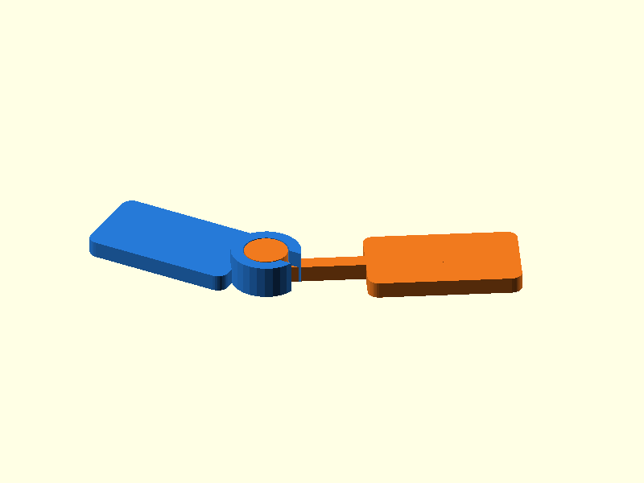

# 005 — Print-in-Place-Flachdrehgelenk

**Variante:** 0,20 mm  
**Kategorie:** Eindimensionale Drehbewegung  
**Mechanikfamilie:** `print-in-place-pivot`

## Status und Qualifikation

- Artefaktstatus: `base-release-1.0.0`
- Qualifikationsstatus: `unqualified`
- Einordnung: Basismuster aus Release 1.0.0; im DRAFT-Prüfpunkt 1.1.0 nicht physisch requalifiziert.
- Anspruchsgrenze: Digitale Geometrieprüfung ist keine Funktions-, Last-, Dichtheits-, Lebensdauer- oder Sicherheitsqualifikation.

## Prinzip

Ein C-förmiger Außenring hält einen getrennt gedruckten Innenzapfen; beide Körper entstehen in einer Druckoperation.

## Typische Verwendung

Flache Klappen, Zeiger, kleine Hebel und Demonstratoren mit begrenztem Drehwinkel.

## Enthaltene Dateien

- `model.scad` — parametrische OpenSCAD-Quelle
- `print_plate.stl` — Druckanordnung des 1.0.0-Basispakets; in diesem DRAFT nicht neu qualifiziert
- `preview.png` — Explosions-/Montagevorschau
- `parts/part_XX.stl` — automatisch getrennte Einzelkörper für CAD-Import
- `components.json` — Abmessungen und ursprüngliche Position jeder Komponente
- `metadata.json` — maschinenlesbare Dokumentation

Vorgesehene Komponenten:

- Außenring mit Blatt
- Innenzapfen mit Blatt

> **Print-in-Place:** Für die vorgesehene Funktion muss `print_plate.stl` als unveränderte gemeinsame Anordnung gedruckt werden. Die Dateien unter `parts/` dienen nur zur Geometrieinspektion oder Weiterkonstruktion.

## Parameter dieser Variante

- `clearance`: `0.2`
- `core_d`: `8`

**Variantenhinweis:** Eng für kalibrierte PLA-Drucke.

## FDM-Empfehlung

- Material: PLA, PETG
- Düse: 0.4 mm
- Schichthöhe: 0.2 mm
- Außenlinien: mindestens 4
- Infill: 25 % als Startwert; funktionskritische Bereiche bei Bedarf lokal erhöhen
- Supportbedarf: grundsätzlich gering; die familienspezifischen Hinweise und die eigene Slicer-Vorschau beachten

Als gemeinsame `print_plate.stl` drucken, nicht als separat platzierte Körper. Erste Schicht nicht überquetschen.

## Montage und Nacharbeit

Nach dem Abkühlen vorsichtig lösen und mehrfach bewegen.

## Integration in ein Projekt

Die beiden Anschlussplatten dürfen verlängert werden; radialen Spalt und C-Öffnung nicht schließen.

## Fremdteile

Kein Fremdteil.

## Grenzen und Sicherheit

Begrenzter Drehwinkel; starkes Elephant-Foot kann die Körper verbinden.

Die Geometrie wurde digital auf geschlossene, positive Volumenkörper geprüft. Sie wurde nicht physisch auf jedem Drucker und Material gedruckt. Vor Lastanwendung zuerst die passende Toleranzvariante testen. Nicht für Personenlasten, Schutzfunktionen oder sonstige sicherheitskritische Anwendungen verwenden.
