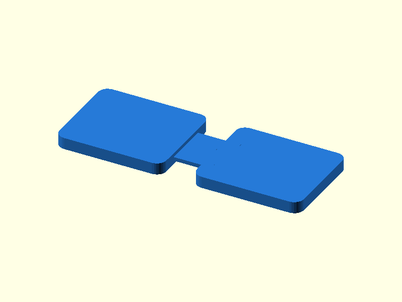

# 011 — Dünnsteg-Festkörpergelenk

**Variante:** steif 1,0 mm  
**Kategorie:** Eindimensionale Drehbewegung  
**Mechanikfamilie:** `thin-section-flexure-hinge`

## Status und Qualifikation

- Artefaktstatus: `base-release-1.0.0`
- Qualifikationsstatus: `unqualified`
- Einordnung: Basismuster aus Release 1.0.0; im DRAFT-Prüfpunkt 1.1.0 nicht physisch requalifiziert.
- Anspruchsgrenze: Digitale Geometrieprüfung ist keine Funktions-, Last-, Dichtheits-, Lebensdauer- oder Sicherheitsqualifikation.

## Prinzip

Zwei starre Platten sind durch einen lokal dünnen, biegeweichen Steg verbunden.

## Typische Verwendung

Kleine Ausschläge ohne Spiel, Sensorhalter, Justageelemente und selten betätigte Deckel.

## Enthaltene Dateien

- `model.scad` — parametrische OpenSCAD-Quelle
- `print_plate.stl` — Druckanordnung des 1.0.0-Basispakets; in diesem DRAFT nicht neu qualifiziert
- `preview.png` — Explosions-/Montagevorschau
- `parts/part_XX.stl` — automatisch getrennte Einzelkörper für CAD-Import
- `components.json` — Abmessungen und ursprüngliche Position jeder Komponente
- `metadata.json` — maschinenlesbare Dokumentation

Vorgesehene Komponenten:

- Festkörpergelenk

## Parameter dieser Variante

- `beam_t`: `1.0`
- `beam_w`: `12`
- `gap`: `8`

**Variantenhinweis:** Mehr Rückstellkraft.

## FDM-Empfehlung

- Material: PETG, PA, PP
- Düse: 0.4 mm
- Schichthöhe: 0.2 mm
- Außenlinien: mindestens 4
- Infill: 25 % als Startwert; funktionskritische Bereiche bei Bedarf lokal erhöhen
- Supportbedarf: grundsätzlich gering; die familienspezifischen Hinweise und die eigene Slicer-Vorschau beachten

Flach drucken. Für wiederholte Biegung PETG, PA oder PP bevorzugen; 100 % Linienfüllung im Steg.

## Montage und Nacharbeit

Langsam einbiegen und maximalen Winkel schrittweise bestimmen.

## Integration in ein Projekt

Den Steg entlang der vorgesehenen Biegeachse ausrichten und Kerben oder scharfe Ecken vermeiden.

## Fremdteile

Kein Fremdteil.

## Grenzen und Sicherheit

Kein endlos rotierendes Gelenk; Lebensdauer hängt stark von Material, Layerhaftung und Winkel ab.

Die Geometrie wurde digital auf geschlossene, positive Volumenkörper geprüft. Sie wurde nicht physisch auf jedem Drucker und Material gedruckt. Vor Lastanwendung zuerst die passende Toleranzvariante testen. Nicht für Personenlasten, Schutzfunktionen oder sonstige sicherheitskritische Anwendungen verwenden.
