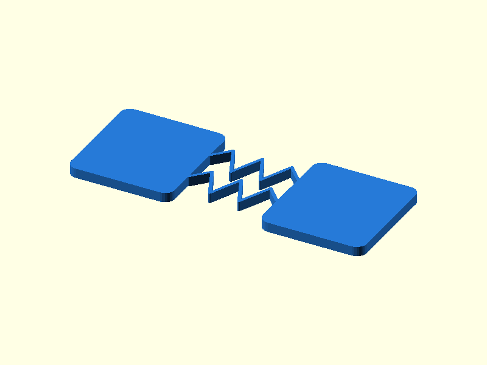

# 013 — Serpentinen-Filmgelenk

**Variante:** 0,8 mm Bahn  
**Kategorie:** Eindimensionale Drehbewegung  
**Mechanikfamilie:** `serpentine-living-hinge`

## Status und Qualifikation

- Artefaktstatus: `base-release-1.0.0`
- Qualifikationsstatus: `unqualified`
- Einordnung: Basismuster aus Release 1.0.0; im DRAFT-Prüfpunkt 1.1.0 nicht physisch requalifiziert.
- Anspruchsgrenze: Digitale Geometrieprüfung ist keine Funktions-, Last-, Dichtheits-, Lebensdauer- oder Sicherheitsqualifikation.

## Prinzip

Zwei meanderförmige Federbahnen verteilen die Dehnung über eine längere Strecke.

## Typische Verwendung

Wiederholt betätigte leichte Klappen, flexible Verbinder und Bewegungsentkopplung.

## Enthaltene Dateien

- `model.scad` — parametrische OpenSCAD-Quelle
- `print_plate.stl` — Druckanordnung des 1.0.0-Basispakets; in diesem DRAFT nicht neu qualifiziert
- `preview.png` — Explosions-/Montagevorschau
- `parts/part_XX.stl` — automatisch getrennte Einzelkörper für CAD-Import
- `components.json` — Abmessungen und ursprüngliche Position jeder Komponente
- `metadata.json` — maschinenlesbare Dokumentation

Vorgesehene Komponenten:

- Serpentinen-Gelenk

## Parameter dieser Variante

- `beam_w`: `0.8`
- `gap`: `22`

**Variantenhinweis:** Sehr weich, mindestens zwei Extrusionslinien prüfen.

## FDM-Empfehlung

- Material: PETG, PA, PP
- Düse: 0.4 mm
- Schichthöhe: 0.2 mm
- Außenlinien: mindestens 4
- Infill: 25 % als Startwert; funktionskritische Bereiche bei Bedarf lokal erhöhen
- Supportbedarf: grundsätzlich gering; die familienspezifischen Hinweise und die eigene Slicer-Vorschau beachten

Flach, ohne Support. Extrusionsbreite und Bahnbreite müssen zueinander passen.

## Montage und Nacharbeit

Langsam zyklisch einfahren; keine scharfen Knicke erzwingen.

## Integration in ein Projekt

Die Anschlussplatten anpassen, die Serpentinen aber nicht lokal verdicken oder durch Texturen schwächen.

## Fremdteile

Kein Fremdteil.

## Grenzen und Sicherheit

Nicht für hohe Kräfte oder hohe Temperatur; PLA ermüdet schneller.

Die Geometrie wurde digital auf geschlossene, positive Volumenkörper geprüft. Sie wurde nicht physisch auf jedem Drucker und Material gedruckt. Vor Lastanwendung zuerst die passende Toleranzvariante testen. Nicht für Personenlasten, Schutzfunktionen oder sonstige sicherheitskritische Anwendungen verwenden.
