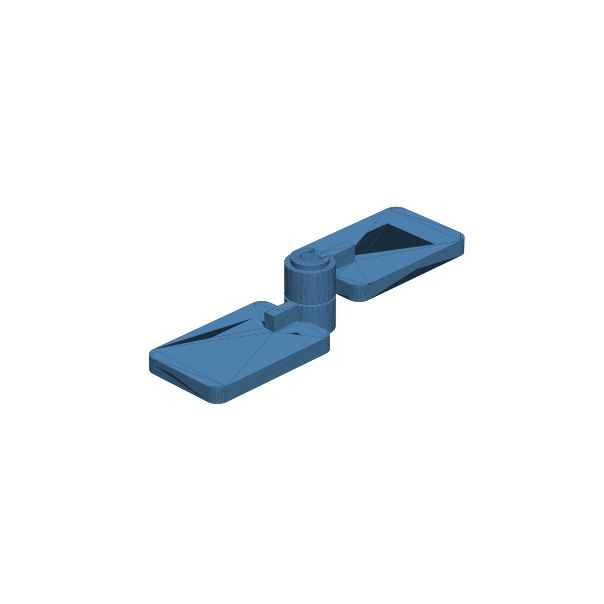

# 143 — Captiver servicefähiger Gelenkstift

**Variante:** Stift 4 mm  
**Kategorie:** Eindimensionale Drehbewegung  
**Mechanikfamilie:** `captive-service-hinge-pin`

## Status und Qualifikation

- Artefaktstatus: `experimental-draft`
- Qualifikationsstatus: `unqualified`
- Einordnung: Experimenteller DRAFT der Erweiterung 1.1.0; digital geprüft, nicht physisch qualifiziert.
- Anspruchsgrenze: Digitale Geometrieprüfung ist keine Funktions-, Last-, Dichtheits-, Lebensdauer- oder Sicherheitsqualifikation.

## Prinzip

Ein Kopfbolzen verbindet zwei Gelenkblätter; ein seitlich montierbarer C-Clip greift in eine Umfangsnut und erlaubt zerstörungsfreie Demontage.

## Typische Verwendung

Wartbare Klappen, Gliederkörper, Modellfahrzeuge und nasse oder schmutzige Gelenke.

## Enthaltene Dateien

- `model.scad` — parametrische OpenSCAD-Quelle
- `print_plate.stl` — experimentelle DRAFT-Druckanordnung; nicht physisch qualifiziert
- `preview.png` — Explosions-/Montagevorschau
- `parts/part_XX.stl` — automatisch getrennte Einzelkörper für CAD-Import
- `components.json` — Abmessungen und ursprüngliche Position jeder Komponente
- `metadata.json` — maschinenlesbare Dokumentation

Vorgesehene Komponenten:

- Gelenkblatt A
- Gelenkblatt B
- Nutstift
- C-Clip

## Parameter dieser Variante

- `pin_d`: `4`
- `bearing_clearance`: `0.25`
- `head_d`: `7`
- `retainer_clearance`: `0.25`
- `grip_l`: `13`
- `leaf_l`: `28`

**Variantenhinweis:** Allgemeiner Standard.

## FDM-Empfehlung

- Material: PETG, PA, PLA
- Düse: 0.4 mm
- Schichthöhe: 0.2 mm
- Außenlinien: mindestens 4
- Infill: 25 % als Startwert; funktionskritische Bereiche bei Bedarf lokal erhöhen
- Supportbedarf: grundsätzlich gering; die familienspezifischen Hinweise und die eigene Slicer-Vorschau beachten

Blätter flach, Stift stehend, Clip flach. Clip bevorzugt aus PETG/PA drucken.

## Montage und Nacharbeit

Bohrungen entgraten, Stift einschieben und Clip seitlich in die Nut drücken; Zugprüfung durchführen.

## Integration in ein Projekt

Nutdurchmesser, Clipöffnung und Griffweite gekoppelt halten; Montagezugang zur Clipseite erhalten.

## Fremdteile

Kein Fremdteil; optional Metallstift und Norm-Sicherungsring.

## Grenzen und Sicherheit

Gedruckter Clip kann kriechen oder bei Kälte brechen. Für hohe Last Metallstift und Norm-Sicherungsring verwenden.

Die Geometrie wurde digital auf geschlossene, positive Volumenkörper geprüft. Sie wurde nicht physisch auf jedem Drucker und Material gedruckt. Vor Lastanwendung zuerst die passende Toleranzvariante testen. Nicht für Personenlasten, Schutzfunktionen oder sonstige sicherheitskritische Anwendungen verwenden.
