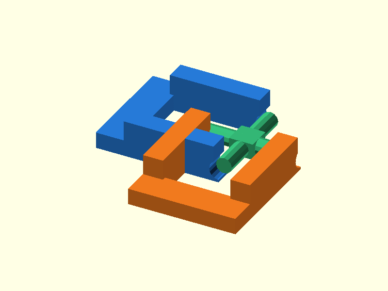

# 019 — Schnapp-Kardangelenk

**Variante:** leichtgängig  
**Kategorie:** Zweiachsige Bewegung  
**Mechanikfamilie:** `snap-universal-joint`

## Status und Qualifikation

- Artefaktstatus: `base-release-1.0.0`
- Qualifikationsstatus: `unqualified`
- Einordnung: Basismuster aus Release 1.0.0; im DRAFT-Prüfpunkt 1.1.0 nicht physisch requalifiziert.
- Anspruchsgrenze: Digitale Geometrieprüfung ist keine Funktions-, Last-, Dichtheits-, Lebensdauer- oder Sicherheitsqualifikation.

## Prinzip

Zwei orthogonale Schnappgabeln greifen einen Kreuzkörper und ermöglichen Kippung um zwei Achsen.

## Typische Verwendung

Leichte Wellenumlenkung, Joysticks, Kamerahalter und Demonstratoren.

## Enthaltene Dateien

- `model.scad` — parametrische OpenSCAD-Quelle
- `print_plate.stl` — Druckanordnung des 1.0.0-Basispakets; in diesem DRAFT nicht neu qualifiziert
- `preview.png` — Explosions-/Montagevorschau
- `parts/part_XX.stl` — automatisch getrennte Einzelkörper für CAD-Import
- `components.json` — Abmessungen und ursprüngliche Position jeder Komponente
- `metadata.json` — maschinenlesbare Dokumentation

Vorgesehene Komponenten:

- Gabel A
- Gabel B
- Kreuz

## Parameter dieser Variante

- `clearance`: `0.4`
- `pin_d`: `4`

**Variantenhinweis:** Einfachere Montage.

## FDM-Empfehlung

- Material: PETG, PA, PLA
- Düse: 0.4 mm
- Schichthöhe: 0.2 mm
- Außenlinien: mindestens 4
- Infill: 25 % als Startwert; funktionskritische Bereiche bei Bedarf lokal erhöhen
- Supportbedarf: grundsätzlich gering; die familienspezifischen Hinweise und die eigene Slicer-Vorschau beachten

Gabeln flach, Kreuz separat. PETG erleichtert das Einschnappen.

## Montage und Nacharbeit

Schnappschlitze entgraten, Kreuz erst in eine und dann in die zweite Gabel drücken.

## Integration in ein Projekt

Gabelbasen in das Projekt einarbeiten; Kreuzspannweite, Zapfendurchmesser und Schnappschlitze gemeinsam skalieren.

## Fremdteile

Kein Fremdteil.

## Grenzen und Sicherheit

Nicht für hohe Drehmomente oder hohe Drehzahl; keine homokinetische Kupplung.

Die Geometrie wurde digital auf geschlossene, positive Volumenkörper geprüft. Sie wurde nicht physisch auf jedem Drucker und Material gedruckt. Vor Lastanwendung zuerst die passende Toleranzvariante testen. Nicht für Personenlasten, Schutzfunktionen oder sonstige sicherheitskritische Anwendungen verwenden.
