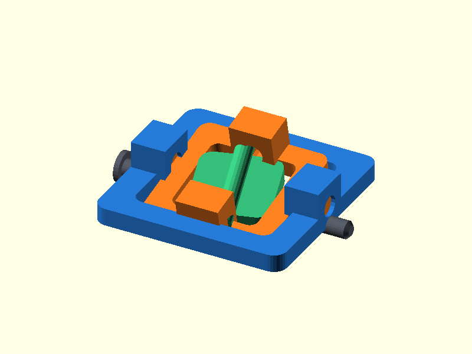

# 023 — Zweiachsiger Gimbal mit Stiften

**Variante:** leichtgängig  
**Kategorie:** Zweiachsige Bewegung  
**Mechanikfamilie:** `pinned-gimbal`

## Status und Qualifikation

- Artefaktstatus: `base-release-1.0.0`
- Qualifikationsstatus: `unqualified`
- Einordnung: Basismuster aus Release 1.0.0; im DRAFT-Prüfpunkt 1.1.0 nicht physisch requalifiziert.
- Anspruchsgrenze: Digitale Geometrieprüfung ist keine Funktions-, Last-, Dichtheits-, Lebensdauer- oder Sicherheitsqualifikation.

## Prinzip

Außenrahmen, Innenrahmen und Plattform drehen um zwei orthogonale, herausnehmbare Stifte.

## Typische Verwendung

Sensor-, Kamera- und Antennenhalter, Joystick- oder Nivelliermechanik.

## Enthaltene Dateien

- `model.scad` — parametrische OpenSCAD-Quelle
- `print_plate.stl` — Druckanordnung des 1.0.0-Basispakets; in diesem DRAFT nicht neu qualifiziert
- `preview.png` — Explosions-/Montagevorschau
- `parts/part_XX.stl` — automatisch getrennte Einzelkörper für CAD-Import
- `components.json` — Abmessungen und ursprüngliche Position jeder Komponente
- `metadata.json` — maschinenlesbare Dokumentation

Vorgesehene Komponenten:

- Außenrahmen
- Innenrahmen
- Plattform
- Achsstift X
- Achsstift Y

## Parameter dieser Variante

- `clearance`: `0.4`
- `pin_d`: `4`

**Variantenhinweis:** Mehr Bewegungsfreiheit.

## FDM-Empfehlung

- Material: PLA, PETG, PA
- Düse: 0.4 mm
- Schichthöhe: 0.2 mm
- Außenlinien: mindestens 4
- Infill: 25 % als Startwert; funktionskritische Bereiche bei Bedarf lokal erhöhen
- Supportbedarf: grundsätzlich gering; die familienspezifischen Hinweise und die eigene Slicer-Vorschau beachten

Rahmen flach, Stifte stehend. Kleine horizontale Bohrungen langsam drucken.

## Montage und Nacharbeit

Bohrungen mit Handreibahle oder passendem Bohrer nur leicht kalibrieren.

## Integration in ein Projekt

Außenrahmen befestigen; Plattformfläche an das Nutzteil anpassen. Achsen müssen orthogonal bleiben.

## Fremdteile

Optional zwei Metallstifte.

## Grenzen und Sicherheit

Druckstifte sind für Demonstration; für dauerhafte Last Metallstifte verwenden.

Die Geometrie wurde digital auf geschlossene, positive Volumenkörper geprüft. Sie wurde nicht physisch auf jedem Drucker und Material gedruckt. Vor Lastanwendung zuerst die passende Toleranzvariante testen. Nicht für Personenlasten, Schutzfunktionen oder sonstige sicherheitskritische Anwendungen verwenden.
