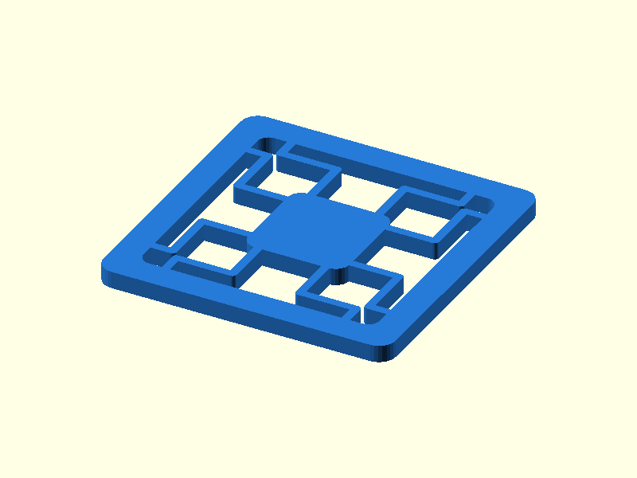

# 028 — XY-Festkörpertisch

**Variante:** kräftig 1,5 mm  
**Kategorie:** Zweiachsige Bewegung  
**Mechanikfamilie:** `xy-flexure-stage`

## Status und Qualifikation

- Artefaktstatus: `base-release-1.0.0`
- Qualifikationsstatus: `unqualified`
- Einordnung: Basismuster aus Release 1.0.0; im DRAFT-Prüfpunkt 1.1.0 nicht physisch requalifiziert.
- Anspruchsgrenze: Digitale Geometrieprüfung ist keine Funktions-, Last-, Dichtheits-, Lebensdauer- oder Sicherheitsqualifikation.

## Prinzip

Gefaltete Federstege führen eine zentrale Plattform mit kleinem, spielfreiem Weg in X und Y.

## Typische Verwendung

Feinpositionierung, Sensorentkopplung, optische Demonstratoren und kleine Greifer.

## Enthaltene Dateien

- `model.scad` — parametrische OpenSCAD-Quelle
- `print_plate.stl` — Druckanordnung des 1.0.0-Basispakets; in diesem DRAFT nicht neu qualifiziert
- `preview.png` — Explosions-/Montagevorschau
- `parts/part_XX.stl` — automatisch getrennte Einzelkörper für CAD-Import
- `components.json` — Abmessungen und ursprüngliche Position jeder Komponente
- `metadata.json` — maschinenlesbare Dokumentation

Vorgesehene Komponenten:

- XY-Festkörpertisch

## Parameter dieser Variante

- `beam_w`: `1.5`
- `beam_l`: `17`

**Variantenhinweis:** Kleiner Weg, höhere Last.

## FDM-Empfehlung

- Material: PETG, PA, PP
- Düse: 0.4 mm
- Schichthöhe: 0.2 mm
- Außenlinien: mindestens 4
- Infill: 25 % als Startwert; funktionskritische Bereiche bei Bedarf lokal erhöhen
- Supportbedarf: grundsätzlich gering; die familienspezifischen Hinweise und die eigene Slicer-Vorschau beachten

Flach und ohne Support. Zähe Werkstoffe und gute Layerhaftung verwenden.

## Montage und Nacharbeit

Mit kleinen Wegen einfahren und mechanische Anschläge im Projekt vorsehen.

## Integration in ein Projekt

Außenrahmen fixieren und Last mittig auf der Plattform einleiten. Federbahnen nicht bohren.

## Fremdteile

Kein Fremdteil.

## Grenzen und Sicherheit

Nur kleiner Hub; nicht für freie Rotation oder hohe Querlasten.

Die Geometrie wurde digital auf geschlossene, positive Volumenkörper geprüft. Sie wurde nicht physisch auf jedem Drucker und Material gedruckt. Vor Lastanwendung zuerst die passende Toleranzvariante testen. Nicht für Personenlasten, Schutzfunktionen oder sonstige sicherheitskritische Anwendungen verwenden.
