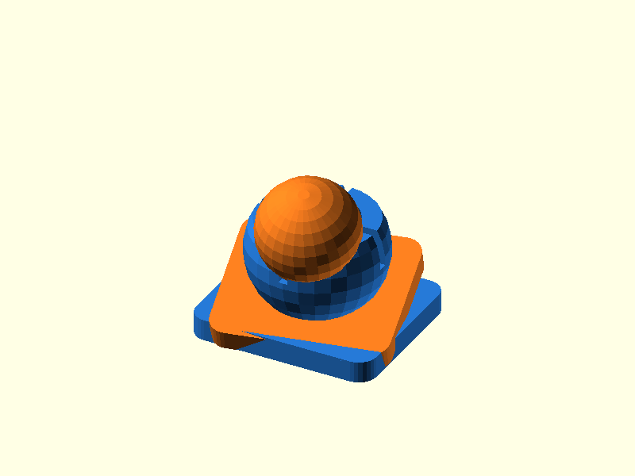

# 030 — Geschlitztes Schnapp-Kugelgelenk

**Variante:** standard  
**Kategorie:** Kugelgelenke  
**Mechanikfamilie:** `slotted-snap-ball-joint`

## Status und Qualifikation

- Artefaktstatus: `base-release-1.0.0`
- Qualifikationsstatus: `unqualified`
- Einordnung: Basismuster aus Release 1.0.0; im DRAFT-Prüfpunkt 1.1.0 nicht physisch requalifiziert.
- Anspruchsgrenze: Digitale Geometrieprüfung ist keine Funktions-, Last-, Dichtheits-, Lebensdauer- oder Sicherheitsqualifikation.

## Prinzip

Eine geschlitzte Kugelpfanne federt beim Einpressen auf und hält den Kugelzapfen formschlüssig.

## Typische Verwendung

Verstellbare Halter, Leuchten, Sensoren, Figuren und kleine Gestänge.

## Enthaltene Dateien

- `model.scad` — parametrische OpenSCAD-Quelle
- `print_plate.stl` — Druckanordnung des 1.0.0-Basispakets; in diesem DRAFT nicht neu qualifiziert
- `preview.png` — Explosions-/Montagevorschau
- `parts/part_XX.stl` — automatisch getrennte Einzelkörper für CAD-Import
- `components.json` — Abmessungen und ursprüngliche Position jeder Komponente
- `metadata.json` — maschinenlesbare Dokumentation

Vorgesehene Komponenten:

- Kugelpfanne
- Kugelzapfen

## Parameter dieser Variante

- `ball_d`: `14`
- `clearance`: `0.35`

**Variantenhinweis:** Ausgewogener Startwert.

## FDM-Empfehlung

- Material: PETG, PA, PLA
- Düse: 0.4 mm
- Schichthöhe: 0.2 mm
- Außenlinien: mindestens 4
- Infill: 25 % als Startwert; funktionskritische Bereiche bei Bedarf lokal erhöhen
- Supportbedarf: grundsätzlich gering; die familienspezifischen Hinweise und die eigene Slicer-Vorschau beachten

Pfanne mit Öffnung nach oben; Kugelzapfen stehend. Für die Pfanne PETG oder PA bevorzugen. Je nach Drucker kann eine kleine organische Stütze nur unter der unteren Kugelhälfte die Rundheit verbessern; Kontaktflächen der Pfanne supportfrei lassen.

## Montage und Nacharbeit

Schlitze säubern, Kugel mit gleichmäßiger Kraft gerade einschnappen und anschließend bewegen.

## Integration in ein Projekt

Sockelplatten ersetzen oder verschmelzen; Kugeldurchmesser, Pfannenwand und Öffnung gemeinsam anpassen.

## Fremdteile

Kein Fremdteil.

## Grenzen und Sicherheit

Haltekraft hängt stark vom Material ab; nicht für sicherheitsrelevante Lasten.

Die Geometrie wurde digital auf geschlossene, positive Volumenkörper geprüft. Sie wurde nicht physisch auf jedem Drucker und Material gedruckt. Vor Lastanwendung zuerst die passende Toleranzvariante testen. Nicht für Personenlasten, Schutzfunktionen oder sonstige sicherheitskritische Anwendungen verwenden.
