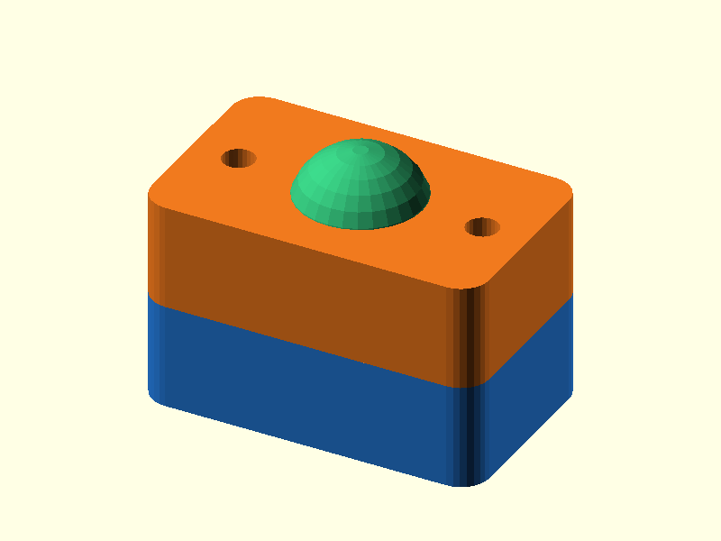

# 034 — Geteilte Klemm-Kugelpfanne

**Variante:** Kugel 14 mm  
**Kategorie:** Kugelgelenke  
**Mechanikfamilie:** `split-clamp-ball-joint`

## Status und Qualifikation

- Artefaktstatus: `base-release-1.0.0`
- Qualifikationsstatus: `unqualified`
- Einordnung: Basismuster aus Release 1.0.0; im DRAFT-Prüfpunkt 1.1.0 nicht physisch requalifiziert.
- Anspruchsgrenze: Digitale Geometrieprüfung ist keine Funktions-, Last-, Dichtheits-, Lebensdauer- oder Sicherheitsqualifikation.

## Prinzip

Zwei Pfannenhälften umschließen die Kugel und stellen Reibung über Schrauben ein.

## Typische Verwendung

Belastbarere Kamera-, Sensor- und Leuchtenhalter mit nachstellbarer Klemmung.

## Enthaltene Dateien

- `model.scad` — parametrische OpenSCAD-Quelle
- `print_plate.stl` — Druckanordnung des 1.0.0-Basispakets; in diesem DRAFT nicht neu qualifiziert
- `preview.png` — Explosions-/Montagevorschau
- `parts/part_XX.stl` — automatisch getrennte Einzelkörper für CAD-Import
- `components.json` — Abmessungen und ursprüngliche Position jeder Komponente
- `metadata.json` — maschinenlesbare Dokumentation

Vorgesehene Komponenten:

- Pfannenhälfte A
- Pfannenhälfte B
- Kugelzapfen

## Parameter dieser Variante

- `ball_d`: `14`
- `clearance`: `0.25`

**Variantenhinweis:** Leichte Standardgröße.

## FDM-Empfehlung

- Material: PLA, PETG, PA
- Düse: 0.4 mm
- Schichthöhe: 0.2 mm
- Außenlinien: mindestens 4
- Infill: 25 % als Startwert; funktionskritische Bereiche bei Bedarf lokal erhöhen
- Supportbedarf: grundsätzlich gering; die familienspezifischen Hinweise und die eigene Slicer-Vorschau beachten

Hälften mit Kugelmulde nach oben, Kugelzapfen stehend. Vier Außenlinien empfohlen. Eine kleine organische Stütze nur unter der unteren Kugelhälfte ist optional, wenn die Rundheit wichtiger als supportfreier Druck ist.

## Montage und Nacharbeit

Mit zwei Schrauben gleichmäßig anziehen; nicht überklemmen.

## Integration in ein Projekt

Pfannenhälften über ihre Außenflächen anbinden; Schraubenachsen und Trennfuge freihalten.

## Fremdteile

Zwei M3-Schrauben und M3-Muttern pro Muster.

## Grenzen und Sicherheit

Benötigt Schrauben und Muttern; Kugeloberfläche zeigt FDM-Schichtstufen.

Die Geometrie wurde digital auf geschlossene, positive Volumenkörper geprüft. Sie wurde nicht physisch auf jedem Drucker und Material gedruckt. Vor Lastanwendung zuerst die passende Toleranzvariante testen. Nicht für Personenlasten, Schutzfunktionen oder sonstige sicherheitskritische Anwendungen verwenden.
