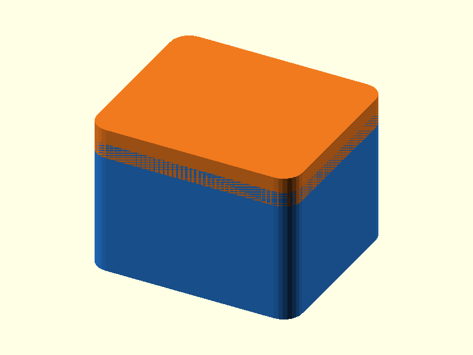

# 037 — Dauerhafter Pressstift

**Variante:** 0,15 mm Übermaß  
**Kategorie:** Dauerhafte Steck- und Schiebverbindungen  
**Mechanikfamilie:** `press-fit-dowel`

## Status und Qualifikation

- Artefaktstatus: `base-release-1.0.0`
- Qualifikationsstatus: `unqualified`
- Einordnung: Basismuster aus Release 1.0.0; im DRAFT-Prüfpunkt 1.1.0 nicht physisch requalifiziert.
- Anspruchsgrenze: Digitale Geometrieprüfung ist keine Funktions-, Last-, Dichtheits-, Lebensdauer- oder Sicherheitsqualifikation.

## Prinzip

Ein konischer Einlauf führt einen zylindrischen Stift in eine kalibrierte Bohrung.

## Typische Verwendung

Dauerhafte Positionierung, Gehäusehälften, Montagehilfen und Klebeverbindungen.

## Enthaltene Dateien

- `model.scad` — parametrische OpenSCAD-Quelle
- `print_plate.stl` — Druckanordnung des 1.0.0-Basispakets; in diesem DRAFT nicht neu qualifiziert
- `preview.png` — Explosions-/Montagevorschau
- `parts/part_XX.stl` — automatisch getrennte Einzelkörper für CAD-Import
- `components.json` — Abmessungen und ursprüngliche Position jeder Komponente
- `metadata.json` — maschinenlesbare Dokumentation

Vorgesehene Komponenten:

- Buchse
- Stiftplatte

## Parameter dieser Variante

- `pin_d`: `8`
- `gap`: `-0.15`

**Variantenhinweis:** Kräftiger Presssitz für zähe Werkstoffe.

## FDM-Empfehlung

- Material: PLA, PETG, PA
- Düse: 0.4 mm
- Schichthöhe: 0.2 mm
- Außenlinien: mindestens 4
- Infill: 25 % als Startwert; funktionskritische Bereiche bei Bedarf lokal erhöhen
- Supportbedarf: grundsätzlich gering; die familienspezifischen Hinweise und die eigene Slicer-Vorschau beachten

Stift und Bohrung vertikal. Flow und Elephant-Foot beeinflussen die Passung stark.

## Montage und Nacharbeit

Trocken testen; für dauerhafte Verbindung bei Bedarf Klebstoff verwenden.

## Integration in ein Projekt

Stift und Bohrung entlang einer belastbaren Wand platzieren; ausreichend Material um die Bohrung vorsehen.

## Fremdteile

Kein Fremdteil.

## Grenzen und Sicherheit

Negative Werte erzeugen Interferenz und können spröde Teile spalten.

Die Geometrie wurde digital auf geschlossene, positive Volumenkörper geprüft. Sie wurde nicht physisch auf jedem Drucker und Material gedruckt. Vor Lastanwendung zuerst die passende Toleranzvariante testen. Nicht für Personenlasten, Schutzfunktionen oder sonstige sicherheitskritische Anwendungen verwenden.
