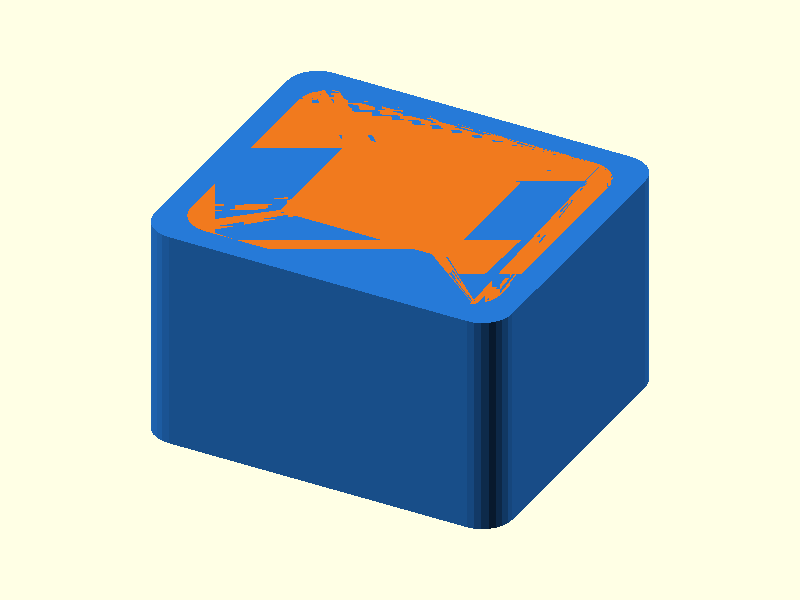

# 041 — Verdrehsichere Schlüssel-Steckverbindung

**Variante:** 0,15 mm  
**Kategorie:** Dauerhafte Steck- und Schiebverbindungen  
**Mechanikfamilie:** `keyed-plug-socket`

## Status und Qualifikation

- Artefaktstatus: `base-release-1.0.0`
- Qualifikationsstatus: `unqualified`
- Einordnung: Basismuster aus Release 1.0.0; im DRAFT-Prüfpunkt 1.1.0 nicht physisch requalifiziert.
- Anspruchsgrenze: Digitale Geometrieprüfung ist keine Funktions-, Last-, Dichtheits-, Lebensdauer- oder Sicherheitsqualifikation.

## Prinzip

Ein rechteckiger Steckzapfen mit Seitenfeder verhindert falsche Orientierung und Verdrehung.

## Typische Verwendung

Modulare Gehäuse, Sensormodule und verklebte Baugruppen.

## Enthaltene Dateien

- `model.scad` — parametrische OpenSCAD-Quelle
- `print_plate.stl` — Druckanordnung des 1.0.0-Basispakets; in diesem DRAFT nicht neu qualifiziert
- `preview.png` — Explosions-/Montagevorschau
- `parts/part_XX.stl` — automatisch getrennte Einzelkörper für CAD-Import
- `components.json` — Abmessungen und ursprüngliche Position jeder Komponente
- `metadata.json` — maschinenlesbare Dokumentation

Vorgesehene Komponenten:

- Buchse
- Schlüsselzapfen

## Parameter dieser Variante

- `clearance`: `0.15`

**Variantenhinweis:** Sehr genaue Passung.

## FDM-Empfehlung

- Material: PLA, PETG, PA
- Düse: 0.4 mm
- Schichthöhe: 0.2 mm
- Außenlinien: mindestens 4
- Infill: 25 % als Startwert; funktionskritische Bereiche bei Bedarf lokal erhöhen
- Supportbedarf: grundsätzlich gering; die familienspezifischen Hinweise und die eigene Slicer-Vorschau beachten

Zapfen und Buchse stehend, Einlauf entgraten.

## Montage und Nacharbeit

Passung testen und bei permanenter Montage verkleben oder thermisch sichern.

## Integration in ein Projekt

Sockel durch Projektgeometrie ersetzen; Schlüsselposition als Montagekodierung nutzen.

## Fremdteile

Kein Fremdteil.

## Grenzen und Sicherheit

Nicht selbstverriegelnd; Zugkräfte benötigen zusätzliche Sicherung.

Die Geometrie wurde digital auf geschlossene, positive Volumenkörper geprüft. Sie wurde nicht physisch auf jedem Drucker und Material gedruckt. Vor Lastanwendung zuerst die passende Toleranzvariante testen. Nicht für Personenlasten, Schutzfunktionen oder sonstige sicherheitskritische Anwendungen verwenden.
