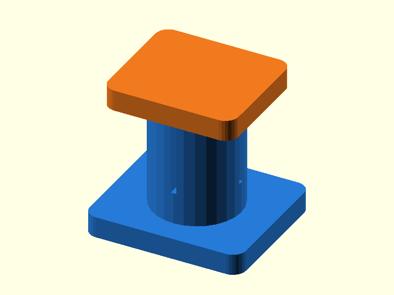

# 047 — Einweg-Steckverbinder mit Widerhaken

**Variante:** 0,35 mm  
**Kategorie:** Dauerhafte Steck- und Schiebverbindungen  
**Mechanikfamilie:** `barbed-one-way-connector`

## Status und Qualifikation

- Artefaktstatus: `base-release-1.0.0`
- Qualifikationsstatus: `unqualified`
- Einordnung: Basismuster aus Release 1.0.0; im DRAFT-Prüfpunkt 1.1.0 nicht physisch requalifiziert.
- Anspruchsgrenze: Digitale Geometrieprüfung ist keine Funktions-, Last-, Dichtheits-, Lebensdauer- oder Sicherheitsqualifikation.

## Prinzip

Tapered Widerhaken passieren eine geschlitzte Buchse und erschweren das Zurückziehen.

## Typische Verwendung

Einmalmontage, Gehäuseclips, leichte Rohr- oder Kabelmodule.

## Enthaltene Dateien

- `model.scad` — parametrische OpenSCAD-Quelle
- `print_plate.stl` — Druckanordnung des 1.0.0-Basispakets; in diesem DRAFT nicht neu qualifiziert
- `preview.png` — Explosions-/Montagevorschau
- `parts/part_XX.stl` — automatisch getrennte Einzelkörper für CAD-Import
- `components.json` — Abmessungen und ursprüngliche Position jeder Komponente
- `metadata.json` — maschinenlesbare Dokumentation

Vorgesehene Komponenten:

- Geschlitzte Buchse
- Widerhakenstift

## Parameter dieser Variante

- `clearance`: `0.35`
- `pin_d`: `7`
- `barb_h`: `1.0`

**Variantenhinweis:** Einfachere Montage.

## FDM-Empfehlung

- Material: PETG, PA, PLA
- Düse: 0.4 mm
- Schichthöhe: 0.2 mm
- Außenlinien: mindestens 4
- Infill: 25 % als Startwert; funktionskritische Bereiche bei Bedarf lokal erhöhen
- Supportbedarf: grundsätzlich gering; die familienspezifischen Hinweise und die eigene Slicer-Vorschau beachten

Beide Teile stehend. Buchse aus PETG/PA für elastische Finger.

## Montage und Nacharbeit

Nur nach erfolgreicher Kalibrierung vollständig einpressen; Verbindung ist schwer lösbar.

## Integration in ein Projekt

Buchsenwand und Schlitze in der belasteten Richtung orientieren; Ausbauzugang bewusst ausschließen oder vorsehen.

## Fremdteile

Kein Fremdteil.

## Grenzen und Sicherheit

Demontage kann Bauteile beschädigen. Nicht für Druckleitungen.

Die Geometrie wurde digital auf geschlossene, positive Volumenkörper geprüft. Sie wurde nicht physisch auf jedem Drucker und Material gedruckt. Vor Lastanwendung zuerst die passende Toleranzvariante testen. Nicht für Personenlasten, Schutzfunktionen oder sonstige sicherheitskritische Anwendungen verwenden.
