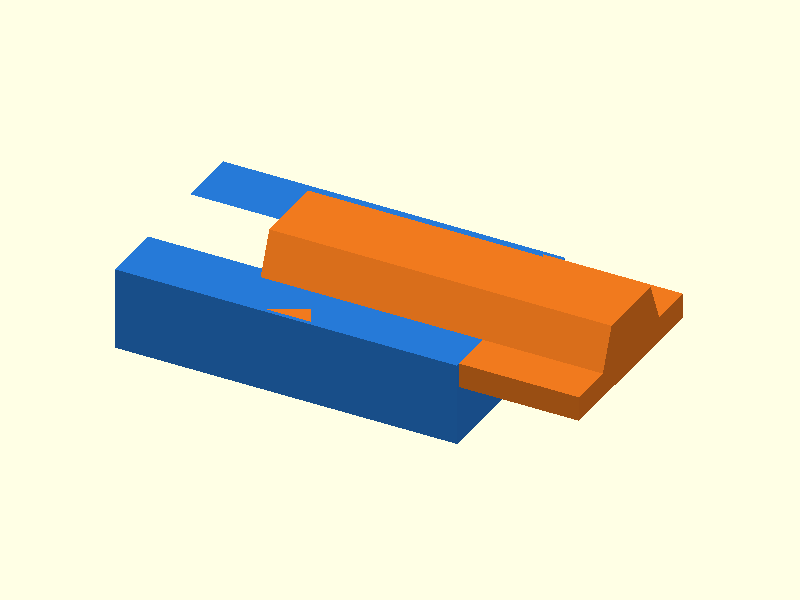

# 052 — Schwalbenschwanz-Verbinder

**Variante:** leichtgängig 0,35 mm  
**Kategorie:** Dauerhafte Steck- und Schiebverbindungen  
**Mechanikfamilie:** `dovetail-joiner`

## Status und Qualifikation

- Artefaktstatus: `base-release-1.0.0`
- Qualifikationsstatus: `unqualified`
- Einordnung: Basismuster aus Release 1.0.0; im DRAFT-Prüfpunkt 1.1.0 nicht physisch requalifiziert.
- Anspruchsgrenze: Digitale Geometrieprüfung ist keine Funktions-, Last-, Dichtheits-, Lebensdauer- oder Sicherheitsqualifikation.

## Prinzip

Trapezförmige Flanken übertragen Zug quer zur Einschubrichtung und führen zwei Bauteile linear.

## Typische Verwendung

Gehäusemodule, Möbelmodelle, Abdeckungen und verklebbare Schiebverbindungen.

## Enthaltene Dateien

- `model.scad` — parametrische OpenSCAD-Quelle
- `print_plate.stl` — Druckanordnung des 1.0.0-Basispakets; in diesem DRAFT nicht neu qualifiziert
- `preview.png` — Explosions-/Montagevorschau
- `parts/part_XX.stl` — automatisch getrennte Einzelkörper für CAD-Import
- `components.json` — Abmessungen und ursprüngliche Position jeder Komponente
- `metadata.json` — maschinenlesbare Dokumentation

Vorgesehene Komponenten:

- Buchsenprofil
- Schwalbenschwanzprofil

## Parameter dieser Variante

- `clearance`: `0.35`
- `length`: `42`

**Variantenhinweis:** Wiederholbare Montage.

## FDM-Empfehlung

- Material: PLA, PETG, PA
- Düse: 0.4 mm
- Schichthöhe: 0.2 mm
- Außenlinien: mindestens 4
- Infill: 25 % als Startwert; funktionskritische Bereiche bei Bedarf lokal erhöhen
- Supportbedarf: grundsätzlich gering; die familienspezifischen Hinweise und die eigene Slicer-Vorschau beachten

Beide Profile flach; keine Supports. Flanken mit geringer Geschwindigkeit drucken.

## Montage und Nacharbeit

Flanken entgraten und von der offenen Seite einschieben.

## Integration in ein Projekt

Profil entlang einer geraden, gut zugänglichen Einschubrichtung anordnen; Endanschlag ergänzen.

## Fremdteile

Kein Fremdteil.

## Grenzen und Sicherheit

Interferenzvariante kann nur einmal montierbar sein; lange Profile reagieren auf Verzug.

Die Geometrie wurde digital auf geschlossene, positive Volumenkörper geprüft. Sie wurde nicht physisch auf jedem Drucker und Material gedruckt. Vor Lastanwendung zuerst die passende Toleranzvariante testen. Nicht für Personenlasten, Schutzfunktionen oder sonstige sicherheitskritische Anwendungen verwenden.
