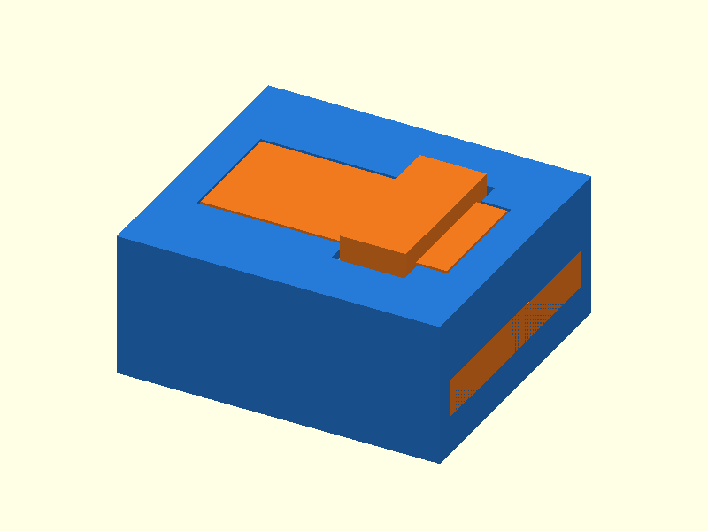

# 055 — Nut-Feder-Verbindung mit Querkeil

**Variante:** 0,35 mm  
**Kategorie:** Dauerhafte Steck- und Schiebverbindungen  
**Mechanikfamilie:** `transverse-wedge-lock`

## Status und Qualifikation

- Artefaktstatus: `base-release-1.0.0`
- Qualifikationsstatus: `unqualified`
- Einordnung: Basismuster aus Release 1.0.0; im DRAFT-Prüfpunkt 1.1.0 nicht physisch requalifiziert.
- Anspruchsgrenze: Digitale Geometrieprüfung ist keine Funktions-, Last-, Dichtheits-, Lebensdauer- oder Sicherheitsqualifikation.

## Prinzip

Eine geführte Zunge wird eingeschoben und anschließend durch einen separaten Querkeil gegen Rückzug gesichert.

## Typische Verwendung

Zerlegbare Rahmen, Gehäusemodule und Bauteile ohne Metallbefestiger.

## Enthaltene Dateien

- `model.scad` — parametrische OpenSCAD-Quelle
- `print_plate.stl` — Druckanordnung des 1.0.0-Basispakets; in diesem DRAFT nicht neu qualifiziert
- `preview.png` — Explosions-/Montagevorschau
- `parts/part_XX.stl` — automatisch getrennte Einzelkörper für CAD-Import
- `components.json` — Abmessungen und ursprüngliche Position jeder Komponente
- `metadata.json` — maschinenlesbare Dokumentation

Vorgesehene Komponenten:

- Nutkörper
- Zungenkörper
- Querkeil

## Parameter dieser Variante

- `clearance`: `0.35`

**Variantenhinweis:** Leichte Montage.

## FDM-Empfehlung

- Material: PLA, PETG, PA
- Düse: 0.4 mm
- Schichthöhe: 0.2 mm
- Außenlinien: mindestens 4
- Infill: 25 % als Startwert; funktionskritische Bereiche bei Bedarf lokal erhöhen
- Supportbedarf: grundsätzlich gering; die familienspezifischen Hinweise und die eigene Slicer-Vorschau beachten

Alle Teile flach; Keil mit vielen Außenlinien drucken.

## Montage und Nacharbeit

Zunge einschieben, Fenster ausrichten, Keil von der breiten Seite eintreiben.

## Integration in ein Projekt

Querkeilzugang offen halten und Lastpfad nicht allein auf die dünne Keilspitze legen.

## Fremdteile

Kein Fremdteil.

## Grenzen und Sicherheit

Keil kann sich unter Vibration lösen; optional Fanglasche ergänzen.

Die Geometrie wurde digital auf geschlossene, positive Volumenkörper geprüft. Sie wurde nicht physisch auf jedem Drucker und Material gedruckt. Vor Lastanwendung zuerst die passende Toleranzvariante testen. Nicht für Personenlasten, Schutzfunktionen oder sonstige sicherheitskritische Anwendungen verwenden.
