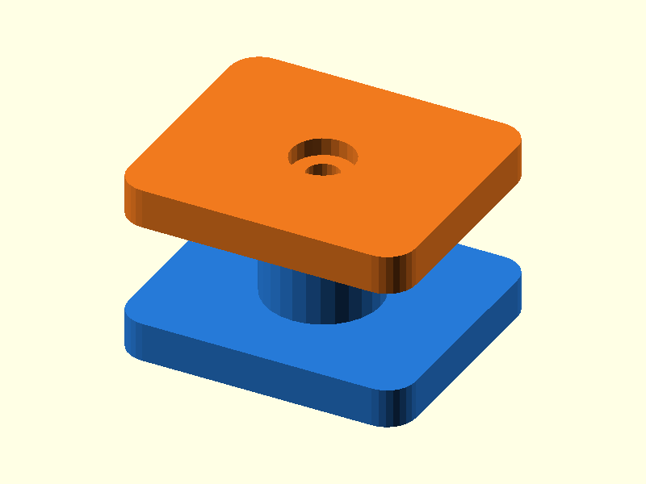

# 058 — Schraubdom mit seitlicher Muttertasche

**Variante:** M3  
**Kategorie:** Schraubverbindungen  
**Mechanikfamilie:** `captured-nut-screw-boss`

## Status und Qualifikation

- Artefaktstatus: `base-release-1.0.0`
- Qualifikationsstatus: `unqualified`
- Einordnung: Basismuster aus Release 1.0.0; im DRAFT-Prüfpunkt 1.1.0 nicht physisch requalifiziert.
- Anspruchsgrenze: Digitale Geometrieprüfung ist keine Funktions-, Last-, Dichtheits-, Lebensdauer- oder Sicherheitsqualifikation.

## Prinzip

Eine Sechskantmutter wird seitlich in einen Dom eingeschoben und durch einen Deckel verschraubt.

## Typische Verwendung

Gehäuse, Wartungsdeckel, Elektronikhalter und wieder lösbare Baugruppen.

## Enthaltene Dateien

- `model.scad` — parametrische OpenSCAD-Quelle
- `print_plate.stl` — Druckanordnung des 1.0.0-Basispakets; in diesem DRAFT nicht neu qualifiziert
- `preview.png` — Explosions-/Montagevorschau
- `parts/part_XX.stl` — automatisch getrennte Einzelkörper für CAD-Import
- `components.json` — Abmessungen und ursprüngliche Position jeder Komponente
- `metadata.json` — maschinenlesbare Dokumentation

Vorgesehene Komponenten:

- Mutterdom
- Deckel

## Parameter dieser Variante

- `screw_d`: `3.4`
- `nut_flat`: `5.7`
- `nut_h`: `2.5`
- `head_d`: `6.5`

**Variantenhinweis:** Allgemeiner Standard.

## FDM-Empfehlung

- Material: PLA, PETG, PA
- Düse: 0.4 mm
- Schichthöhe: 0.2 mm
- Außenlinien: mindestens 4
- Infill: 25 % als Startwert; funktionskritische Bereiche bei Bedarf lokal erhöhen
- Supportbedarf: grundsätzlich gering; die familienspezifischen Hinweise und die eigene Slicer-Vorschau beachten

Muttertasche und Bohrung vertikal. Keine Supports nötig.

## Montage und Nacharbeit

Mutter einschieben, Schraube von Hand ansetzen und nicht überdrehen.

## Integration in ein Projekt

Dom mit Rippen an tragende Wände anbinden und Schraubenlänge an Projektstärke anpassen.

## Fremdteile

Je Variante passende Schraube und Sechskantmutter.

## Grenzen und Sicherheit

Abmessungen sind typische Startwerte; reale Muttern und Schraubenköpfe messen.

Die Geometrie wurde digital auf geschlossene, positive Volumenkörper geprüft. Sie wurde nicht physisch auf jedem Drucker und Material gedruckt. Vor Lastanwendung zuerst die passende Toleranzvariante testen. Nicht für Personenlasten, Schutzfunktionen oder sonstige sicherheitskritische Anwendungen verwenden.
