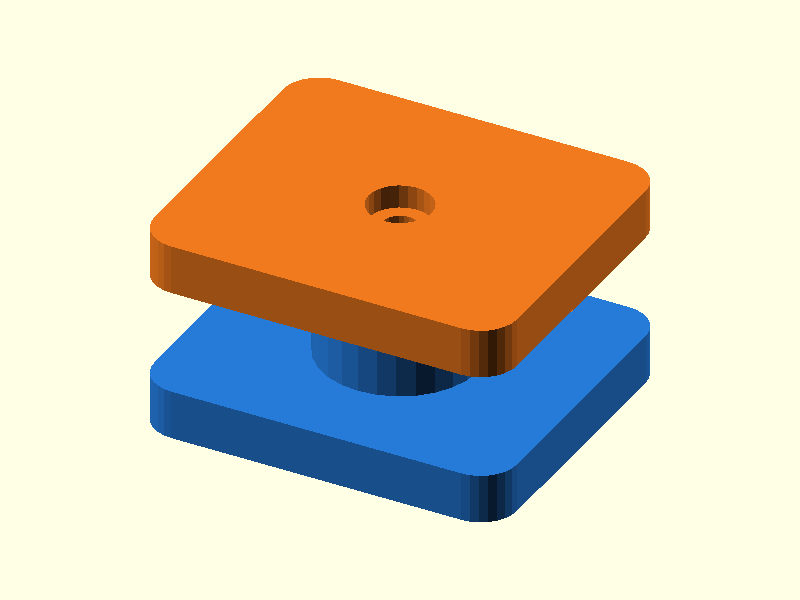

# 062 — Heizeinsatz-Schraubprobe

**Variante:** M2,5  
**Kategorie:** Schraubverbindungen  
**Mechanikfamilie:** `heat-set-insert-coupon`

## Status und Qualifikation

- Artefaktstatus: `base-release-1.0.0`
- Qualifikationsstatus: `unqualified`
- Einordnung: Basismuster aus Release 1.0.0; im DRAFT-Prüfpunkt 1.1.0 nicht physisch requalifiziert.
- Anspruchsgrenze: Digitale Geometrieprüfung ist keine Funktions-, Last-, Dichtheits-, Lebensdauer- oder Sicherheitsqualifikation.

## Prinzip

Ein abgestufter Pilotkanal nimmt einen Messing-Heizeinsatz auf; der Deckel prüft die Schraubverbindung.

## Typische Verwendung

Kalibrierung von Heat-Set-Inserts vor dem Einbau in Gehäuse und Funktionsteile.

## Enthaltene Dateien

- `model.scad` — parametrische OpenSCAD-Quelle
- `print_plate.stl` — Druckanordnung des 1.0.0-Basispakets; in diesem DRAFT nicht neu qualifiziert
- `preview.png` — Explosions-/Montagevorschau
- `parts/part_XX.stl` — automatisch getrennte Einzelkörper für CAD-Import
- `components.json` — Abmessungen und ursprüngliche Position jeder Komponente
- `metadata.json` — maschinenlesbare Dokumentation

Vorgesehene Komponenten:

- Insert-Dom
- Prüfdeckel

## Parameter dieser Variante

- `pilot_d`: `3.8`
- `screw_clear`: `2.9`
- `head_d`: `5.2`
- `insert_depth`: `5.0`

**Variantenhinweis:** Pilot für kompakte Inserts.

## FDM-Empfehlung

- Material: PETG, ABS, ASA, PA, PLA
- Düse: 0.4 mm
- Schichthöhe: 0.2 mm
- Außenlinien: mindestens 4
- Infill: 25 % als Startwert; funktionskritische Bereiche bei Bedarf lokal erhöhen
- Supportbedarf: grundsätzlich gering; die familienspezifischen Hinweise und die eigene Slicer-Vorschau beachten

Dom stehend. Mindestens vier Außenlinien und 40 % lokales Infill.

## Montage und Nacharbeit

Insert mit temperaturgeregeltem Werkzeug rechtwinklig einsetzen und vollständig abkühlen lassen.

## Integration in ein Projekt

Domdurchmesser und Restwandstärke beibehalten; reale Insert-Zeichnung als Autorität verwenden.

## Fremdteile

Passender Messing-Heizeinsatz und Schraube.

## Grenzen und Sicherheit

Pilotmaße sind generisch; Herstellergeometrien unterscheiden sich deutlich.

Die Geometrie wurde digital auf geschlossene, positive Volumenkörper geprüft. Sie wurde nicht physisch auf jedem Drucker und Material gedruckt. Vor Lastanwendung zuerst die passende Toleranzvariante testen. Nicht für Personenlasten, Schutzfunktionen oder sonstige sicherheitskritische Anwendungen verwenden.
