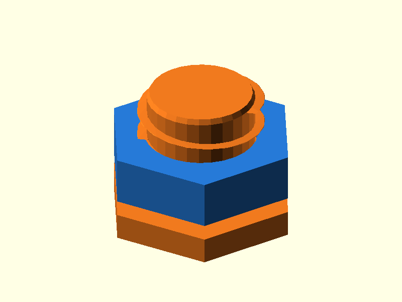

# 068 — Grobgewinde aus dem Drucker

**Variante:** Ø 24 / P 5  
**Kategorie:** Schraubverbindungen  
**Mechanikfamilie:** `coarse-printed-thread`

## Status und Qualifikation

- Artefaktstatus: `base-release-1.0.0`
- Qualifikationsstatus: `unqualified`
- Einordnung: Basismuster aus Release 1.0.0; im DRAFT-Prüfpunkt 1.1.0 nicht physisch requalifiziert.
- Anspruchsgrenze: Digitale Geometrieprüfung ist keine Funktions-, Last-, Dichtheits-, Lebensdauer- oder Sicherheitsqualifikation.

## Prinzip

Ein großes einstufiges Helixprofil bildet eine direkt druckbare Schraube und Mutter.

## Typische Verwendung

Werkzeuglose Deckel, Versteller, Klemmen und große Handverschraubungen.

## Enthaltene Dateien

- `model.scad` — parametrische OpenSCAD-Quelle
- `print_plate.stl` — Druckanordnung des 1.0.0-Basispakets; in diesem DRAFT nicht neu qualifiziert
- `preview.png` — Explosions-/Montagevorschau
- `parts/part_XX.stl` — automatisch getrennte Einzelkörper für CAD-Import
- `components.json` — Abmessungen und ursprüngliche Position jeder Komponente
- `metadata.json` — maschinenlesbare Dokumentation

Vorgesehene Komponenten:

- Mutter
- Schraube

## Parameter dieser Variante

- `d`: `24`
- `pitch`: `5.0`
- `clearance`: `0.45`
- `length`: `20`

**Variantenhinweis:** Große Handverschraubung.

## FDM-Empfehlung

- Material: PLA, PETG, PA
- Düse: 0.4 mm
- Schichthöhe: 0.2 mm
- Außenlinien: mindestens 4
- Infill: 25 % als Startwert; funktionskritische Bereiche bei Bedarf lokal erhöhen
- Supportbedarf: grundsätzlich gering; die familienspezifischen Hinweise und die eigene Slicer-Vorschau beachten

Stehend mit kleiner Schichthöhe. Nahtposition möglichst vom Lastbereich weglegen.

## Montage und Nacharbeit

Gewinde reinigen, mehrfach vorsichtig ein- und ausschrauben; trockenes PTFE kann helfen.

## Integration in ein Projekt

Gewindelänge, Anlauf und Wandstärke anpassen; keine kleinen Metallgewinde imitieren.

## Fremdteile

Kein Fremdteil.

## Grenzen und Sicherheit

Profil ist FDM-optimiert, nicht normgerecht. Nicht für Druckbehälter oder hohe Vorspannung.

Die Geometrie wurde digital auf geschlossene, positive Volumenkörper geprüft. Sie wurde nicht physisch auf jedem Drucker und Material gedruckt. Vor Lastanwendung zuerst die passende Toleranzvariante testen. Nicht für Personenlasten, Schutzfunktionen oder sonstige sicherheitskritische Anwendungen verwenden.
