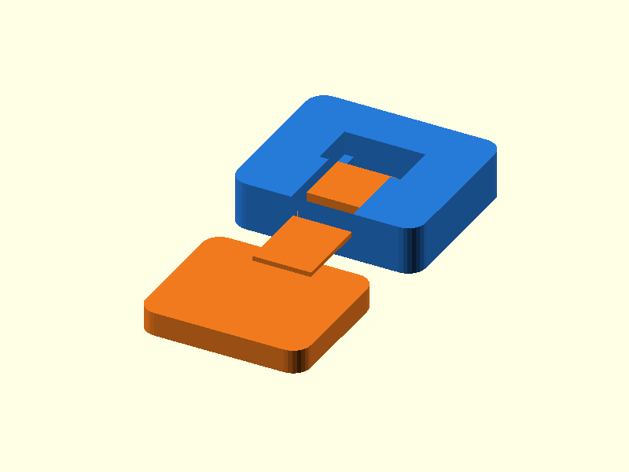

# 069 — Wiederlösbarer Kragarm-Schnapper

**Variante:** weich 0,8 mm  
**Kategorie:** Periodisch lösbare Verschlüsse  
**Mechanikfamilie:** `cantilever-snap-latch`

## Status und Qualifikation

- Artefaktstatus: `base-release-1.0.0`
- Qualifikationsstatus: `unqualified`
- Einordnung: Basismuster aus Release 1.0.0; im DRAFT-Prüfpunkt 1.1.0 nicht physisch requalifiziert.
- Anspruchsgrenze: Digitale Geometrieprüfung ist keine Funktions-, Last-, Dichtheits-, Lebensdauer- oder Sicherheitsqualifikation.

## Prinzip

Ein elastischer Kragarm wird beim Einschieben ausgelenkt und rastet hinter einem Fenster ein.

## Typische Verwendung

Gehäusedeckel, Batteriefächer, austauschbare Module und Kabelabdeckungen.

## Enthaltene Dateien

- `model.scad` — parametrische OpenSCAD-Quelle
- `print_plate.stl` — Druckanordnung des 1.0.0-Basispakets; in diesem DRAFT nicht neu qualifiziert
- `preview.png` — Explosions-/Montagevorschau
- `parts/part_XX.stl` — automatisch getrennte Einzelkörper für CAD-Import
- `components.json` — Abmessungen und ursprüngliche Position jeder Komponente
- `metadata.json` — maschinenlesbare Dokumentation

Vorgesehene Komponenten:

- Rastfenster
- Kragarmhaken

## Parameter dieser Variante

- `beam_t`: `0.8`
- `clearance`: `0.25`
- `hook`: `1.6`

**Variantenhinweis:** Leicht zu lösen.

## FDM-Empfehlung

- Material: PETG, PA, PP, PLA
- Düse: 0.4 mm
- Schichthöhe: 0.2 mm
- Außenlinien: mindestens 4
- Infill: 25 % als Startwert; funktionskritische Bereiche bei Bedarf lokal erhöhen
- Supportbedarf: grundsätzlich gering; die familienspezifischen Hinweise und die eigene Slicer-Vorschau beachten

Kragarm flach in Layer-Ebene; PETG/PA für Wiederholzyklen.

## Montage und Nacharbeit

Kanten entgraten und zunächst mit kleinem Weg testen.

## Integration in ein Projekt

Am Kragarmansatz großzügige Radien vorsehen und eine Finger- oder Werkzeugfreigabe zum Lösen erhalten.

## Fremdteile

Kein Fremdteil.

## Grenzen und Sicherheit

PLA kann bei Dauerverformung kriechen oder brechen.

Die Geometrie wurde digital auf geschlossene, positive Volumenkörper geprüft. Sie wurde nicht physisch auf jedem Drucker und Material gedruckt. Vor Lastanwendung zuerst die passende Toleranzvariante testen. Nicht für Personenlasten, Schutzfunktionen oder sonstige sicherheitskritische Anwendungen verwenden.
