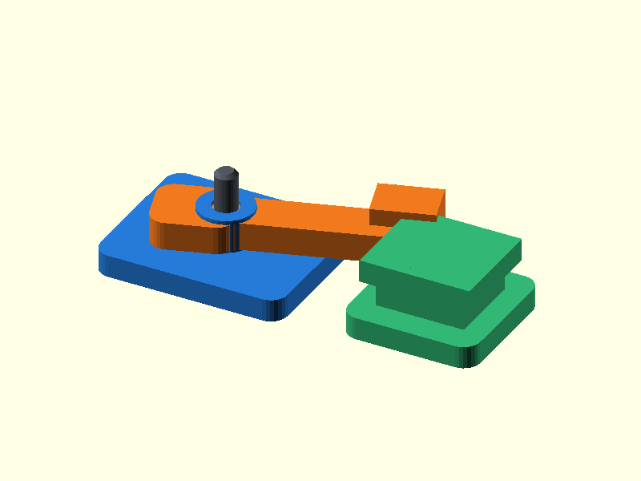

# 076 — Drehhakenverschluss

**Variante:** 0,45 mm  
**Kategorie:** Periodisch lösbare Verschlüsse  
**Mechanikfamilie:** `rotating-hook-latch`

## Status und Qualifikation

- Artefaktstatus: `base-release-1.0.0`
- Qualifikationsstatus: `unqualified`
- Einordnung: Basismuster aus Release 1.0.0; im DRAFT-Prüfpunkt 1.1.0 nicht physisch requalifiziert.
- Anspruchsgrenze: Digitale Geometrieprüfung ist keine Funktions-, Last-, Dichtheits-, Lebensdauer- oder Sicherheitsqualifikation.

## Prinzip

Ein drehbarer Haken greift hinter einen separaten Fangblock und wird durch einen Stift geführt.

## Typische Verwendung

Kisten, Klappen, Modellbau und wiederholt zu öffnende Abdeckungen.

## Enthaltene Dateien

- `model.scad` — parametrische OpenSCAD-Quelle
- `print_plate.stl` — Druckanordnung des 1.0.0-Basispakets; in diesem DRAFT nicht neu qualifiziert
- `preview.png` — Explosions-/Montagevorschau
- `parts/part_XX.stl` — automatisch getrennte Einzelkörper für CAD-Import
- `components.json` — Abmessungen und ursprüngliche Position jeder Komponente
- `metadata.json` — maschinenlesbare Dokumentation

Vorgesehene Komponenten:

- Drehbasis
- Hakenhebel
- Fangblock
- Stift

## Parameter dieser Variante

- `pin_d`: `4`
- `clearance`: `0.45`
- `arm`: `34`

**Variantenhinweis:** Für raue Oberflächen.

## FDM-Empfehlung

- Material: PLA, PETG, PA
- Düse: 0.4 mm
- Schichthöhe: 0.2 mm
- Außenlinien: mindestens 4
- Infill: 25 % als Startwert; funktionskritische Bereiche bei Bedarf lokal erhöhen
- Supportbedarf: grundsätzlich gering; die familienspezifischen Hinweise und die eigene Slicer-Vorschau beachten

Alle Teile flach, Stift stehend.

## Montage und Nacharbeit

Stift einsetzen, Hebelspiel prüfen und optional mit Kopf oder Clip sichern.

## Integration in ein Projekt

Grundplatte und Fangblock auf derselben Bezugsebene montieren; Hebelweg freihalten.

## Fremdteile

Kein Fremdteil; optional Metallstift.

## Grenzen und Sicherheit

Kein Über-Center-Effekt; bei Vibration zusätzliche Rastung vorsehen.

Die Geometrie wurde digital auf geschlossene, positive Volumenkörper geprüft. Sie wurde nicht physisch auf jedem Drucker und Material gedruckt. Vor Lastanwendung zuerst die passende Toleranzvariante testen. Nicht für Personenlasten, Schutzfunktionen oder sonstige sicherheitskritische Anwendungen verwenden.
