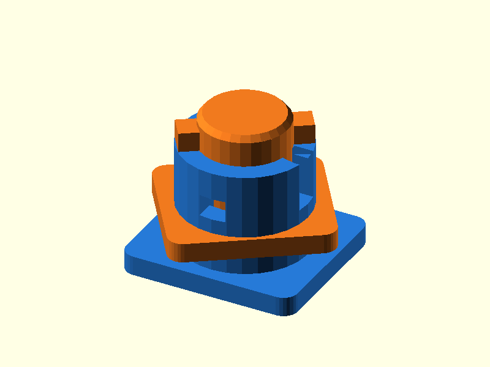

# 077 — Bajonett-Vierteldrehverschluss

**Variante:** 0,20 mm  
**Kategorie:** Periodisch lösbare Verschlüsse  
**Mechanikfamilie:** `bayonet-quarter-turn`

## Status und Qualifikation

- Artefaktstatus: `base-release-1.0.0`
- Qualifikationsstatus: `unqualified`
- Einordnung: Basismuster aus Release 1.0.0; im DRAFT-Prüfpunkt 1.1.0 nicht physisch requalifiziert.
- Anspruchsgrenze: Digitale Geometrieprüfung ist keine Funktions-, Last-, Dichtheits-, Lebensdauer- oder Sicherheitsqualifikation.

## Prinzip

Radiale Nasen werden axial eingeführt und durch eine kurze Drehung in seitliche Kanäle verschoben.

## Typische Verwendung

Deckel, Filterhalter, Sensoradapter und schnell wechselbare Module.

## Enthaltene Dateien

- `model.scad` — parametrische OpenSCAD-Quelle
- `print_plate.stl` — Druckanordnung des 1.0.0-Basispakets; in diesem DRAFT nicht neu qualifiziert
- `preview.png` — Explosions-/Montagevorschau
- `parts/part_XX.stl` — automatisch getrennte Einzelkörper für CAD-Import
- `components.json` — Abmessungen und ursprüngliche Position jeder Komponente
- `metadata.json` — maschinenlesbare Dokumentation

Vorgesehene Komponenten:

- Bajonettbuchse
- Bajonettstecker

## Parameter dieser Variante

- `core_d`: `18`
- `clearance`: `0.2`
- `lug_w`: `5`

**Variantenhinweis:** Enger Sitz.

## FDM-Empfehlung

- Material: PLA, PETG, PA
- Düse: 0.4 mm
- Schichthöhe: 0.2 mm
- Außenlinien: mindestens 4
- Infill: 25 % als Startwert; funktionskritische Bereiche bei Bedarf lokal erhöhen
- Supportbedarf: grundsätzlich gering; die familienspezifischen Hinweise und die eigene Slicer-Vorschau beachten

Stehend. Kanalüberhänge sind kurz, kleine Schichthöhe verbessert die Bewegung.

## Montage und Nacharbeit

Kanäle entgraten, axial einführen und etwa 35–45° drehen.

## Integration in ein Projekt

Einführ- und Drehanschlag sichtbar halten; bei Axialvorspannung Rampen oder Dichtung ergänzen.

## Fremdteile

Kein Fremdteil.

## Grenzen und Sicherheit

Ohne Feder oder Dichtung keine selbsttätige Vorspannung gegen Klappern.

Die Geometrie wurde digital auf geschlossene, positive Volumenkörper geprüft. Sie wurde nicht physisch auf jedem Drucker und Material gedruckt. Vor Lastanwendung zuerst die passende Toleranzvariante testen. Nicht für Personenlasten, Schutzfunktionen oder sonstige sicherheitskritische Anwendungen verwenden.
