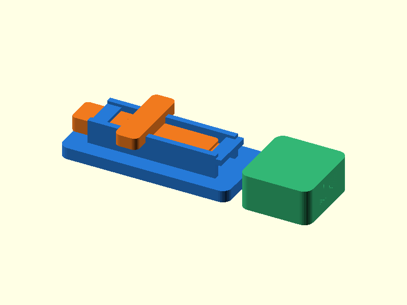

# 083 — Linearer Schubriegel

**Variante:** 0,35 mm  
**Kategorie:** Periodisch lösbare Verschlüsse  
**Mechanikfamilie:** `sliding-bolt-latch`

## Status und Qualifikation

- Artefaktstatus: `base-release-1.0.0`
- Qualifikationsstatus: `unqualified`
- Einordnung: Basismuster aus Release 1.0.0; im DRAFT-Prüfpunkt 1.1.0 nicht physisch requalifiziert.
- Anspruchsgrenze: Digitale Geometrieprüfung ist keine Funktions-, Last-, Dichtheits-, Lebensdauer- oder Sicherheitsqualifikation.

## Prinzip

Ein T-förmig geführter Riegel bewegt sich linear zwischen Basis und separatem Fangstück.

## Typische Verwendung

Türen, Schubladen, Modellbauklappen und Transportsicherungen.

## Enthaltene Dateien

- `model.scad` — parametrische OpenSCAD-Quelle
- `print_plate.stl` — Druckanordnung des 1.0.0-Basispakets; in diesem DRAFT nicht neu qualifiziert
- `preview.png` — Explosions-/Montagevorschau
- `parts/part_XX.stl` — automatisch getrennte Einzelkörper für CAD-Import
- `components.json` — Abmessungen und ursprüngliche Position jeder Komponente
- `metadata.json` — maschinenlesbare Dokumentation

Vorgesehene Komponenten:

- Riegelführung
- Riegel
- Fangstück

## Parameter dieser Variante

- `clearance`: `0.35`
- `bolt_w`: `10`
- `bolt_h`: `5`

**Variantenhinweis:** Leichtgängig.

## FDM-Empfehlung

- Material: PLA, PETG, PA
- Düse: 0.4 mm
- Schichthöhe: 0.2 mm
- Außenlinien: mindestens 4
- Infill: 25 % als Startwert; funktionskritische Bereiche bei Bedarf lokal erhöhen
- Supportbedarf: grundsätzlich gering; die familienspezifischen Hinweise und die eigene Slicer-Vorschau beachten

Alle Teile flach und supportfrei.

## Montage und Nacharbeit

Führungen entgraten, Riegel einschieben und Fangstück ausrichten.

## Integration in ein Projekt

Basis und Fangstück fluchten lassen; Griffweg und Anschläge erhalten.

## Fremdteile

Kein Fremdteil.

## Grenzen und Sicherheit

Keine automatische Verriegelung; bei Vibration Rastnase oder Magnet ergänzen.

Die Geometrie wurde digital auf geschlossene, positive Volumenkörper geprüft. Sie wurde nicht physisch auf jedem Drucker und Material gedruckt. Vor Lastanwendung zuerst die passende Toleranzvariante testen. Nicht für Personenlasten, Schutzfunktionen oder sonstige sicherheitskritische Anwendungen verwenden.
