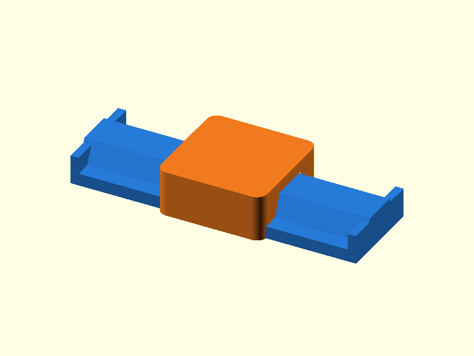

# 085 — Schwalbenschwanz-Linearführung

**Variante:** 0,20 mm  
**Kategorie:** Periodische Linearbewegung  
**Mechanikfamilie:** `dovetail-linear-rail`

## Status und Qualifikation

- Artefaktstatus: `base-release-1.0.0`
- Qualifikationsstatus: `unqualified`
- Einordnung: Basismuster aus Release 1.0.0; im DRAFT-Prüfpunkt 1.1.0 nicht physisch requalifiziert.
- Anspruchsgrenze: Digitale Geometrieprüfung ist keine Funktions-, Last-, Dichtheits-, Lebensdauer- oder Sicherheitsqualifikation.

## Prinzip

Ein langer Schwalbenschwanz führt einen geschlossenen Schlitten und nimmt Querkräfte auf.

## Typische Verwendung

Versteller, Schubladen, Sensorpositionierung und modulare Vorrichtungen.

## Enthaltene Dateien

- `model.scad` — parametrische OpenSCAD-Quelle
- `print_plate.stl` — Druckanordnung des 1.0.0-Basispakets; in diesem DRAFT nicht neu qualifiziert
- `preview.png` — Explosions-/Montagevorschau
- `parts/part_XX.stl` — automatisch getrennte Einzelkörper für CAD-Import
- `components.json` — Abmessungen und ursprüngliche Position jeder Komponente
- `metadata.json` — maschinenlesbare Dokumentation

Vorgesehene Komponenten:

- Schiene
- Schlitten

## Parameter dieser Variante

- `clearance`: `0.2`
- `length`: `70`
- `carriage_l`: `26`

**Variantenhinweis:** Eng für kurze, präzise Führungen.

## FDM-Empfehlung

- Material: PLA, PETG, PA
- Düse: 0.4 mm
- Schichthöhe: 0.2 mm
- Außenlinien: mindestens 4
- Infill: 25 % als Startwert; funktionskritische Bereiche bei Bedarf lokal erhöhen
- Supportbedarf: grundsätzlich gering; die familienspezifischen Hinweise und die eigene Slicer-Vorschau beachten

Schiene und Schlitten flach. Verzug der langen Schiene vermeiden.

## Montage und Nacharbeit

Flanken leicht entgraten und mit trockenem PTFE oder Wachs einlaufen lassen.

## Integration in ein Projekt

Schiene möglichst gerade und entlang der Druckbahnen orientieren; Anschläge und Schmierzugang vorsehen.

## Fremdteile

Kein Fremdteil.

## Grenzen und Sicherheit

FDM-Flanken sind keine Präzisionsführung; Spiel und Verschleiß kalibrieren.

Die Geometrie wurde digital auf geschlossene, positive Volumenkörper geprüft. Sie wurde nicht physisch auf jedem Drucker und Material gedruckt. Vor Lastanwendung zuerst die passende Toleranzvariante testen. Nicht für Personenlasten, Schutzfunktionen oder sonstige sicherheitskritische Anwendungen verwenden.
