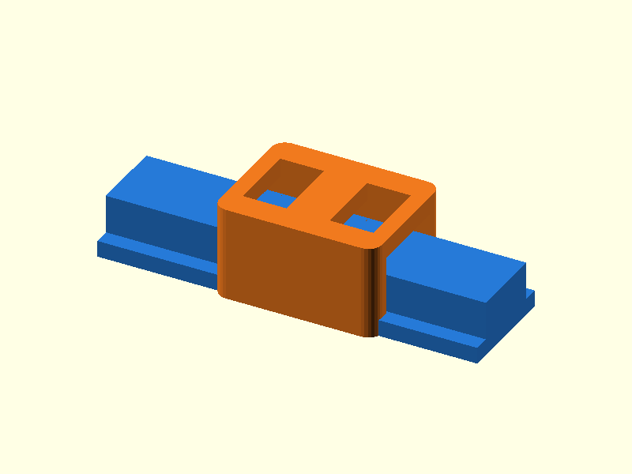

# 096 — Vorgespannter Feder-Schlitten

**Variante:** robust  
**Kategorie:** Periodische Linearbewegung  
**Mechanikfamilie:** `compliant-preload-slider`

## Status und Qualifikation

- Artefaktstatus: `base-release-1.0.0`
- Qualifikationsstatus: `unqualified`
- Einordnung: Basismuster aus Release 1.0.0; im DRAFT-Prüfpunkt 1.1.0 nicht physisch requalifiziert.
- Anspruchsgrenze: Digitale Geometrieprüfung ist keine Funktions-, Last-, Dichtheits-, Lebensdauer- oder Sicherheitsqualifikation.

## Prinzip

Dünne Dachfedern drücken den Schlitten gegen eine Rechteckschiene und reduzieren Klappern.

## Typische Verwendung

Leichte Kameraschlitten, Sensorführungen und handbetätigte Versteller.

## Enthaltene Dateien

- `model.scad` — parametrische OpenSCAD-Quelle
- `print_plate.stl` — Druckanordnung des 1.0.0-Basispakets; in diesem DRAFT nicht neu qualifiziert
- `preview.png` — Explosions-/Montagevorschau
- `parts/part_XX.stl` — automatisch getrennte Einzelkörper für CAD-Import
- `components.json` — Abmessungen und ursprüngliche Position jeder Komponente
- `metadata.json` — maschinenlesbare Dokumentation

Vorgesehene Komponenten:

- Rechteckschiene
- Federschlitten

## Parameter dieser Variante

- `clearance`: `0.55`
- `beam_t`: `1.4`

**Variantenhinweis:** Großer Grundspalt mit kräftigen Federn.

## FDM-Empfehlung

- Material: PETG, PA, PLA
- Düse: 0.4 mm
- Schichthöhe: 0.2 mm
- Außenlinien: mindestens 4
- Infill: 25 % als Startwert; funktionskritische Bereiche bei Bedarf lokal erhöhen
- Supportbedarf: grundsätzlich gering; die familienspezifischen Hinweise und die eigene Slicer-Vorschau beachten

Schlitten wie geliefert drucken. PETG/PA für Federbahnen bevorzugen.

## Montage und Nacharbeit

Schlitten von einem Ende aufschieben und Federvorspannung langsam einfahren.

## Integration in ein Projekt

Federbereiche frei halten; Schiene mit definierten glatten Kontaktflächen verlängern.

## Fremdteile

Kein Fremdteil.

## Grenzen und Sicherheit

Reibung steigt mit Vorspannung; Federkriechen bei Wärme beachten.

Die Geometrie wurde digital auf geschlossene, positive Volumenkörper geprüft. Sie wurde nicht physisch auf jedem Drucker und Material gedruckt. Vor Lastanwendung zuerst die passende Toleranzvariante testen. Nicht für Personenlasten, Schutzfunktionen oder sonstige sicherheitskritische Anwendungen verwenden.
