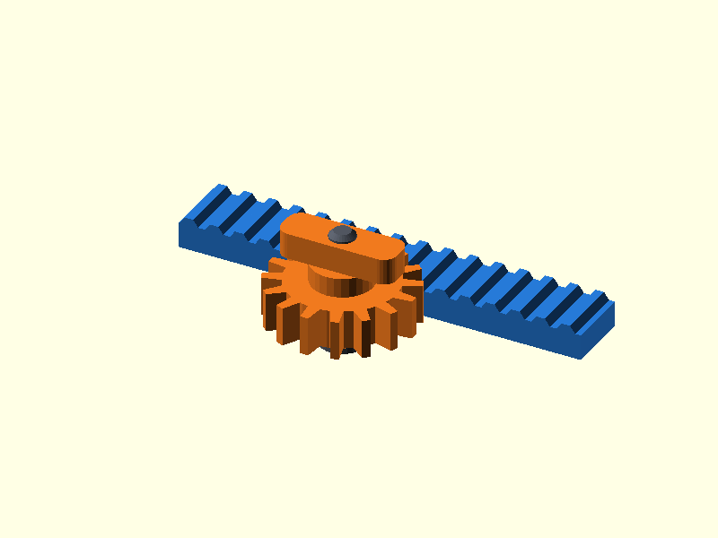

# 097 — Zahnstange und Ritzel

**Variante:** Modul 1,25  
**Kategorie:** Antriebe und weitere Mechanik  
**Mechanikfamilie:** `rack-and-pinion`

## Status und Qualifikation

- Artefaktstatus: `base-release-1.0.0`
- Qualifikationsstatus: `unqualified`
- Einordnung: Basismuster aus Release 1.0.0; im DRAFT-Prüfpunkt 1.1.0 nicht physisch requalifiziert.
- Anspruchsgrenze: Digitale Geometrieprüfung ist keine Funktions-, Last-, Dichtheits-, Lebensdauer- oder Sicherheitsqualifikation.

## Prinzip

Ein grob druckbares Ritzel wandelt Drehung in lineare Zahnstangenbewegung um.

## Typische Verwendung

Versteller, Greifer, Schieber, Demonstratoren und langsam bewegte Modellmechanik.

## Enthaltene Dateien

- `model.scad` — parametrische OpenSCAD-Quelle
- `print_plate.stl` — Druckanordnung des 1.0.0-Basispakets; in diesem DRAFT nicht neu qualifiziert
- `preview.png` — Explosions-/Montagevorschau
- `parts/part_XX.stl` — automatisch getrennte Einzelkörper für CAD-Import
- `components.json` — Abmessungen und ursprüngliche Position jeder Komponente
- `metadata.json` — maschinenlesbare Dokumentation

Vorgesehene Komponenten:

- Zahnstange
- Ritzel
- Achsstift

## Parameter dieser Variante

- `teeth`: `16`
- `module_size`: `1.25`
- `clearance`: `0.25`

**Variantenhinweis:** Kompaktes Profil.

## FDM-Empfehlung

- Material: PLA, PETG, PA
- Düse: 0.4 mm
- Schichthöhe: 0.2 mm
- Außenlinien: mindestens 4
- Infill: 25 % als Startwert; funktionskritische Bereiche bei Bedarf lokal erhöhen
- Supportbedarf: grundsätzlich gering; die familienspezifischen Hinweise und die eigene Slicer-Vorschau beachten

Zahnstange und Ritzel flach. Kleine Schichthöhe verbessert Zahnflanken.

## Montage und Nacharbeit

Zähne entgraten und Achsabstand so einstellen, dass kein Klemmen entsteht.

## Integration in ein Projekt

Achsabstand im Projekt einstellbar machen; Zahnstange seitlich führen und Endanschläge ergänzen.

## Fremdteile

Kein Fremdteil; optional Metallachse.

## Grenzen und Sicherheit

Vereinfachtes FDM-Zahnprofil, nicht für hohe Drehzahl oder exakte Übersetzung.

Die Geometrie wurde digital auf geschlossene, positive Volumenkörper geprüft. Sie wurde nicht physisch auf jedem Drucker und Material gedruckt. Vor Lastanwendung zuerst die passende Toleranzvariante testen. Nicht für Personenlasten, Schutzfunktionen oder sonstige sicherheitskritische Anwendungen verwenden.
