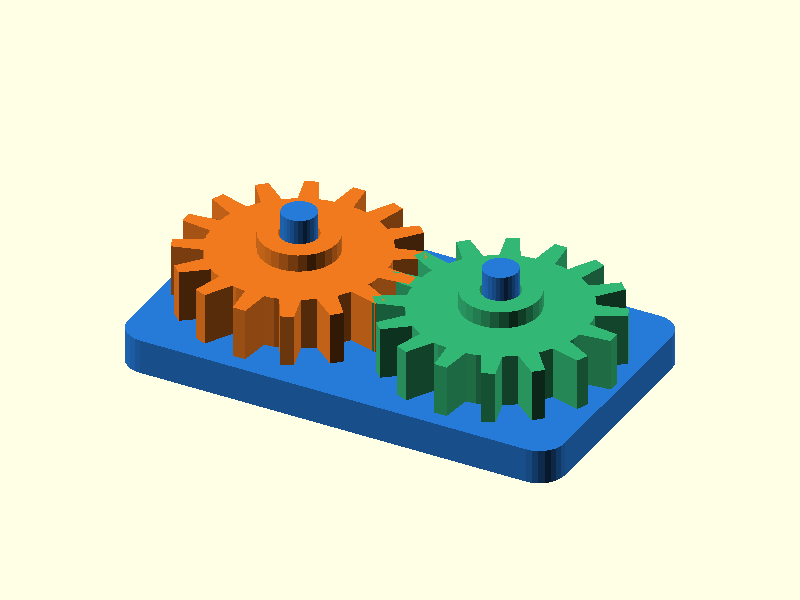

# 101 — Stirnradpaar auf Stiftbasis

**Variante:** 1:1  
**Kategorie:** Antriebe und weitere Mechanik  
**Mechanikfamilie:** `spur-gear-pair`

## Status und Qualifikation

- Artefaktstatus: `base-release-1.0.0`
- Qualifikationsstatus: `unqualified`
- Einordnung: Basismuster aus Release 1.0.0; im DRAFT-Prüfpunkt 1.1.0 nicht physisch requalifiziert.
- Anspruchsgrenze: Digitale Geometrieprüfung ist keine Funktions-, Last-, Dichtheits-, Lebensdauer- oder Sicherheitsqualifikation.

## Prinzip

Zwei flach gedruckte Räder laufen auf vertikalen Stiften und demonstrieren mehrere Übersetzungen.

## Typische Verwendung

Langsame Getriebe, Lernmodelle, Zähler und handbetätigte Mechanik.

## Enthaltene Dateien

- `model.scad` — parametrische OpenSCAD-Quelle
- `print_plate.stl` — Druckanordnung des 1.0.0-Basispakets; in diesem DRAFT nicht neu qualifiziert
- `preview.png` — Explosions-/Montagevorschau
- `parts/part_XX.stl` — automatisch getrennte Einzelkörper für CAD-Import
- `components.json` — Abmessungen und ursprüngliche Position jeder Komponente
- `metadata.json` — maschinenlesbare Dokumentation

Vorgesehene Komponenten:

- Stiftbasis
- Rad A
- Rad B

## Parameter dieser Variante

- `teeth_a`: `16`
- `teeth_b`: `16`
- `module_size`: `1.5`
- `clearance`: `0.25`

**Variantenhinweis:** Gleiche Zahnzahlen.

## FDM-Empfehlung

- Material: PLA, PETG, PA
- Düse: 0.4 mm
- Schichthöhe: 0.2 mm
- Außenlinien: mindestens 4
- Infill: 25 % als Startwert; funktionskritische Bereiche bei Bedarf lokal erhöhen
- Supportbedarf: grundsätzlich gering; die familienspezifischen Hinweise und die eigene Slicer-Vorschau beachten

Räder flach, Basis flach. Zahnnaht nicht auf alle Zähne derselben Flanke legen.

## Montage und Nacharbeit

Zähne entgraten, Räder aufstecken und mit dünner Scheibe sichern.

## Integration in ein Projekt

Achsabstand aus Modul und Zahnzahl übernehmen; Lagerung und Axialsicherung projektspezifisch ergänzen.

## Fremdteile

Kein Fremdteil; optional Metallachsen.

## Grenzen und Sicherheit

Vereinfachte Zahnform; nicht für hohe Leistung, Drehzahl oder exakte Evolventengeometrie.

Die Geometrie wurde digital auf geschlossene, positive Volumenkörper geprüft. Sie wurde nicht physisch auf jedem Drucker und Material gedruckt. Vor Lastanwendung zuerst die passende Toleranzvariante testen. Nicht für Personenlasten, Schutzfunktionen oder sonstige sicherheitskritische Anwendungen verwenden.
