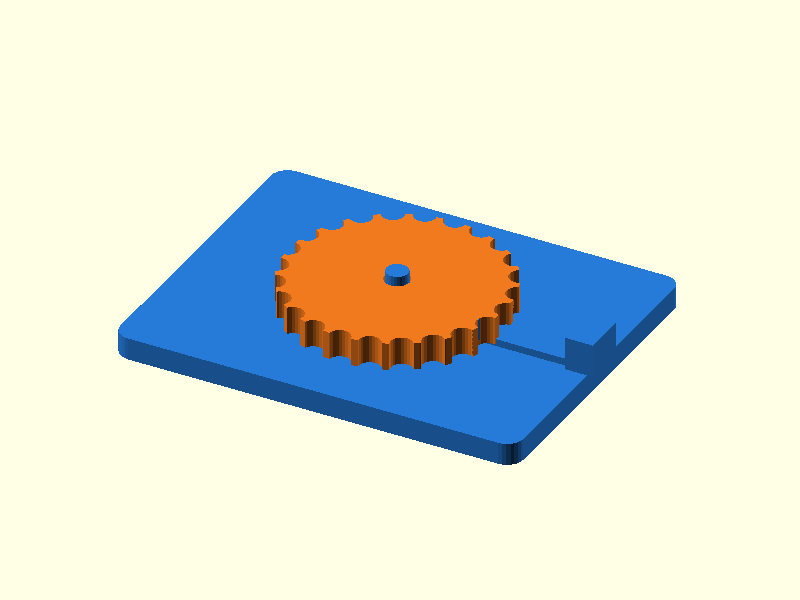

# 108 — Dreh-Rastindexierung

**Variante:** 24 Positionen  
**Kategorie:** Antriebe und weitere Mechanik  
**Mechanikfamilie:** `rotary-detent-indexer`

## Status und Qualifikation

- Artefaktstatus: `base-release-1.0.0`
- Qualifikationsstatus: `unqualified`
- Einordnung: Basismuster aus Release 1.0.0; im DRAFT-Prüfpunkt 1.1.0 nicht physisch requalifiziert.
- Anspruchsgrenze: Digitale Geometrieprüfung ist keine Funktions-, Last-, Dichtheits-, Lebensdauer- oder Sicherheitsqualifikation.

## Prinzip

Ein Federarm greift in Umfangskerben einer drehbaren Scheibe und erzeugt definierte Rastpositionen.

## Typische Verwendung

Drehwähler, Klappenpositionen, Werkzeughalter und haptische Einsteller.

## Enthaltene Dateien

- `model.scad` — parametrische OpenSCAD-Quelle
- `print_plate.stl` — Druckanordnung des 1.0.0-Basispakets; in diesem DRAFT nicht neu qualifiziert
- `preview.png` — Explosions-/Montagevorschau
- `parts/part_XX.stl` — automatisch getrennte Einzelkörper für CAD-Import
- `components.json` — Abmessungen und ursprüngliche Position jeder Komponente
- `metadata.json` — maschinenlesbare Dokumentation

Vorgesehene Komponenten:

- Basis mit Rastfeder
- Rastscheibe

## Parameter dieser Variante

- `notches`: `24`
- `beam_t`: `1.3`
- `clearance`: `0.3`

**Variantenhinweis:** 15°-Raster mit kleinerer Kerbe.

## FDM-Empfehlung

- Material: PETG, PA, PLA
- Düse: 0.4 mm
- Schichthöhe: 0.2 mm
- Außenlinien: mindestens 4
- Infill: 25 % als Startwert; funktionskritische Bereiche bei Bedarf lokal erhöhen
- Supportbedarf: grundsätzlich gering; die familienspezifischen Hinweise und die eigene Slicer-Vorschau beachten

Basis und Scheibe flach. Federarm in Layer-Ebene.

## Montage und Nacharbeit

Scheibe aufstecken und Federkraft durch behutsames Einfahren beurteilen.

## Integration in ein Projekt

Federarm austauschbar oder zugänglich halten; Rastzahl und Scheibendurchmesser gemeinsam wählen.

## Fremdteile

Kein Fremdteil.

## Grenzen und Sicherheit

Gedruckte Feder kann kriechen; keine sichere Verriegelung gegen hohe Momente.

Die Geometrie wurde digital auf geschlossene, positive Volumenkörper geprüft. Sie wurde nicht physisch auf jedem Drucker und Material gedruckt. Vor Lastanwendung zuerst die passende Toleranzvariante testen. Nicht für Personenlasten, Schutzfunktionen oder sonstige sicherheitskritische Anwendungen verwenden.
