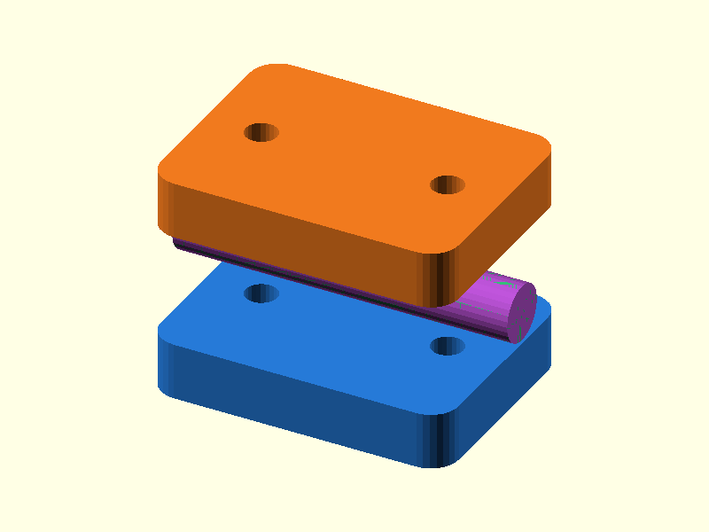

# 111 — Geteilte Wellen-Klemmkupplung

**Variante:** 6-mm-Welle  
**Kategorie:** Antriebe und weitere Mechanik  
**Mechanikfamilie:** `split-shaft-coupler`

## Status und Qualifikation

- Artefaktstatus: `base-release-1.0.0`
- Qualifikationsstatus: `unqualified`
- Einordnung: Basismuster aus Release 1.0.0; im DRAFT-Prüfpunkt 1.1.0 nicht physisch requalifiziert.
- Anspruchsgrenze: Digitale Geometrieprüfung ist keine Funktions-, Last-, Dichtheits-, Lebensdauer- oder Sicherheitsqualifikation.

## Prinzip

Zwei verschraubte Halbschalen klemmen zwei koaxiale Rundwellen in einer gemeinsamen Bohrung.

## Typische Verwendung

Langsame Modellbauwellen, Handantriebe, Teststände und provisorische Kupplungen.

## Enthaltene Dateien

- `model.scad` — parametrische OpenSCAD-Quelle
- `print_plate.stl` — Druckanordnung des 1.0.0-Basispakets; in diesem DRAFT nicht neu qualifiziert
- `preview.png` — Explosions-/Montagevorschau
- `parts/part_XX.stl` — automatisch getrennte Einzelkörper für CAD-Import
- `components.json` — Abmessungen und ursprüngliche Position jeder Komponente
- `metadata.json` — maschinenlesbare Dokumentation

Vorgesehene Komponenten:

- Kupplungshälfte A
- Kupplungshälfte B
- Testwelle A
- Testwelle B

## Parameter dieser Variante

- `bore_d`: `6`
- `clearance`: `0.2`
- `screw_d`: `3.4`
- `nut_flat`: `5.7`

**Variantenhinweis:** Robuster Standard.

## FDM-Empfehlung

- Material: PLA, PETG, PA
- Düse: 0.4 mm
- Schichthöhe: 0.2 mm
- Außenlinien: mindestens 4
- Infill: 25 % als Startwert; funktionskritische Bereiche bei Bedarf lokal erhöhen
- Supportbedarf: grundsätzlich gering; die familienspezifischen Hinweise und die eigene Slicer-Vorschau beachten

Halbschalen mit Mulde nach oben; Testwellen stehend.

## Montage und Nacharbeit

Mit zwei M3-Schrauben gleichmäßig klemmen und Rundlauf prüfen.

## Integration in ein Projekt

Wellen fluchten lassen und Schraubkräfte über ausreichend große Flansche einleiten.

## Fremdteile

Zwei M3-Schrauben und M3-Muttern.

## Grenzen und Sicherheit

Starre Kupplung gleicht keine Fluchtfehler aus; nicht für hohe Drehzahl.

Die Geometrie wurde digital auf geschlossene, positive Volumenkörper geprüft. Sie wurde nicht physisch auf jedem Drucker und Material gedruckt. Vor Lastanwendung zuerst die passende Toleranzvariante testen. Nicht für Personenlasten, Schutzfunktionen oder sonstige sicherheitskritische Anwendungen verwenden.
