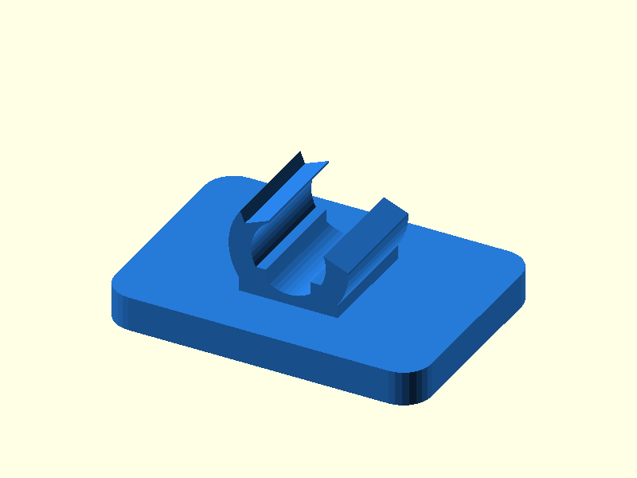

# 114 — Wiederlösbarer Kabel-Schnappclip

**Variante:** Kabel 6 mm  
**Kategorie:** Antriebe und weitere Mechanik  
**Mechanikfamilie:** `reusable-cable-clip`

## Status und Qualifikation

- Artefaktstatus: `base-release-1.0.0`
- Qualifikationsstatus: `unqualified`
- Einordnung: Basismuster aus Release 1.0.0; im DRAFT-Prüfpunkt 1.1.0 nicht physisch requalifiziert.
- Anspruchsgrenze: Digitale Geometrieprüfung ist keine Funktions-, Last-, Dichtheits-, Lebensdauer- oder Sicherheitsqualifikation.

## Prinzip

Eine geschlitzte C-Schale federt auf und hält ein Kabel quer zur Montageplatte.

## Typische Verwendung

Kabelmanagement, Schläuche ohne Druck, Sensorleitungen und Bowdenzugführung.

## Enthaltene Dateien

- `model.scad` — parametrische OpenSCAD-Quelle
- `print_plate.stl` — Druckanordnung des 1.0.0-Basispakets; in diesem DRAFT nicht neu qualifiziert
- `preview.png` — Explosions-/Montagevorschau
- `parts/part_XX.stl` — automatisch getrennte Einzelkörper für CAD-Import
- `components.json` — Abmessungen und ursprüngliche Position jeder Komponente
- `metadata.json` — maschinenlesbare Dokumentation

Vorgesehene Komponenten:

- Kabelclip

## Parameter dieser Variante

- `cable_d`: `6`
- `clearance`: `0.3`
- `wall`: `2.0`

**Variantenhinweis:** Allgemeiner Standard.

## FDM-Empfehlung

- Material: PETG, PA, PP, PLA
- Düse: 0.4 mm
- Schichthöhe: 0.2 mm
- Außenlinien: mindestens 4
- Infill: 25 % als Startwert; funktionskritische Bereiche bei Bedarf lokal erhöhen
- Supportbedarf: grundsätzlich gering; die familienspezifischen Hinweise und die eigene Slicer-Vorschau beachten

Wie geliefert flach; Clipbogen in Layer-Ebene. PETG/PA für Wiederholzyklen.

## Montage und Nacharbeit

Kanten entgraten und Kabel seitlich von oben einklicken.

## Integration in ein Projekt

Montageplatte durch Gehäusewand ersetzen; Öffnung in der gewünschten Entnahmerichtung ausrichten.

## Fremdteile

Kein Fremdteil.

## Grenzen und Sicherheit

Nicht für heiße Leitungen, Druckschläuche oder elektrische Isolation zertifiziert.

Die Geometrie wurde digital auf geschlossene, positive Volumenkörper geprüft. Sie wurde nicht physisch auf jedem Drucker und Material gedruckt. Vor Lastanwendung zuerst die passende Toleranzvariante testen. Nicht für Personenlasten, Schutzfunktionen oder sonstige sicherheitskritische Anwendungen verwenden.
