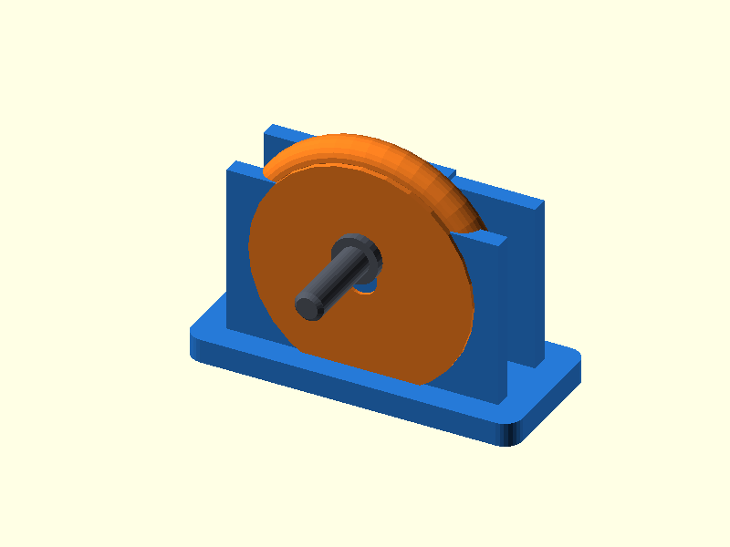

# 120 — Umlenkrollen-Block

**Variante:** 40 mm / Seil 5 mm  
**Kategorie:** Antriebe und weitere Mechanik  
**Mechanikfamilie:** `pulley-block`

## Status und Qualifikation

- Artefaktstatus: `base-release-1.0.0`
- Qualifikationsstatus: `unqualified`
- Einordnung: Basismuster aus Release 1.0.0; im DRAFT-Prüfpunkt 1.1.0 nicht physisch requalifiziert.
- Anspruchsgrenze: Digitale Geometrieprüfung ist keine Funktions-, Last-, Dichtheits-, Lebensdauer- oder Sicherheitsqualifikation.

## Prinzip

Eine profilierte Rolle dreht zwischen zwei Wangen auf einem herausnehmbaren Stift.

## Typische Verwendung

Seilumlenkung, leichte Flaschenzüge, Modellbau und Kabelführung.

## Enthaltene Dateien

- `model.scad` — parametrische OpenSCAD-Quelle
- `print_plate.stl` — Druckanordnung des 1.0.0-Basispakets; in diesem DRAFT nicht neu qualifiziert
- `preview.png` — Explosions-/Montagevorschau
- `parts/part_XX.stl` — automatisch getrennte Einzelkörper für CAD-Import
- `components.json` — Abmessungen und ursprüngliche Position jeder Komponente
- `metadata.json` — maschinenlesbare Dokumentation

Vorgesehene Komponenten:

- Rollenbügel
- Rolle
- Stift

## Parameter dieser Variante

- `rope_d`: `5`
- `outer_d`: `40`
- `pin_d`: `5`
- `clearance`: `0.35`

**Variantenhinweis:** Großer Demonstrator.

## FDM-Empfehlung

- Material: PLA, PETG, PA
- Düse: 0.4 mm
- Schichthöhe: 0.2 mm
- Außenlinien: mindestens 4
- Infill: 25 % als Startwert; funktionskritische Bereiche bei Bedarf lokal erhöhen
- Supportbedarf: grundsätzlich gering; die familienspezifischen Hinweise und die eigene Slicer-Vorschau beachten

Bracket flach, Rolle und Stift stehend. Rollenrille mit kleiner Schichthöhe drucken.

## Montage und Nacharbeit

Rolle einsetzen, Stift durchschieben und gegen Herausfallen sichern.

## Integration in ein Projekt

Bracket an tragende Geometrie anbinden; Seilaustritt und Befestigungsloch auf Lastpfad ausrichten.

## Fremdteile

Kein Fremdteil; optional Metallachse.

## Grenzen und Sicherheit

Nicht für Personenlasten, Klettern oder sicherheitskritische Hebezeuge.

Die Geometrie wurde digital auf geschlossene, positive Volumenkörper geprüft. Sie wurde nicht physisch auf jedem Drucker und Material gedruckt. Vor Lastanwendung zuerst die passende Toleranzvariante testen. Nicht für Personenlasten, Schutzfunktionen oder sonstige sicherheitskritische Anwendungen verwenden.
