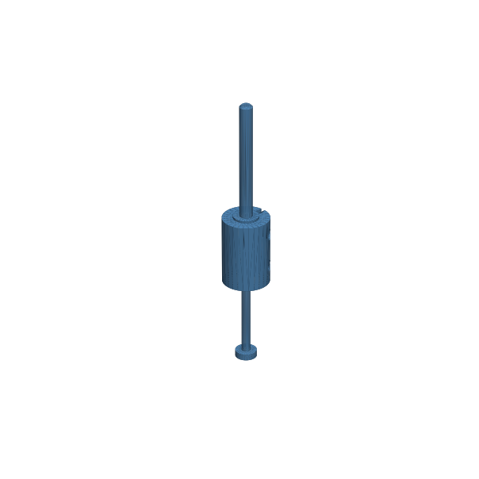

# 129 — Kompakte asymmetrische Wellenkupplung

**Variante:** 2 auf 3 mm  
**Kategorie:** Antriebe und weitere Mechanik  
**Mechanikfamilie:** `compact-asymmetric-shaft-coupler`

## Status und Qualifikation

- Artefaktstatus: `experimental-draft`
- Qualifikationsstatus: `unqualified`
- Einordnung: Experimenteller DRAFT der Erweiterung 1.1.0; digital geprüft, nicht physisch qualifiziert.
- Anspruchsgrenze: Digitale Geometrieprüfung ist keine Funktions-, Last-, Dichtheits-, Lebensdauer- oder Sicherheitsqualifikation.

## Prinzip

Ein geschlitzter Klemmkörper verbindet zwei koaxiale Wellen mit unabhängig dimensionierten Bohrungen und zwei M2-Klemmpunkten.

## Typische Verwendung

Kleine Getriebemotoren, Modellbauachsen, Kurbeln und langsame Prüfaufbauten.

## Enthaltene Dateien

- `model.scad` — parametrische OpenSCAD-Quelle
- `print_plate.stl` — experimentelle DRAFT-Druckanordnung; nicht physisch qualifiziert
- `preview.png` — Explosions-/Montagevorschau
- `parts/part_XX.stl` — automatisch getrennte Einzelkörper für CAD-Import
- `components.json` — Abmessungen und ursprüngliche Position jeder Komponente
- `metadata.json` — maschinenlesbare Dokumentation

Vorgesehene Komponenten:

- Kupplungskörper
- Eingangswellenlehre
- Ausgangswellenlehre

## Parameter dieser Variante

- `input_d`: `2`
- `output_d`: `3`
- `input_clearance`: `0.15`
- `output_clearance`: `0.15`
- `length`: `16`
- `outer_d`: `11`
- `fastener`: `2.4`
- `axial_stop`: `0.8`

**Variantenhinweis:** Kleine Motor- auf Modellwelle.

## FDM-Empfehlung

- Material: PETG, PA, ASA, PLA
- Düse: 0.4 mm
- Schichthöhe: 0.2 mm
- Außenlinien: mindestens 4
- Infill: 25 % als Startwert; funktionskritische Bereiche bei Bedarf lokal erhöhen
- Supportbedarf: grundsätzlich gering; die familienspezifischen Hinweise und die eigene Slicer-Vorschau beachten

Kupplung stehend; Wellenlehren stehend. Schlitz frei von Stringing halten, fünf Außenlinien verwenden.

## Montage und Nacharbeit

Wellen trocken einführen, Rundlauf prüfen und beide M2-Klemmen gleichmäßig anziehen.

## Integration in ein Projekt

Eingangs- und Ausgangsbohrung getrennt parametrieren, axiale Überdeckung erhalten und Wellen vor dem Klemmen fluchten.

## Fremdteile

Zwei M2-Schrauben und Muttern beziehungsweise Inserts; reale Eingangs- und Ausgangswelle.

## Grenzen und Sicherheit

Starre Niedrigdrehzahlkupplung; gleicht keinen Fluchtfehler aus. Reibschluss und Berstfestigkeit müssen physisch geprüft werden.

Die Geometrie wurde digital auf geschlossene, positive Volumenkörper geprüft. Sie wurde nicht physisch auf jedem Drucker und Material gedruckt. Vor Lastanwendung zuerst die passende Toleranzvariante testen. Nicht für Personenlasten, Schutzfunktionen oder sonstige sicherheitskritische Anwendungen verwenden.
