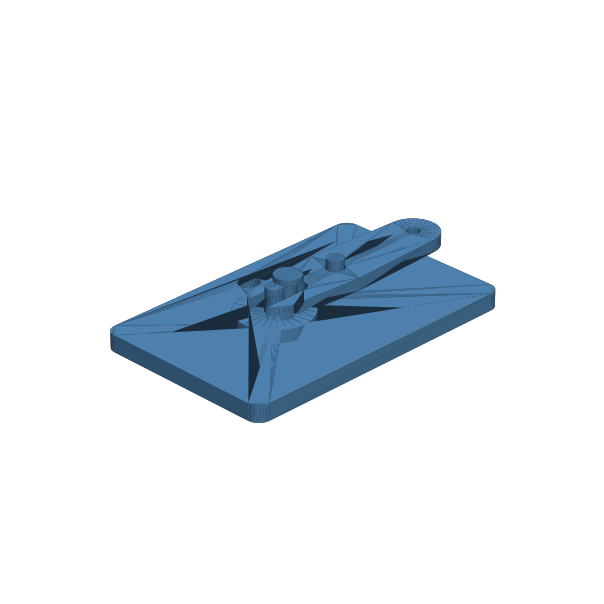

# 134 — Kurbel-Langloch-Schwinge

**Variante:** Kurbelradius 4 mm  
**Kategorie:** Antriebe und weitere Mechanik  
**Mechanikfamilie:** `crank-slotted-rocker-oscillator`

## Status und Qualifikation

- Artefaktstatus: `experimental-draft`
- Qualifikationsstatus: `unqualified`
- Einordnung: Experimenteller DRAFT der Erweiterung 1.1.0; digital geprüft, nicht physisch qualifiziert.
- Anspruchsgrenze: Digitale Geometrieprüfung ist keine Funktions-, Last-, Dichtheits-, Lebensdauer- oder Sicherheitsqualifikation.

## Prinzip

Ein Kurbelzapfen läuft in einem Langloch und wandelt kontinuierliche Drehung in eine begrenzte Schwingbewegung um.

## Typische Verwendung

Flossen, Pumpen, Automaten, Rührer und langsam oszillierende Modellmechanik.

## Enthaltene Dateien

- `model.scad` — parametrische OpenSCAD-Quelle
- `print_plate.stl` — experimentelle DRAFT-Druckanordnung; nicht physisch qualifiziert
- `preview.png` — Explosions-/Montagevorschau
- `parts/part_XX.stl` — automatisch getrennte Einzelkörper für CAD-Import
- `components.json` — Abmessungen und ursprüngliche Position jeder Komponente
- `metadata.json` — maschinenlesbare Dokumentation

Vorgesehene Komponenten:

- Stiftbasis
- Kurbel mit Zapfen
- Langlochschwinge

## Parameter dieser Variante

- `crank_r`: `4`
- `pivot_offset`: `18`
- `slot_w`: `5.4`
- `pin_d`: `4`
- `rocker_r`: `24`
- `plate_t`: `3`

**Variantenhinweis:** Kompakter Standardhub.

## FDM-Empfehlung

- Material: PETG, PA, PLA
- Düse: 0.4 mm
- Schichthöhe: 0.2 mm
- Außenlinien: mindestens 4
- Infill: 25 % als Startwert; funktionskritische Bereiche bei Bedarf lokal erhöhen
- Supportbedarf: grundsätzlich gering; die familienspezifischen Hinweise und die eigene Slicer-Vorschau beachten

Basis, Kurbel und Schwinge flach. Zapfen mit fünf Außenlinien, Kontaktflächen fein drucken.

## Montage und Nacharbeit

Aufstecken, Langloch leicht fetten, von Hand durchdrehen und erst dann motorisch betreiben.

## Integration in ein Projekt

Kurbelradius, Achsabstand, Langlochlänge und Zapfenspiel gekoppelt halten; vollständigen Schwenkraum freihalten.

## Fremdteile

Kein Fremdteil; optional Metallachsen oder verschleißfester Zapfen.

## Grenzen und Sicherheit

Gleitpaarung erzeugt Spiel und Verschleiß; nicht für hohe Drehzahl oder präzise sinusförmige Bewegung.

Die Geometrie wurde digital auf geschlossene, positive Volumenkörper geprüft. Sie wurde nicht physisch auf jedem Drucker und Material gedruckt. Vor Lastanwendung zuerst die passende Toleranzvariante testen. Nicht für Personenlasten, Schutzfunktionen oder sonstige sicherheitskritische Anwendungen verwenden.
