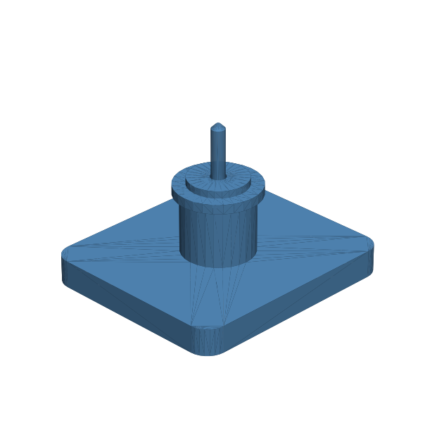

# 121 — Radiale O-Ring-Wellendichtung

**Variante:** Welle 2 mm  
**Kategorie:** Dicht- und Serviceschnittstellen  
**Mechanikfamilie:** `radial-o-ring-shaft-gland`

## Status und Qualifikation

- Artefaktstatus: `experimental-draft`
- Qualifikationsstatus: `unqualified`
- Einordnung: Experimenteller DRAFT der Erweiterung 1.1.0; digital geprüft, nicht physisch qualifiziert.
- Anspruchsgrenze: Dichtungsgeometrie und O-Ring-Vorspannung sind nur Konstruktionsabsicht. Keine geprüfte Leckrate, IP-/Wasserdichtheit, Druckfreigabe oder Lebensdauer.

## Prinzip

Ein gefetteter O-Ring sitzt radial zwischen rotierender Welle und gedrucktem Gehäuse; ein separater Haltering hält ihn axial in der Tasche.

## Typische Verwendung

Langsam laufende Modellwellen, Rührer, kleine Pumpen und wassergeschützte Spielzeugantriebe.

## Enthaltene Dateien

- `model.scad` — parametrische OpenSCAD-Quelle
- `print_plate.stl` — experimentelle DRAFT-Druckanordnung; nicht physisch qualifiziert
- `preview.png` — Explosions-/Montagevorschau
- `parts/part_XX.stl` — automatisch getrennte Einzelkörper für CAD-Import
- `components.json` — Abmessungen und ursprüngliche Position jeder Komponente
- `metadata.json` — maschinenlesbare Dokumentation

Vorgesehene Komponenten:

- Dichtungsgehäuse
- Haltering
- Wellenlehre

## Parameter dieser Variante

- `shaft_d`: `2`
- `oring_id`: `2`
- `oring_cs`: `1.5`
- `radial_squeeze`: `0.12`
- `clearance`: `0.18`
- `land_l`: `10`
- `lead_in`: `1.0`
- `grease_reservoir`: `1.2`
- `wall`: `3`

**Variantenhinweis:** Kleine Sensor- und Spielzeugwelle.

## FDM-Empfehlung

- Material: PETG, ASA, PA, PLA
- Düse: 0.4 mm
- Schichthöhe: 0.2 mm
- Außenlinien: mindestens 4
- Infill: 25 % als Startwert; funktionskritische Bereiche bei Bedarf lokal erhöhen
- Supportbedarf: grundsätzlich gering; die familienspezifischen Hinweise und die eigene Slicer-Vorschau beachten

Gehäuse, Haltering und Wellenlehre stehend. Dichtflächen mit kleiner Schichthöhe und fünf Außenlinien drucken.

## Montage und Nacharbeit

Bohrung entgraten, O-Ring gefettet einsetzen, Haltering montieren und erst von Hand drehen.

## Integration in ein Projekt

Wellenachse exakt übernehmen, O-Ring-Datenblatt als Autorität verwenden und Haltering zugänglich halten. Fettreservoir und Einführfase nicht entfernen.

## Fremdteile

Passender metrischer O-Ring und reale Metallwelle; silikonverträgliches Fett.

## Grenzen und Sicherheit

Nur für niedrige Drehzahl und geringe Eintauchtiefe. Digitale Geometrie beweist weder Dichtheit noch Erwärmung oder Lebensdauer.

Die Geometrie wurde digital auf geschlossene, positive Volumenkörper geprüft. Sie wurde nicht physisch auf jedem Drucker und Material gedruckt. Vor Lastanwendung zuerst die passende Toleranzvariante testen. Nicht für Personenlasten, Schutzfunktionen oder sonstige sicherheitskritische Anwendungen verwenden.
