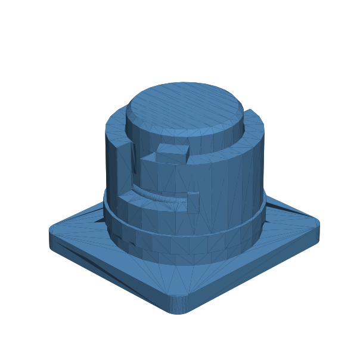

# 127 — O-Ring-vorgespanntes Rampenbajonett

**Variante:** 20 % radiale Kompression  
**Kategorie:** Dicht- und Serviceschnittstellen  
**Mechanikfamilie:** `o-ring-ramped-bayonet`

## Status und Qualifikation

- Artefaktstatus: `experimental-draft`
- Qualifikationsstatus: `unqualified`
- Einordnung: Experimenteller DRAFT der Erweiterung 1.1.0; digital geprüft, nicht physisch qualifiziert.
- Anspruchsgrenze: O-Ring-Nut, Rampenvorspannung und Spritzwasserschutz sind nur Konstruktionsabsicht. Keine geprüfte Leckrate, IP-/Wasserdichtheit, Druckfreigabe oder Lebensdauer.

## Prinzip

Bajonettnasen laufen nach axialer Einführung über steigende Kanäle bis zu einem Hartanschlag; eine separate Nut stellt nominelle radiale O-Ring-Kompression bereit.

## Typische Verwendung

Wartungsdeckel, Filtergehäuse, Sensoradapter und spritzwassergeschützte Elektronikkapseln.

## Enthaltene Dateien

- `model.scad` — parametrische OpenSCAD-Quelle
- `print_plate.stl` — experimentelle DRAFT-Druckanordnung; nicht physisch qualifiziert
- `preview.png` — Explosions-/Montagevorschau
- `parts/part_XX.stl` — automatisch getrennte Einzelkörper für CAD-Import
- `components.json` — Abmessungen und ursprüngliche Position jeder Komponente
- `metadata.json` — maschinenlesbare Dokumentation

Vorgesehene Komponenten:

- Rampen-Bajonettbuchse
- O-Ring-Bajonettstecker

## Parameter dieser Variante

- `core_d`: `24`
- `running_clearance`: `0.3`
- `lug_w`: `6`
- `ramp_h`: `0.75`
- `turn_deg`: `42`
- `oring_id`: `21`
- `oring_cs`: `2`
- `radial_squeeze`: `0.2`
- `hard_stop`: `1.5`

**Variantenhinweis:** Kräftigere radiale Dichtpressung.

## FDM-Empfehlung

- Material: PETG, ASA, PA, PLA
- Düse: 0.4 mm
- Schichthöhe: 0.2 mm
- Außenlinien: mindestens 4
- Infill: 25 % als Startwert; funktionskritische Bereiche bei Bedarf lokal erhöhen
- Supportbedarf: grundsätzlich gering; die familienspezifischen Hinweise und die eigene Slicer-Vorschau beachten

Stehend mit 0,2-mm- oder kleinerer Schichthöhe; Rampen und Kanäle ohne Support drucken und sauber entgraten.

## Montage und Nacharbeit

O-Ring fetten, axial einführen, über die Rampe drehen und Schließmoment sowie Anschlag prüfen.

## Integration in ein Projekt

O-Ring-Nut, Rampenhöhe, Axialanschlag und Laufspiel gekoppelt halten. Reale O-Ring-Schnur und Dichtflächen messen.

## Fremdteile

O-Ring 2 mm Schnurstärke, passend zum Referenzdurchmesser.

## Grenzen und Sicherheit

Keine Druckbehälterfreigabe. Höhere Kompression steigert Schließmoment, Verschleiß und Risiko für O-Ring-Extrusion.

Die Geometrie wurde digital auf geschlossene, positive Volumenkörper geprüft. Sie wurde nicht physisch auf jedem Drucker und Material gedruckt. Vor Lastanwendung zuerst die passende Toleranzvariante testen. Nicht für Personenlasten, Schutzfunktionen oder sonstige sicherheitskritische Anwendungen verwenden.
