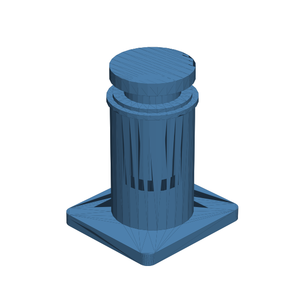

# 139 — Doppel-O-Ring-Reibkolben

**Variante:** Bohrung 20 mm  
**Kategorie:** Dicht- und Serviceschnittstellen  
**Mechanikfamilie:** `dual-o-ring-friction-piston`

## Status und Qualifikation

- Artefaktstatus: `experimental-draft`
- Qualifikationsstatus: `unqualified`
- Einordnung: Experimenteller DRAFT der Erweiterung 1.1.0; digital geprüft, nicht physisch qualifiziert.
- Anspruchsgrenze: Kolben- und O-Ring-Geometrie sind nur Konstruktionsabsicht. Keine geprüfte Leckrate, IP-/Wasserdichtheit, Druckfreigabe oder Lebensdauer.

## Prinzip

Ein Kolbenkopf mit zwei beabstandeten O-Ring-Nuten läuft in einer glatten Bohrung; ein Haltering hält den schmaleren Schaft captive.

## Typische Verwendung

Trimmblasen, Volumenversteller, Dosierer, Dämpfer und Niederdruck-Demonstratoren.

## Enthaltene Dateien

- `model.scad` — parametrische OpenSCAD-Quelle
- `print_plate.stl` — experimentelle DRAFT-Druckanordnung; nicht physisch qualifiziert
- `preview.png` — Explosions-/Montagevorschau
- `parts/part_XX.stl` — automatisch getrennte Einzelkörper für CAD-Import
- `components.json` — Abmessungen und ursprüngliche Position jeder Komponente
- `metadata.json` — maschinenlesbare Dokumentation

Vorgesehene Komponenten:

- Kolbengehäuse
- Doppel-O-Ring-Kolben
- Haltering

## Parameter dieser Variante

- `bore_d`: `20`
- `travel`: `24`
- `oring_id`: `17.5`
- `oring_cs`: `1.5`
- `groove_depth`: `1.08`
- `groove_spacing`: `4.4`
- `lead_in`: `1.2`
- `anti_loss_stop`: `4.5`
- `clearance`: `0.22`

**Variantenhinweis:** Allgemeiner Standard.

## FDM-Empfehlung

- Material: PETG, ASA, PA, PLA
- Düse: 0.4 mm
- Schichthöhe: 0.2 mm
- Außenlinien: mindestens 4
- Infill: 25 % als Startwert; funktionskritische Bereiche bei Bedarf lokal erhöhen
- Supportbedarf: grundsätzlich gering; die familienspezifischen Hinweise und die eigene Slicer-Vorschau beachten

Gehäuse, Kolben und Haltering stehend. Dichtflächen fein und mit mindestens fünf Außenlinien drucken.

## Montage und Nacharbeit

Nuten entgraten, O-Ringe fetten, Kolben gerade einsetzen und Schubkraft über den ganzen Weg messen.

## Integration in ein Projekt

Bohrung, Nut, Schnurstärke und Einführfase gemeinsam auslegen; Haltering und Anschläge servicefähig halten.

## Fremdteile

Zwei passende O-Ringe; silikonverträgliches Fett.

## Grenzen und Sicherheit

Kein Druckzylinder. Reibung, Kriechen und Leckage hängen stark von realem O-Ring und Oberflächenqualität ab.

Die Geometrie wurde digital auf geschlossene, positive Volumenkörper geprüft. Sie wurde nicht physisch auf jedem Drucker und Material gedruckt. Vor Lastanwendung zuerst die passende Toleranzvariante testen. Nicht für Personenlasten, Schutzfunktionen oder sonstige sicherheitskritische Anwendungen verwenden.
