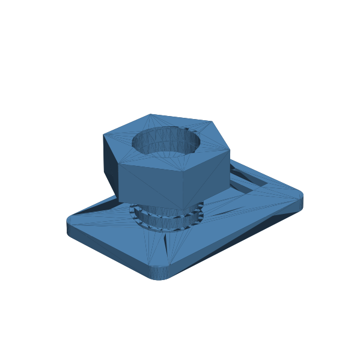

# 146 — Kompressions-Kabeldurchführung

**Variante:** Kabel 3 mm  
**Kategorie:** Dicht- und Serviceschnittstellen  
**Mechanikfamilie:** `compression-cable-gland`

## Status und Qualifikation

- Artefaktstatus: `experimental-draft`
- Qualifikationsstatus: `unqualified`
- Einordnung: Experimenteller DRAFT der Erweiterung 1.1.0; digital geprüft, nicht physisch qualifiziert.
- Anspruchsgrenze: Die Durchführung ist nur die Konstruktionsabsicht eines unqualifizierten Dicht- und Montagekonzepts. Keine geprüfte Leckrate, IP-/Wasserdichtheit, Druckfreigabe, elektrische Freigabe oder Lebensdauer.

## Prinzip

Eine Gewindemutter presst einen geschlitzten Elastomerring axial um ein Kabel; das Gehäuse übernimmt Wandanschluss und Zugpfad.

## Typische Verwendung

Sensorleitungen, Kleinspannungskabel und vergossene Durchführungen in Gehäusen.

## Enthaltene Dateien

- `model.scad` — parametrische OpenSCAD-Quelle
- `print_plate.stl` — experimentelle DRAFT-Druckanordnung; nicht physisch qualifiziert
- `preview.png` — Explosions-/Montagevorschau
- `parts/part_XX.stl` — automatisch getrennte Einzelkörper für CAD-Import
- `components.json` — Abmessungen und ursprüngliche Position jeder Komponente
- `metadata.json` — maschinenlesbare Dokumentation

Vorgesehene Komponenten:

- Gewinde-Glandkörper
- Kompressionsring-Lehre
- Glandmutter

## Parameter dieser Variante

- `cable_d`: `3`
- `seal_clearance`: `0.3`
- `compression_l`: `4.5`
- `thread_d`: `16`
- `pitch`: `3.0`
- `strain_relief`: `12`
- `wall`: `3`

**Variantenhinweis:** Kleine Kleinspannungsleitung.

## FDM-Empfehlung

- Material: PETG, ASA, PA, TPU
- Düse: 0.4 mm
- Schichthöhe: 0.2 mm
- Außenlinien: mindestens 4
- Infill: 25 % als Startwert; funktionskritische Bereiche bei Bedarf lokal erhöhen
- Supportbedarf: grundsätzlich gering; die familienspezifischen Hinweise und die eigene Slicer-Vorschau beachten

Gehäuse, Mutter und Ring stehend. Gewinde mit kleiner Schichthöhe; Ring nur als TPU-Lehre betrachten.

## Montage und Nacharbeit

Gewinde einlaufen lassen, Kabel und Ring einsetzen, Mutter gleichmäßig anziehen und Zug-/Lecktest durchführen.

## Integration in ein Projekt

Kabelmantel messen, Zugentlastung getrennt vorsehen und Dicht-/Pottingmaterial auf Verträglichkeit prüfen.

## Fremdteile

Reales Kabel sowie geeigneter Elastomer- oder Pottingeinsatz; optional separate Zugentlastung.

## Grenzen und Sicherheit

Nicht für Netzspannung, Druckleitungen oder zertifizierte IP-Schutzarten. Gedruckter Ring ersetzt keinen qualifizierten Dichteinsatz.

Die Geometrie wurde digital auf geschlossene, positive Volumenkörper geprüft. Sie wurde nicht physisch auf jedem Drucker und Material gedruckt. Vor Lastanwendung zuerst die passende Toleranzvariante testen. Nicht für Personenlasten, Schutzfunktionen oder sonstige sicherheitskritische Anwendungen verwenden.
