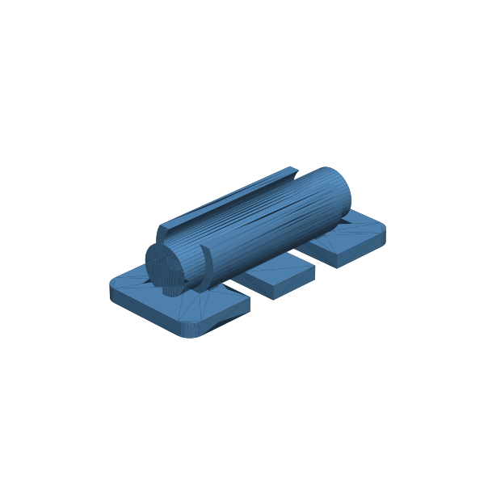

# 149 — Zylindrischer Zellhalter

**Variante:** 1 x AAA  
**Kategorie:** Komponentenhalter  
**Mechanikfamilie:** `cylindrical-cell-cradle`

## Status und Qualifikation

- Artefaktstatus: `experimental-draft`
- Qualifikationsstatus: `unqualified`
- Einordnung: Experimenteller DRAFT der Erweiterung 1.1.0; digital geprüft, nicht physisch qualifiziert.
- Anspruchsgrenze: Digitale Geometrieprüfung ist keine Funktions-, Last-, Dichtheits-, Lebensdauer- oder Sicherheitsqualifikation.

## Prinzip

Offene zylindrische Sättel führen Batteriezellen; Querfenster nehmen einen separaten Gurt auf und halten elektrische Kontaktzonen frei.

## Typische Verwendung

Batteriefächer, Prototypen, Messgeräte und Modellbau-Elektronik.

## Enthaltene Dateien

- `model.scad` — parametrische OpenSCAD-Quelle
- `print_plate.stl` — experimentelle DRAFT-Druckanordnung; nicht physisch qualifiziert
- `preview.png` — Explosions-/Montagevorschau
- `parts/part_XX.stl` — automatisch getrennte Einzelkörper für CAD-Import
- `components.json` — Abmessungen und ursprüngliche Position jeder Komponente
- `metadata.json` — maschinenlesbare Dokumentation

Vorgesehene Komponenten:

- Zellhalter
- Durchmesserlehre

## Parameter dieser Variante

- `cell_d`: `10.5`
- `cell_l`: `44.5`
- `count`: `1`
- `cell_gap`: `2`
- `clearance`: `0.35`
- `strap_w`: `6`
- `contact_keepout`: `5`

**Variantenhinweis:** Einzelne AAA-Zelle.

## FDM-Empfehlung

- Material: PETG, ASA, PA, PLA
- Düse: 0.4 mm
- Schichthöhe: 0.2 mm
- Außenlinien: mindestens 4
- Infill: 25 % als Startwert; funktionskritische Bereiche bei Bedarf lokal erhöhen
- Supportbedarf: grundsätzlich gering; die familienspezifischen Hinweise und die eigene Slicer-Vorschau beachten

Halter flach, Durchmesserlehre stehend. Gurtfenster und Satteloberflächen ohne Support drucken.

## Montage und Nacharbeit

Kanten brechen, Lehre prüfen, dann echte Zelle ohne Kraft einsetzen und mit nichtleitendem Gurt sichern.

## Integration in ein Projekt

Reale Zellen messen, Kontakt- und Isolations-Keep-outs erhalten und Halter an eine tragende, temperaturverträgliche Wand anbinden.

## Fremdteile

Reale Zelle, nichtleitender Gurt und supplier-spezifische elektrische Kontakte.

## Grenzen und Sicherheit

Keine elektrischen Kontakte oder Batteriesicherheitsfunktion. Zellhüllen dürfen nicht gequetscht, geritzt oder erwärmt werden.

Die Geometrie wurde digital auf geschlossene, positive Volumenkörper geprüft. Sie wurde nicht physisch auf jedem Drucker und Material gedruckt. Vor Lastanwendung zuerst die passende Toleranzvariante testen. Nicht für Personenlasten, Schutzfunktionen oder sonstige sicherheitskritische Anwendungen verwenden.
