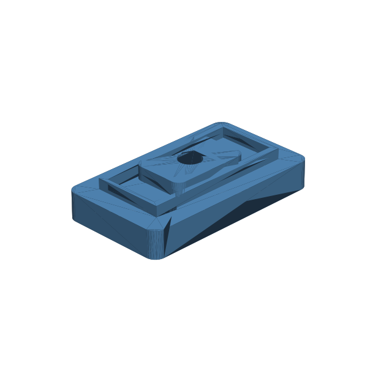

# 154 — Abgedichtete Magnetbetätiger-Tasche

**Variante:** Wand 2 mm  
**Kategorie:** Komponentenhalter  
**Mechanikfamilie:** `sealed-magnetic-actuator-pocket`

## Status und Qualifikation

- Artefaktstatus: `experimental-draft`
- Qualifikationsstatus: `unqualified`
- Einordnung: Experimenteller DRAFT der Erweiterung 1.1.0; digital geprüft, nicht physisch qualifiziert.
- Anspruchsgrenze: „Abgedichtet“ und „dicht“ bezeichnen ausschließlich die Konstruktionsabsicht einer ununterbrochenen Wandbarriere ohne Sensordurchbruch. Keine geprüfte Leckrate, IP-/Wasserdichtheit, Druckfreigabe oder Lebensdauer.

## Prinzip

Ein externer Magnetschieber läuft über einer ununterbrochenen Wandbarriere ohne Sensordurchbruch; dahinter liegt ein supplier-spezifischer Reed- oder Hall-Sensor-Keep-out. Diese Barriere ist nicht auf Dichtheit geprüft.

## Typische Verwendung

Magnetisch durch eine ununterbrochene Wand betätigte Schalterkonzepte, abnehmbare Magnetschlüssel und Sensortrigger; wassernahe Elektronik nur nach eigener Dichtheitsprüfung.

## Enthaltene Dateien

- `model.scad` — parametrische OpenSCAD-Quelle
- `print_plate.stl` — experimentelle DRAFT-Druckanordnung; nicht physisch qualifiziert
- `preview.png` — Explosions-/Montagevorschau
- `parts/part_XX.stl` — automatisch getrennte Einzelkörper für CAD-Import
- `components.json` — Abmessungen und ursprüngliche Position jeder Komponente
- `metadata.json` — maschinenlesbare Dokumentation

Vorgesehene Komponenten:

- Dichte Sensortasche mit Führung
- Magnetschieber

## Parameter dieser Variante

- `wall_t`: `2`
- `magnet_d`: `6`
- `magnet_l`: `3`
- `switch_keepout`: `[18, 6, 6]`
- `travel`: `20`
- `retention`: `1.2`
- `clearance`: `0.35`

**Variantenhinweis:** Ausgewogener Startwert.

## FDM-Empfehlung

- Material: PETG, ASA, PA, PLA
- Düse: 0.4 mm
- Schichthöhe: 0.2 mm
- Außenlinien: mindestens 4
- Infill: 25 % als Startwert; funktionskritische Bereiche bei Bedarf lokal erhöhen
- Supportbedarf: grundsätzlich gering; die familienspezifischen Hinweise und die eigene Slicer-Vorschau beachten

Gehäuse flach mit kurzer Brücke über der Sensortasche; Schieber flach. Magnettasche sauber halten.

## Montage und Nacharbeit

Magnet einsetzen/sichern, Sensor hinter der Wand positionieren und Schaltabstand in allen Orientierungen messen.

## Integration in ein Projekt

Magnet und Sensor als gekaufte Komponenten vermessen, Polung festlegen und Wanddicke nur nach Reichweitentest wählen.

## Fremdteile

Neodym-Magnet etwa 6 x 3 mm und supplier-spezifischer Reed- oder Hall-Sensor.

## Grenzen und Sicherheit

Keine garantierte Schaltfunktion ohne reale Magnet-/Sensordaten. Fremdmagnete und Vibration können Fehlauslösung verursachen. „Abgedichtet“ beziehungsweise „dicht“ bezeichnet hier nur die nicht durchdrungene Wandbarriere, nicht eine geprüfte Dichtheit.

Die Geometrie wurde digital auf geschlossene, positive Volumenkörper geprüft. Sie wurde nicht physisch auf jedem Drucker und Material gedruckt. Vor Lastanwendung zuerst die passende Toleranzvariante testen. Nicht für Personenlasten, Schutzfunktionen oder sonstige sicherheitskritische Anwendungen verwenden.
